> 归档说明（2026-10-03）：本文为设计/参考实现基线，正文保留版本历史。功能实现与发布状态请查阅[版本索引](README.md)和[本仓库工程变更](CHANGELOG.md)；设计中的生产能力与代码骨架不表示已经上线或完成验收。

# SmartExpiry 智能保质期管理

## 前端 / 后端 / 算法团队参考实现文档

**Reference Implementation V1.0**

| 项目 | 内容 |
|---|---|
| 基础设计文档 | `SmartExpiry_HarmonyOS_Java_Technical_Design_V1.2.md` |
| 客户端 | HarmonyOS NEXT / ArkTS / ArkUI / Stage Model |
| 后端 | Java 21 / Spring Boot 4.x / PostgreSQL / Redis |
| 算法 | 规则解析 + 日期算法 + OCR/ASR + LLM Structured Output + Benchmark |
| 架构基线 | Local-First + MVVM/Clean Architecture + Modular Monolith |
| 文档目的 | 供前端、后端、算法、测试团队直接拆任务、编码、联调和验收 |
| 版本日期 | 2026-10-03 |

> 本文档不是新的产品需求文档，而是对 Technical Design V1.2 的**工程落地展开**。  
> V1.2 已确定的领域模型、Local-First、模块化单体、Item/InventoryBatch 分离、核心本地提醒、AI 只生成 ItemDraft、PostgreSQL 为服务端真值、Redis 不存主业务真值等原则继续有效。

---

# 0. 文档使用规则

## 0.1 两类内容必须区分

本文内容分为两类：

### A. 继承自 Technical Design V1.2 的硬约束

以下内容不得由单个团队自行修改：

- 客户端采用 Local-First。
- Item 与 InventoryBatch 分离。
- ExpiryStatus 为派生状态，不持久化为每日更新字段。
- 关键日期算法由确定性代码负责，不交给 LLM。
- AI/OCR/语音最终只生成 ItemDraft，用户确认后才能进入正式库存。
- 核心临期提醒优先在 HarmonyOS 本地注册。
- Java 后端继续采用模块化单体，不因算法或 Push 单独拆微服务。
- PostgreSQL 保存服务端业务真值。
- Redis 用于缓存、限流、异步队列辅助，不作为不可恢复的唯一真值。
- 大规模 Push 通过 Outbox + Queue + Worker 异步执行。
- OpenAPI、Schema、错误码、共享测试用例是跨团队契约。

### B. 本文新增的参考实现约定

为方便团队直接开工，本文新增：

- 推荐仓库目录。
- 推荐类名、接口名和包名。
- ArkTS/Java 代码骨架。
- Recognition Pipeline 的具体模块划分。
- 日期候选生成和置信度融合公式。
- SyncQueue 状态机。
- OpenAPI DTO 约定。
- 算法评测集格式。
- M1~M6 三团队并行任务拆分。
- Contract Freeze 与联调 Gate。

这些属于“默认参考实现”。如果团队采用不同实现，必须保证外部契约和 V1.2 核心架构不变。

## 0.2 V1 在线算法形态

V1 **不新建独立算法微服务**。

推荐运行形态：

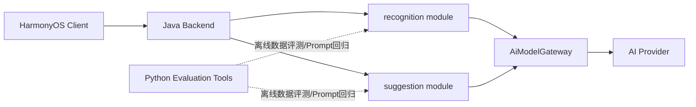

算法团队负责：

1. 规则和日期解析策略。
2. OCR/ASR 后处理。
3. Structured Output Schema。
4. 置信度融合。
5. Prompt。
6. Suggestion Policy。
7. Benchmark 与离线评测工具。

在线执行代码优先落在 Java 后端 `recognition` / `suggestion` 模块中。Python 仓库用于离线评测、数据清洗、Benchmark 和实验，不成为 V1 生产主链路单点。

---

# 1. 团队边界与交付物

## 1.1 前端团队

前端负责“用户操作 → 本地可靠落库 → UI 立即响应 → 后台同步 → 本地提醒”。

核心模块：

- ArkUI Pages / Components。
- ViewModel / UI State。
- ArkData RDB。
- Repository。
- Local-First CRUD。
- SyncQueue。
- Camera。
- Core Vision OCR。
- Core Speech。
- ItemDraft 确认页。
- ExpiryService 的 ArkTS 实现。
- ReminderPolicy / ReminderScheduler。
- REST Client。
- 错误恢复和离线状态。

前端交付物：

```text
HarmonyOS 工程
OpenAPI Client Adapter
ArkData Schema
expiry-test-cases.json 前端测试
端侧 OCR Adapter
Speech Adapter
Reminder Adapter
Sync Queue
E2E 测试
```

## 1.2 后端团队

后端负责“云端真值 + API + 同步 + AI 编排 + 异步任务 + Push + 可观测性”。

核心模块：

- REST Controller。
- Application Service。
- Domain。
- PostgreSQL/JPA。
- Flyway。
- Redis。
- Sync。
- Recognition API。
- AiModelGateway。
- Suggestion。
- Dashboard。
- Outbox。
- Push Worker。
- 限流/缓存/观测。

后端交付物：

```text
Spring Boot 工程
OpenAPI
Flyway Migration
PostgreSQL Schema
Redis Adapter
AiModelGateway
Recognition/Suggestion runtime
Sync API
Outbox/Push Worker
Prometheus Metrics
k6 支持环境
```

## 1.3 算法团队

算法团队不拥有 Item/Batch 的数据库写入权限，也不直接修改正式业务数据。

负责：

- OCR Text Normalizer。
- Date Keyword Parser。
- Date Candidate Generator。
- Shelf-Life Parser。
- Field Association。
- Category Inference。
- Confidence Fusion。
- Recognition Schema。
- LLM Prompt。
- RecognitionValidator 规则。
- Suggestion Prompt/Rule。
- Benchmark 数据集。
- 指标计算。
- 模型/Prompt 回归。

交付物：

```text
contracts/
  recognition-schema.json
  suggestion-schema.json

prompts/
  recognition-system.txt
  suggestion-food.txt
  suggestion-cosmetics.txt
  suggestion-pet-food.txt
  suggestion-other.txt

rules/
  date-keywords.yaml
  category-rules.yaml
  safety-rules.yaml

benchmark/
  recognition-benchmark.jsonl
  expected/
  images/

tools/
  evaluate_recognition.py
  compare_prompt_versions.py
  error_analysis.py
```

## 1.4 责任矩阵

| 能力 | 前端 | 后端 | 算法 | 测试 |
|---|---|---|---|---|
| Item/Batch UI | A/R | C | I | C |
| ArkData | A/R | I | I | C |
| PostgreSQL | I | A/R | I | C |
| Expiry 算法 | R | R | C | A/C |
| OCR 调用 | A/R | C | C | C |
| OCR 文本后处理 | C | R | A/R | C |
| 日期解析 | C | R | A/R | C |
| LLM Schema/Prompt | I | R | A/R | C |
| ItemDraft | R | R | C | C |
| Sync | R | A/R | I | C |
| 本地提醒 | A/R | C | I | C |
| Server Push | I | A/R | I | C |
| AI Benchmark | I | C | A/R | R |
| OpenAPI | C | A/R | C | C |
| 共享测试集 | R | R | R | A/R |

---

# 2. 推荐仓库与目录

若团队已经采用前后端分仓，推荐保持三个逻辑仓库：

```text
smart-expiry-harmony/
smart-expiry-backend/
smart-expiry-algorithm/
```

不要求算法仓库独立部署。

## 2.1 HarmonyOS 仓库

```text
smart-expiry-harmony/
├── AppScope/
├── entry/
│   └── src/main/ets/
│       ├── entryability/
│       ├── pages/
│       │   ├── HomePage.ets
│       │   ├── InventoryPage.ets
│       │   ├── AddItemPage.ets
│       │   ├── RecognitionPage.ets
│       │   ├── ItemConfirmPage.ets
│       │   ├── ItemDetailPage.ets
│       │   ├── SuggestionPage.ets
│       │   ├── StatisticsPage.ets
│       │   └── ProfilePage.ets
│       ├── components/
│       ├── viewmodel/
│       ├── domain/
│       │   ├── model/
│       │   ├── repository/
│       │   ├── service/
│       │   ├── usecase/
│       │   └── rule/
│       ├── data/
│       │   ├── local/
│       │   │   ├── database/
│       │   │   ├── dao/
│       │   │   └── entity/
│       │   ├── remote/
│       │   ├── mapper/
│       │   └── repository/
│       ├── recognition/
│       │   ├── camera/
│       │   ├── ocr/
│       │   ├── speech/
│       │   └── orchestrator/
│       ├── reminder/
│       ├── sync/
│       └── common/
├── test/
└── shared-test-cases/
    └── expiry-test-cases.json
```

## 2.2 Java 后端仓库

```text
smart-expiry-backend/
├── pom.xml
├── src/main/java/com/example/smartexpiry/
│   ├── common/
│   ├── auth/
│   ├── user/
│   ├── category/
│   ├── item/
│   ├── inventory/
│   ├── expiry/
│   ├── recognition/
│   ├── suggestion/
│   ├── reminder/
│   ├── preference/
│   ├── statistics/
│   ├── sync/
│   ├── notification/
│   ├── outbox/
│   ├── shopping/
│   └── infrastructure/
├── src/main/resources/
│   ├── db/migration/
│   ├── prompts/
│   ├── rules/
│   └── application.yml
├── src/test/
├── performance/
│   └── k6/
└── contracts/
    ├── openapi.yaml
    ├── recognition-schema.json
    └── expiry-test-cases.json
```

## 2.3 算法仓库

```text
smart-expiry-algorithm/
├── README.md
├── contracts/
│   ├── recognition-schema.json
│   └── suggestion-schema.json
├── prompts/
├── rules/
├── benchmark/
│   ├── manifest.jsonl
│   ├── images/
│   └── expected/
├── tools/
│   ├── evaluate_recognition.py
│   ├── compare_versions.py
│   ├── build_confusion_matrix.py
│   └── inspect_failures.py
├── experiments/
└── reports/
```

算法仓库中的 `contracts/prompts/rules` 通过版本号同步到 Java 后端，不建议生产时由 Java 动态读取另一个 Git 仓库。

---

# 3. 跨团队共享领域契约

## 3.1 ID

推荐业务 ID 统一采用 UUID 字符串。

```text
Item.id
InventoryBatch.id
RecognitionRecord.id
Suggestion.id
SyncEvent.id
PushTask.id
```

客户端可以在离线状态提前生成 UUID，从而避免“必须联网才能创建记录”。

## 3.2 时间类型

| 语义 | ArkTS | Java | JSON |
|---|---|---|---|
| 生产日期 | string / LocalDate-like wrapper | LocalDate | `YYYY-MM-DD` |
| 到期日期 | string / wrapper | LocalDate | `YYYY-MM-DD` |
| 开封日期 | string / wrapper | LocalDate | `YYYY-MM-DD` |
| createdAt | number/string | Instant | ISO-8601 UTC |
| 用户时区 | string | ZoneId | `Asia/Shanghai` 等 |
| 提醒时刻 | string | LocalTime | `09:00` |

禁止将自然日期全部转换成 UTC 时间戳后做天数算法。

## 3.3 LifecycleStatus

```text
ACTIVE
CONSUMED
DISCARDED
ARCHIVED
```

## 3.4 ExpiryStatus

```text
UNKNOWN
NORMAL
NEAR_EXPIRY
EXPIRED
```

ExpiryStatus 不作为数据库每日批量更新字段。

## 3.5 ShelfLifeUnit

```text
DAY
MONTH
YEAR
```

月和年必须采用日历语义，而不是 `30 天 = 1 月`、`365 天 = 1 年`。

## 3.6 Item

参考契约：

```json
{
  "id": "uuid",
  "name": "纯牛奶",
  "categoryId": "food",
  "brand": "示例品牌",
  "barcode": null,
  "lifecycleStatus": "ACTIVE",
  "sourceType": "CAMERA",
  "version": 1,
  "createdAt": "2026-10-03T04:00:00Z",
  "updatedAt": "2026-10-03T04:00:00Z"
}
```

## 3.7 InventoryBatch

```json
{
  "id": "uuid",
  "itemId": "uuid",
  "quantity": 1,
  "unit": "盒",
  "productionDate": "2026-10-02",
  "expiryDate": "2026-10-30",
  "shelfLifeValue": 28,
  "shelfLifeUnit": "DAY",
  "openedDate": null,
  "afterOpenValue": null,
  "afterOpenUnit": null,
  "location": "冰箱"
}
```

## 3.8 ItemDraft

ItemDraft 是识别链路唯一可以直接由算法输出的业务对象。

```json
{
  "draftId": "uuid",
  "name": {
    "value": "纯牛奶",
    "confidence": 0.96,
    "source": "OCR_LLM",
    "evidence": "纯牛奶"
  },
  "category": {
    "value": "FOOD",
    "confidence": 0.94,
    "source": "RULE_LLM"
  },
  "productionDate": {
    "value": "2026-10-02",
    "confidence": 0.98,
    "source": "RULE",
    "evidence": "生产日期 2026.10.02"
  },
  "expiryDate": {
    "value": "2026-10-30",
    "confidence": 0.99,
    "source": "CALCULATED"
  },
  "shelfLife": {
    "value": 28,
    "unit": "DAY",
    "confidence": 0.97
  },
  "warnings": [],
  "requiresConfirmation": true,
  "algorithmVersion": "recognition-v1.0.0",
  "promptVersion": "recognition-prompt-v1"
}
```

## 3.9 字段来源

```text
MANUAL
OCR
ASR
RULE
LLM
OCR_RULE
OCR_LLM
RULE_LLM
CALCULATED
```

任何关键日期都要能够解释“值从哪里来”。

---

# 4. 前端参考实现

# 4.1 前端数据流

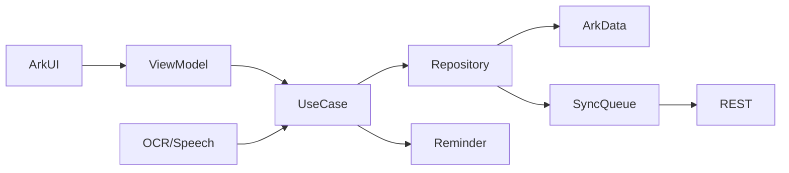

核心原则：

> UI 永远优先读取 Local Repository，不直接把远端 API 当页面数据源。

## 4.2 ArkData DatabaseManager

HarmonyOS 当前关系型数据库能力通过 ArkData `relationalStore` 提供。参考实现：

```ts
import { relationalStore } from '@kit.ArkData';
import { common } from '@kit.AbilityKit';

const DB_NAME = 'smart_expiry.db';
const DB_VERSION = 1;

export class DatabaseManager {
  private store?: relationalStore.RdbStore;

  async init(context: common.UIAbilityContext): Promise<void> {
    const config: relationalStore.StoreConfig = {
      name: DB_NAME,
      securityLevel: relationalStore.SecurityLevel.S1
    };
    this.store = await relationalStore.getRdbStore(context, config);
    await this.migrate();
  }

  getStore(): relationalStore.RdbStore {
    if (!this.store) {
      throw new Error('Database is not initialized');
    }
    return this.store;
  }

  private async migrate(): Promise<void> {
    const store = this.getStore();
    await store.executeSql(`
      CREATE TABLE IF NOT EXISTS app_meta (
        key TEXT PRIMARY KEY,
        value TEXT NOT NULL
      )
    `);
    // 读取 schema_version 并逐版本执行 Migration。
  }
}
```

实际 HarmonyOS SDK 的具体 StoreConfig 属性应以项目编译 API 版本为准。

## 4.3 客户端表

V1 建议至少：

```text
item
inventory_batch
reminder_setting
reminder_record
recognition_cache
suggestion_cache
sync_queue
app_meta
```

### item

```sql
CREATE TABLE IF NOT EXISTS item (
  id TEXT PRIMARY KEY,
  name TEXT NOT NULL,
  category_id TEXT NOT NULL,
  brand TEXT,
  barcode TEXT,
  lifecycle_status TEXT NOT NULL,
  source_type TEXT NOT NULL,
  version INTEGER NOT NULL DEFAULT 0,
  dirty INTEGER NOT NULL DEFAULT 1,
  deleted_at TEXT,
  created_at TEXT NOT NULL,
  updated_at TEXT NOT NULL
);
```

### inventory_batch

```sql
CREATE TABLE IF NOT EXISTS inventory_batch (
  id TEXT PRIMARY KEY,
  item_id TEXT NOT NULL,
  quantity REAL NOT NULL DEFAULT 1,
  unit TEXT,
  production_date TEXT,
  expiry_date TEXT,
  shelf_life_value INTEGER,
  shelf_life_unit TEXT,
  opened_date TEXT,
  after_open_value INTEGER,
  after_open_unit TEXT,
  location TEXT,
  version INTEGER NOT NULL DEFAULT 0,
  dirty INTEGER NOT NULL DEFAULT 1,
  updated_at TEXT NOT NULL
);
```

### sync_queue

```sql
CREATE TABLE IF NOT EXISTS sync_queue (
  id TEXT PRIMARY KEY,
  entity_type TEXT NOT NULL,
  entity_id TEXT NOT NULL,
  operation TEXT NOT NULL,
  entity_version INTEGER NOT NULL,
  payload TEXT NOT NULL,
  retry_count INTEGER NOT NULL DEFAULT 0,
  next_retry_at TEXT,
  status TEXT NOT NULL,
  created_at TEXT NOT NULL,
  updated_at TEXT NOT NULL
);
```

## 4.4 本地 Migration

禁止直接在 `EntryAbility` 里堆 `CREATE TABLE`。

推荐：

```text
database/
├── DatabaseManager.ets
├── Migration.ets
├── MigrationV1.ets
├── MigrationV2.ets
└── SchemaVersionDao.ets
```

接口：

```ts
export interface Migration {
  version: number;
  migrate(store: relationalStore.RdbStore): Promise<void>;
}
```

## 4.5 Domain Model 与 DB Entity 分离

不要让页面直接操作数据库行对象。

```ts
export interface Item {
  id: string;
  name: string;
  categoryId: string;
  lifecycleStatus: LifecycleStatus;
  sourceType: SourceType;
  version: number;
}

export interface ItemEntity {
  id: string;
  name: string;
  category_id: string;
  lifecycle_status: string;
  source_type: string;
  version: number;
  dirty: number;
}
```

通过 Mapper：

```ts
export class ItemMapper {
  static toDomain(entity: ItemEntity): Item {
    return {
      id: entity.id,
      name: entity.name,
      categoryId: entity.category_id,
      lifecycleStatus: entity.lifecycle_status as LifecycleStatus,
      sourceType: entity.source_type as SourceType,
      version: entity.version
    };
  }
}
```

## 4.6 ItemRepository

Domain：

```ts
export interface ItemRepository {
  create(item: Item, batch: InventoryBatch): Promise<void>;
  update(item: Item, batch: InventoryBatch): Promise<void>;
  softDelete(itemId: string): Promise<void>;
  getById(id: string): Promise<ItemAggregate | undefined>;
  query(query: ItemQuery): Promise<ItemAggregate[]>;
}
```

实现：

```text
LocalFirstItemRepository
  ├─ ItemDao
  ├─ BatchDao
  ├─ SyncQueueDao
  └─ Clock
```

### create 流程

```text
BEGIN LOCAL TRANSACTION
  insert item
  insert batch
  insert sync_queue(CREATE)
COMMIT

↓
UI 返回成功

↓
异步触发 SyncWorker
```

保存页面不能等待云端成功后才退出。

## 4.7 AddItemUseCase

```ts
export class AddItemUseCase {
  constructor(
    private readonly repository: ItemRepository,
    private readonly expiryService: ExpiryService,
    private readonly reminderManager: ReminderManager
  ) {}

  async execute(input: ConfirmedItemInput): Promise<string> {
    const aggregate = ItemFactory.fromConfirmedInput(input);

    this.expiryService.validateDates(aggregate.batch);

    await this.repository.create(aggregate.item, aggregate.batch);

    await this.reminderManager.rebuildFor(aggregate);

    return aggregate.item.id;
  }
}
```

## 4.8 ExpiryService

客户端和后端必须使用同一组 `expiry-test-cases.json`。

```ts
export class ExpiryService {
  effectiveExpireDate(batch: InventoryBatch): string | undefined {
    const dates: string[] = [];

    if (batch.expiryDate) {
      dates.push(batch.expiryDate);
    }

    if (batch.openedDate && batch.afterOpenValue && batch.afterOpenUnit) {
      dates.push(
        CalendarDate.plus(
          batch.openedDate,
          batch.afterOpenValue,
          batch.afterOpenUnit
        )
      );
    }

    return CalendarDate.min(dates);
  }

  calculateStatus(
    effectiveExpiry: string | undefined,
    reminderDays: number,
    today: string
  ): ExpiryStatus {
    if (!effectiveExpiry) return ExpiryStatus.UNKNOWN;

    const days = CalendarDate.daysBetween(today, effectiveExpiry);

    if (days < 0) return ExpiryStatus.EXPIRED;
    if (days <= reminderDays) return ExpiryStatus.NEAR_EXPIRY;
    return ExpiryStatus.NORMAL;
  }
}
```

`CalendarDate.plusMonths()` 必须按日历月实现。

## 4.9 首页数据

HomePage 不应向多个 API 连续发请求。

ViewModel：

```ts
export interface HomeUiState {
  loading: boolean;
  urgentItems: ItemCardModel[];
  expiredCount: number;
  nearExpiryCount: number;
  categorySummary: CategorySummary[];
  syncState: SyncState;
  error?: UiError;
}
```

V1 首屏优先从本地数据库聚合：

```text
ArkData
↓
ExpiryService
↓
HomeProjection
↓
HomeUiState
```

远端 Dashboard 主要用于账号/跨设备后的云端一致视图或数据补充。

## 4.10 Core Vision OCR Adapter

当前 HarmonyOS Core Vision 提供 `textRecognition` 能力。

封装接口：

```ts
export interface OcrService {
  recognize(pixelMap: PixelMap): Promise<OcrDocument>;
}
```

Adapter 示例：

```ts
import { textRecognition } from '@kit.CoreVisionKit';

export class HarmonyOcrService implements OcrService {
  private initialized = false;

  async init(): Promise<void> {
    if (this.initialized) return;

    const ok = await textRecognition.init();
    if (!ok) {
      throw new Error('OCR_INIT_FAILED');
    }
    this.initialized = true;
  }

  async recognize(pixelMap: PixelMap): Promise<OcrDocument> {
    await this.init();

    const result = await textRecognition.recognizeText({
      pixelMap: pixelMap
    });

    return OcrMapper.toDocument(result);
  }

  async release(): Promise<void> {
    if (!this.initialized) return;
    await textRecognition.release();
    this.initialized = false;
  }
}
```

> `VisionInfo` 的构造方式必须根据项目实际 HarmonyOS SDK 编译版本调整；Adapter 层负责吸收 SDK API 差异，Domain 不引用 Core Vision 类型。

OCR 原始结果建议统一转换：

```ts
export interface OcrDocument {
  fullText: string;
  blocks: OcrBlock[];
}

export interface OcrBlock {
  text: string;
  confidence?: number;
  bounds?: Rect;
}
```

## 4.11 OCR 使用策略

前端：

```text
Camera
↓
Image Quality Check
↓
Core Vision OCR
↓
OcrDocument
↓
本地 Rule Fast Parse
↓
若足够可信 → ItemDraft
否则 → POST /recognition/text
```

这样可以：

- 降低服务端图片上传。
- 保护家庭场景隐私。
- 降低 AI 成本。
- 无网时仍然可以进行基础识别。

## 4.12 Speech Adapter

统一接口：

```ts
export interface SpeechRecognitionService {
  start(listener: SpeechListener): Promise<void>;
  stop(): Promise<void>;
}

export interface SpeechListener {
  onPartial(text: string): void;
  onFinal(text: string): void;
  onError(code: string, message: string): void;
}
```

Core Speech Kit 的 SDK 对象只存在于 Adapter 内。

语音结果最终转换为普通文本：

```text
SpeechRecognizer
↓
ASR text
↓
RecognitionOrchestrator.parseText()
```

算法层不关心文本来自 OCR 还是 ASR。

## 4.13 RecognitionOrchestrator

```ts
export class RecognitionOrchestrator {
  constructor(
    private readonly localParser: LocalRecognitionParser,
    private readonly recognitionApi: RecognitionApi
  ) {}

  async recognizeText(text: string): Promise<ItemDraft> {
    const local = this.localParser.parse(text);

    if (local.overallConfidence >= 0.90 && local.hasCriticalDate()) {
      return local.toDraft();
    }

    return await this.recognitionApi.parseText({
      rawText: text,
      localCandidates: local.candidates
    });
  }
}
```

这里的 `0.90` 是初始策略值，需要算法 Benchmark 后配置化。

## 4.14 ItemConfirmPage

AI 结果不能直接落库存。

页面需要明确显示：

```text
物品名称
分类
生产日期
到期日期
保质期
数量

以及：
低置信度标识
冲突标识
字段来源
```

状态：

```ts
export interface ConfirmField<T> {
  value?: T;
  confidence: number;
  source: string;
  evidence?: string;
  warning?: string;
  userEdited: boolean;
}
```

一旦用户手工修改：

```text
source = MANUAL
confidence = 1.0
userEdited = true
```

后续模型结果不能覆盖。

## 4.15 ReminderPolicy

```ts
export interface ReminderPlan {
  itemId: string;
  batchId: string;
  triggerDate: string;
  reminderType: string;
  title: string;
  content: string;
}
```

策略：

```ts
export class ReminderPolicy {
  buildPlans(
    batch: InventoryBatch,
    config: ReminderSetting
  ): ReminderPlan[] {
    const expiry = this.expiryService.effectiveExpireDate(batch);
    if (!expiry) return [];

    return config.advanceDays
      .map(days => this.build(expiry, days, batch))
      .filter(plan => !CalendarDate.isPast(plan.triggerDate));
  }
}
```

## 4.16 ReminderScheduler

HarmonyOS 代理提醒由系统在应用后台或进程终止后代为执行；该能力存在开放能力申请和权限要求。

业务层接口：

```ts
export interface ReminderScheduler {
  schedule(plan: ReminderPlan): Promise<string>;
  cancel(systemReminderId: string): Promise<void>;
}
```

SDK Adapter：

```text
HarmonyReminderScheduler
↓
reminderAgentManager.publishReminder()
reminderAgentManager.cancelReminder()
```

不要在 Domain 中引用系统 ReminderRequest。

## 4.17 ReminderManager

```text
Item Create/Update
↓
Cancel old reminder records
↓
calculate effectiveExpireDate
↓
ReminderPolicy
↓
ReminderScheduler
↓
persist reminder_record
```

如果系统权限不可用：

```text
Local UI 显示提醒能力未开启
+
保留 ReminderPlan
+
允许用户重新授权
```

## 4.18 SyncQueue 状态机

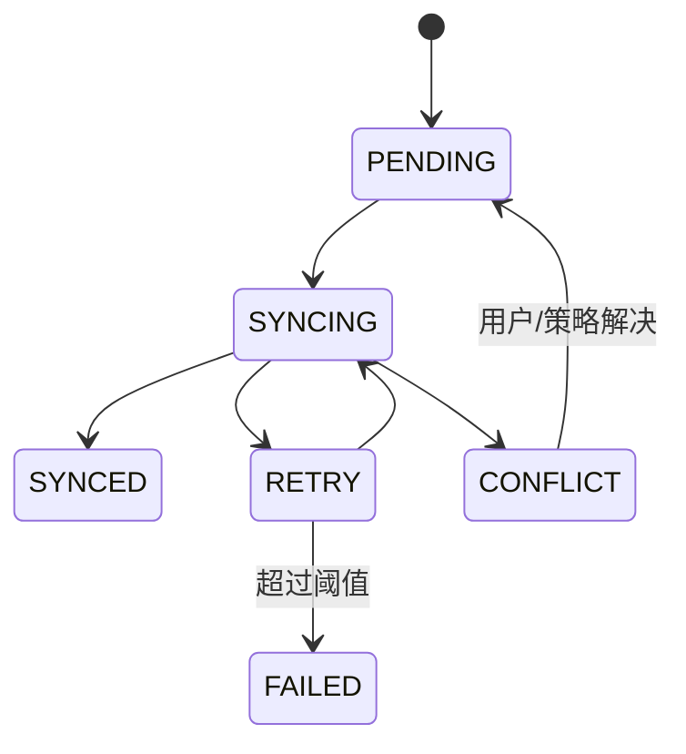

字段：

```text
id
entityType
entityId
operation
entityVersion
payload
status
retryCount
nextRetryAt
createdAt
updatedAt
```

## 4.19 SyncWorker

伪代码：

```ts
async runOnce(): Promise<void> {
  const batch = await queue.claimPending(50);

  if (batch.length === 0) return;

  try {
    const response = await api.push(batch);
    await applySyncResult(response);
  } catch (e) {
    await scheduleRetry(batch, Backoff.next(...));
  }
}
```

网络恢复后增加 Jitter：

```text
baseDelay + random(0, 300s)
```

避免大量设备同时同步。

## 4.20 前端错误层

统一错误类型：

```ts
export type AppError =
  | ValidationError
  | DatabaseError
  | NetworkError
  | SyncConflictError
  | RecognitionError
  | ReminderPermissionError
  | UnknownError;
```

页面不直接判断 HTTP 500/429 字符串。

## 4.21 前端必须测试

### Unit

- ExpiryService。
- Date Calendar。
- ReminderPolicy。
- Mapper。
- Repository transaction。
- Sync backoff。
- Recognition field state。

### Integration

- ArkData create/update/delete。
- Item + Batch + SyncQueue 原子写。
- 修改日期后 Reminder rebuild。
- 离线新增 → 网络恢复 → sync。
- 409 conflict。

### E2E

```text
拍照
→ OCR
→ ItemDraft
→ 用户确认
→ ArkData
→ 首页显示
→ 云同步
→ Reminder
→ Consume
```

---

# 5. 后端参考实现

## 5.1 包级架构

每个领域模块内部统一：

```text
module/
├── controller/
├── application/
│   ├── command/
│   ├── query/
│   └── dto/
├── domain/
│   ├── model/
│   ├── repository/
│   ├── service/
│   └── event/
└── infrastructure/
    ├── persistence/
    ├── mapper/
    └── adapter/
```

## 5.2 Controller 规则

Controller 只处理：

- HTTP。
- Bean Validation。
- Auth Context。
- DTO 转换。
- ApiResponse。

禁止：

- 写日期算法。
- 调 JPA Repository。
- 写 Prompt。
- 直接调用 AI Provider。
- 直接发送 Push。

## 5.3 Application Service

示例：

```java
@Service
@RequiredArgsConstructor
public class ItemApplicationService {

    private final ItemRepository itemRepository;
    private final InventoryBatchRepository batchRepository;
    private final SyncEventRepository syncEventRepository;

    @Transactional
    public ItemResponse create(CreateItemCommand command) {
        Item item = ItemFactory.create(command);
        InventoryBatch batch = BatchFactory.create(item.getId(), command);

        itemRepository.save(item);
        batchRepository.save(batch);

        syncEventRepository.append(
            SyncEvent.itemCreated(item, batch)
        );

        return ItemResponse.from(item, batch);
    }
}
```

## 5.4 JPA Entity 不等于 Domain Entity

推荐：

```text
Item          Domain
ItemJpaEntity Persistence
ItemMapper    Mapping
```

避免在 Domain 中出现：

```java
@Entity
@Column
JpaRepository
```

这样算法、测试和业务规则不依赖 ORM。

## 5.5 Flyway

推荐起始：

```text
V1__init_core.sql
V2__recognition.sql
V3__sync.sql
V4__notification_outbox.sql
V5__indexes.sql
```

开发环境也走 Flyway，不使用 `ddl-auto=update`。

## 5.6 API Response

```java
public record ApiResponse<T>(
    int code,
    String message,
    T data,
    String traceId
) {}
```

错误：

```json
{
  "code": 400003,
  "message": "DATE_CONFLICT",
  "data": {
    "recognizedExpiryDate": "2026-10-31",
    "calculatedExpiryDate": "2026-10-30"
  },
  "traceId": "..."
}
```

## 5.7 CreateItemRequest

```java
public record CreateItemRequest(
    @NotBlank String name,
    @NotBlank String categoryId,
    String brand,
    BigDecimal quantity,
    String unit,
    LocalDate productionDate,
    LocalDate expiryDate,
    Integer shelfLifeValue,
    ShelfLifeUnit shelfLifeUnit,
    LocalDate openedDate,
    Integer afterOpenValue,
    ShelfLifeUnit afterOpenUnit,
    String location,
    SourceType sourceType,
    String requestId
) {}
```

## 5.8 服务端 ExpiryDomainService

```java
@Component
public class ExpiryDomainService {

    public Optional<LocalDate> effectiveExpiry(InventoryBatch batch) {
        List<LocalDate> dates = new ArrayList<>();

        if (batch.expiryDate() != null) {
            dates.add(batch.expiryDate());
        }

        if (batch.openedDate() != null
                && batch.afterOpenValue() != null
                && batch.afterOpenUnit() != null) {
            dates.add(addCalendarDuration(
                batch.openedDate(),
                batch.afterOpenValue(),
                batch.afterOpenUnit()
            ));
        }

        return dates.stream().min(LocalDate::compareTo);
    }

    public ExpiryStatus status(
        LocalDate expiry,
        int reminderDays,
        LocalDate today
    ) {
        long days = ChronoUnit.DAYS.between(today, expiry);
        if (days < 0) return ExpiryStatus.EXPIRED;
        if (days <= reminderDays) return ExpiryStatus.NEAR_EXPIRY;
        return ExpiryStatus.NORMAL;
    }
}
```

## 5.9 expiry-test-cases.json

由三团队共用：

```json
[
  {
    "id": "near-expiry-001",
    "today": "2026-10-01",
    "expiry": "2026-10-05",
    "reminderDays": 7,
    "expected": "NEAR_EXPIRY"
  },
  {
    "id": "expired-001",
    "today": "2026-10-03",
    "expiry": "2026-10-02",
    "reminderDays": 7,
    "expected": "EXPIRED"
  }
]
```

每次规则变更：

```text
先改测试集
↓
ArkTS Test
↓
Java Test
↓
全部通过后合并
```

## 5.10 GET /items

后端 Query Service 不应该加载全部记录后在 Java 内存过滤。

推荐 SQL 维度：

```text
user_id
lifecycle_status
category_id
expiry_date
updated_at
```

必须分页。

## 5.11 Dashboard

```java
public record DashboardResponse(
    long activeCount,
    long nearExpiryCount,
    long expiredCount,
    List<UrgentItemResponse> urgentItems,
    List<CategorySummary> categorySummary
) {}
```

实现：

```text
DashboardController
↓
DashboardQueryService
↓
Redis Cache
  HIT → Response
  MISS → Repository Projection → Cache
```

修改 Item/Batch/Consumption 后失效用户 Dashboard Key。

## 5.12 Sync Push API

请求：

```json
{
  "deviceId": "device-01",
  "events": [
    {
      "requestId": "uuid",
      "entityType": "ITEM",
      "entityId": "uuid",
      "operation": "UPDATE",
      "baseVersion": 4,
      "payload": {}
    }
  ]
}
```

响应：

```json
{
  "accepted": [
    {
      "requestId": "uuid",
      "entityId": "uuid",
      "newVersion": 5
    }
  ],
  "conflicts": []
}
```

## 5.13 Sync 幂等

数据库需要保存 requestId 或 sync event id。

同一个 requestId 重复到达：

```text
不重复执行业务写
↓
返回第一次成功结果
```

## 5.14 Version Conflict

```java
if (command.baseVersion() != entity.version()) {
    throw new SyncConflictException(
        entity.toSnapshot()
    );
}
```

V1 不做自动字段级 CRDT 合并。

返回服务器最新状态，让客户端决定。

## 5.15 Recognition API

### POST `/api/v1/recognition/text`

```json
{
  "inputType": "OCR_TEXT",
  "rawText": "生产日期 2026.10.02 保质期28天 纯牛奶",
  "locale": "zh-CN",
  "localCandidates": []
}
```

响应：

```json
{
  "code": 0,
  "data": {
    "draft": {},
    "warnings": [],
    "algorithmVersion": "recognition-v1.0.0",
    "promptVersion": "recognition-prompt-v1"
  }
}
```

## 5.16 RecognitionApplicationService

```java
@Service
@RequiredArgsConstructor
public class RecognitionApplicationService {

    private final TextNormalizer normalizer;
    private final RecognitionRuleEngine ruleEngine;
    private final AiRecognitionParser aiParser;
    private final ConfidenceFusionService fusionService;
    private final RecognitionValidator validator;
    private final RecognitionRecordRepository recordRepository;

    public ItemDraft recognize(RecognitionRequest request) {
        String normalized = normalizer.normalize(request.rawText());

        RuleRecognitionResult rule =
            ruleEngine.parse(normalized, request.locale());

        AiRecognitionResult ai =
            shouldCallAi(rule)
                ? aiParser.parse(normalized, rule)
                : AiRecognitionResult.empty();

        ItemDraft draft = fusionService.fuse(rule, ai);

        RecognitionValidation validation =
            validator.validate(draft);

        ItemDraft finalDraft =
            draft.withValidation(validation);

        recordRepository.save(
            RecognitionRecord.from(
                request,
                finalDraft
            )
        );

        return finalDraft;
    }
}
```

## 5.17 AI Gateway

```java
public interface AiModelGateway {

    <T> AiResult<T> structuredGenerate(
        AiRequest request,
        Class<T> responseType
    );
}
```

返回值必须包含：

```java
public record AiResult<T>(
    T value,
    String provider,
    String model,
    String promptVersion,
    long latencyMs,
    TokenUsage tokenUsage
) {}
```

算法逻辑不能直接依赖某家模型 SDK。

## 5.18 Spring AI Adapter

如果使用 Spring AI，Adapter 可以将目标 Java Record 映射为 structured output。

但必须再执行：

```text
JSON Schema validation
+
Business validation
+
Date deterministic recalculation
```

模型“能输出 JSON”不等于业务值可信。

## 5.19 Recognition Record

建议至少：

```text
id
user_id
input_type
provider
model
prompt_version
algorithm_version
raw_text_hash
structured_result
overall_confidence
status
processing_ms
created_at
```

原始 OCR 文本是否持久化遵循隐私策略；可用 hash 和脱敏摘要替代。

## 5.20 SuggestionApplicationService

流程：

```text
Inventory
+
Expiry
+
Category
+
Preference
↓
SafetyRuleEngine
↓
SuggestionContext
↓
PromptBuilder
↓
AiModelGateway
↓
SuggestionValidator
↓
Suggestion
```

食品过期等安全边界必须在 `SafetyRuleEngine` 先做裁决。

## 5.21 Outbox

业务事务：

```java
@Transactional
public void completeRecognition(...) {
    recognitionRepository.save(...);
    outboxRepository.append(
        OutboxEvent.aiCompleted(...)
    );
}
```

事务内不发送外部 Push。

## 5.22 Push Worker

```text
outbox_event
↓
OutboxDispatcher
↓
Redis Stream
↓
PushWorker
↓
PushProvider
```

Push Provider 失败不会回滚 Item 业务事务。

## 5.23 Redis 使用清单

允许：

```text
dashboard cache
rate limit
token/session（未来）
Redis Stream
short-lived distributed lock
```

禁止：

```text
Item 主真值
Batch 主真值
唯一不可恢复的 Push Task
```

## 5.24 后端线程/资源隔离

独立：

```text
HTTP request
AI calls
Push worker
Object storage
Scheduled job
```

AI Provider 慢不能占满核心业务线程。

## 5.25 Observability

必须打：

```text
http.server.requests
recognition.duration
recognition.success
recognition.low_confidence
ai.provider.latency
ai.provider.error
sync.conflict
outbox.pending
push.queue.lag
push.success
push.failure
```

高基数字段 `userId/itemId` 不作为 Prometheus Tag。

## 5.26 后端测试

### Unit

- Domain。
- Recognition Rule。
- Validator。
- Expiry。
- Sync version。
- Backoff。

### Integration

建议 PostgreSQL/Redis 使用真实兼容环境或容器化测试，而不是所有测试都用 H2 替代 PostgreSQL。

### API

- OpenAPI Schema。
- Validation。
- Error code。
- 409。
- Idempotency。

### Performance

- CRUD。
- Dashboard。
- Sync。
- Recognition Mock AI。
- Push Worker。

---

# 6. 算法团队参考实现

## 6.1 Recognition Pipeline

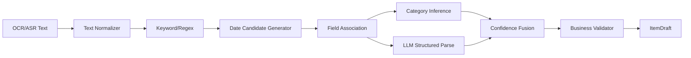

原则：

> 规则能确定的字段优先使用规则；LLM 用于歧义消解、字段归属和自然语言理解，不做关键日期算术真值来源。

## 6.2 Text Normalizer

输入可能：

```text
生产曰期:2026.IO.O2
保质期 28天
EXP 2026/10/30
```

Normalizer 负责：

- Unicode normalize。
- 全角半角统一。
- 常用 OCR 混淆字符修正。
- 连续空格。
- 标点统一。
- 换行保留。
- 不随意删除原始字符。

输出同时保留：

```python
NormalizedText(
    raw_text=...,
    normalized_text=...,
    normalization_steps=[...]
)
```

关键证据要能映射回 raw text。

## 6.3 关键词词典

`date-keywords.yaml`：

```yaml
production:
  zh:
    - 生产日期
    - 制造日期
    - 生产日
  en:
    - MFG
    - MFD
    - MANUFACTURED

expiry:
  zh:
    - 有效期至
    - 保质期至
    - 到期日
  en:
    - EXP
    - EXPIRY
    - USE BY
    - BEST BEFORE

shelf_life:
  zh:
    - 保质期
  en:
    - SHELF LIFE
```

词典版本：

```text
date-keywords-v1.0.0
```

## 6.4 日期格式候选

支持：

```text
YYYY-MM-DD
YYYY/MM/DD
YYYY.MM.DD
YYYYMMDD
YYYY年MM月DD日
YY-MM-DD（需要额外歧义策略）
```

Regex 只负责产生 Candidate，不直接宣布字段语义。

```python
@dataclass
class DateCandidate:
    value: date
    raw_text: str
    start: int
    end: int
    format_type: str
    parse_confidence: float
```

## 6.5 日期语义关联

假设：

```text
生产日期 2026-10-02
保质期28天
EXP 2026-10-30
```

算法根据关键词距离：

```text
keyword
↔
date candidate
```

计算 association score。

参考：

```text
score =
  keywordTypeWeight
  × distanceDecay
  × sameLineWeight
  × formatConfidence
```

例如：

```python
distance_decay = exp(-char_distance / 40.0)
```

具体参数必须通过 Benchmark 调整，不作为固定业务常数。

## 6.6 Shelf-Life Parser

候选：

```text
28天
6个月
12M
1年
```

输出：

```json
{
  "value": 28,
  "unit": "DAY",
  "confidence": 0.97,
  "evidence": "保质期28天"
}
```

`12M` 在不同包装上下文可能有歧义：

- Shelf Life 12 months。
- PAO 开封后 12M。

需结合：

```text
开封后
PAO 图标/上下文
保质期关键词
```

分类。

## 6.7 确定性 Expiry Calculator

算法团队必须提供和 Java/ArkTS 一致的参考测试。

规则：

```text
productionDate + shelfLife
= calculatedExpiryDate
```

日：

```text
plusDays(N)
```

月：

```text
plusMonths(N)
```

年：

```text
plusYears(N)
```

禁止：

```text
MONTH => N * 30 days
YEAR => N * 365 days
```

## 6.8 日期冲突

当同时识别：

```text
production = 2026-10-02
shelfLife = 28 DAY
recognizedExpiry = 2026-10-31
```

确定性：

```text
calculated = 2026-10-30
```

若差值超过配置阈值：

```text
DATE_CONFLICT
```

算法不能“猜一个更可能正确的然后静默覆盖”。

输出：

```json
{
  "code": "DATE_CONFLICT",
  "candidates": {
    "recognizedExpiry": "2026-10-31",
    "calculatedExpiry": "2026-10-30"
  },
  "requiresConfirmation": true
}
```

## 6.9 产品名称提取

优先级：

1. 包装主标题 OCR block。
2. 品牌/品类规则。
3. LLM 字段归属。
4. 用户确认。

算法输出不应把“生产日期”“净含量”等字段误当名称。

## 6.10 Category Inference

V1 分类：

```text
FOOD
COSMETICS
PET_FOOD
OTHER
```

推荐混合策略：

```text
barcode metadata（未来）
+
keyword rule
+
product-name dictionary
+
LLM
```

规则命中高置信：

```text
猫粮/犬粮 → PET_FOOD
面霜/精华/口红 → COSMETICS
```

歧义才调用模型。

## 6.11 LLM 输入

不直接把整张家庭照片作为默认云端输入。

优先：

```text
normalized OCR text
+
rule candidates
+
locale
+
strict schema
```

示例：

```json
{
  "text": "...",
  "candidates": {
    "dates": [],
    "shelfLife": []
  },
  "task": "Associate fields only. Do not perform date arithmetic."
}
```

## 6.12 LLM Structured Output

Java Record 参考：

```java
public record AiRecognitionResult(
    FieldValue<String> productName,
    FieldValue<String> category,
    FieldValue<LocalDate> productionDate,
    FieldValue<LocalDate> recognizedExpiryDate,
    ShelfLifeValue shelfLife,
    List<String> warnings
) {}
```

Schema 约束：

- 禁止额外未知字段。
- Date 必须 `YYYY-MM-DD`。
- category 为 enum。
- confidence 0~1。
- evidence 长度限制。
- 找不到就 `null`，禁止编造。

## 6.13 LLM Prompt 原则

System Prompt 包含：

```text
角色
允许做什么
禁止做什么
字段定义
Schema
日期字段关联规则
禁止日期算术
未知字段返回 null
证据必须来自输入
```

Prompt 必须版本化。

禁止：

```text
Controller 中拼 Prompt
数据库里无版本地覆盖 Prompt
```

## 6.14 Confidence Fusion

每个字段有多来源：

```text
OCR confidence
Rule confidence
LLM confidence
Consistency confidence
```

初始参考：

```text
C =
w_rule * C_rule
+
w_llm * C_llm
+
w_ocr * C_ocr
+
w_consistency * C_consistency
```

再限制到 `[0,1]`。

关键日期建议给确定性规则更高权重。

例如只作为初始实验参数：

```text
rule        0.40
llm         0.20
ocr         0.15
consistency 0.25
```

这些不是产品硬编码，应由 Benchmark 重新拟合/调参。

## 6.15 Consistency Confidence

示例：

```text
production + shelfLife == expiry
→ consistency high

expiry < production
→ 0 + hard warning

日期远离所有关键词
→ lower confidence
```

## 6.16 ItemDraft 判定

参考：

```text
>= 0.90
自动填入，但关键日期仍展示来源

0.60 ~ 0.90
重点确认

< 0.60
不作为可靠值，要求用户补充
```

对日期字段可以比名称更严格。

## 6.17 RecognitionValidator

Validator 不是 LLM。

硬规则：

```text
productionDate <= today + tolerance
expiryDate >= productionDate
quantity >= 0
shelfLifeValue > 0
DATE_CONFLICT
required field
enum
schema
```

注意：是否允许未来生产日期等业务规则由产品确认，不能算法团队自行假定。

## 6.18 Suggestion Engine

算法输出必须在安全规则之后。

```text
Inventory Context
↓
SafetyRuleEngine
↓
AllowedSuggestionIntent
↓
LLM
↓
PostValidator
```

食品已过期时：

```text
SafetyRuleEngine
→ 禁止生成鼓励食用的不确定性建议
```

LLM 负责语言表达，不覆盖安全规则。

## 6.19 Suggestion Context 最小化

发送模型：

```text
物品类别
名称
剩余天数
数量
必要用户偏好
可组合库存摘要
```

不要默认发送：

```text
完整用户历史
原始家庭照片
无关敏感信息
```

## 6.20 Benchmark Manifest

`manifest.jsonl`：

```json
{"id":"img-0001","image":"images/0001.jpg","category":"FOOD","difficulty":["REFLECTION","MULTI_DATE"],"language":["zh"],"expected":"expected/0001.json"}
```

Expected：

```json
{
  "productName": "纯牛奶",
  "category": "FOOD",
  "productionDate": "2026-10-02",
  "expiryDate": "2026-10-30",
  "shelfLife": {
    "value": 28,
    "unit": "DAY"
  }
}
```

## 6.21 Benchmark 分层

500~1000 张起步，至少分：

```text
FOOD
COSMETICS
PET_FOOD

×
clear
reflection
blur
small-font
inkjet
multi-date
mixed-language
rotation
```

## 6.22 指标

### Field Accuracy

```text
name exact/normalized accuracy
category accuracy
production date accuracy
expiry date accuracy
shelf-life value/unit accuracy
```

### E2E Success

只有关键字段全部满足才成功：

```text
name acceptable
AND
category correct
AND
critical date correct
```

### Confirmation Rate

```text
需要人工确认样本 / 总样本
```

不能只追求“自动填得多”，而牺牲关键日期正确性。

## 6.23 Failure Taxonomy

每个失败必须标注：

```text
OCR_MISS
OCR_CONFUSION
DATE_FORMAT
DATE_ASSOCIATION
SHELF_LIFE_PARSE
CATEGORY
LLM_HALLUCINATION
SCHEMA_INVALID
DATE_CONFLICT
BUSINESS_VALIDATION
```

这样才能知道该改 OCR、规则、Prompt 还是业务策略。

## 6.24 Prompt 回归

任何 Prompt 更新：

```text
old prompt
vs
new prompt
↓
同一 Benchmark
↓
Field Metrics
E2E
Latency
Token
Cost
Failure Type
```

不允许只凭几十个肉眼样例上线。

## 6.25 算法版本

每次在线结果记录：

```text
algorithmVersion
ruleVersion
promptVersion
model
provider
```

最终可以定位：

> 哪个版本造成哪批识别退化。

---

# 7. 三条核心业务链路的跨团队实现

## 7.1 手动新增

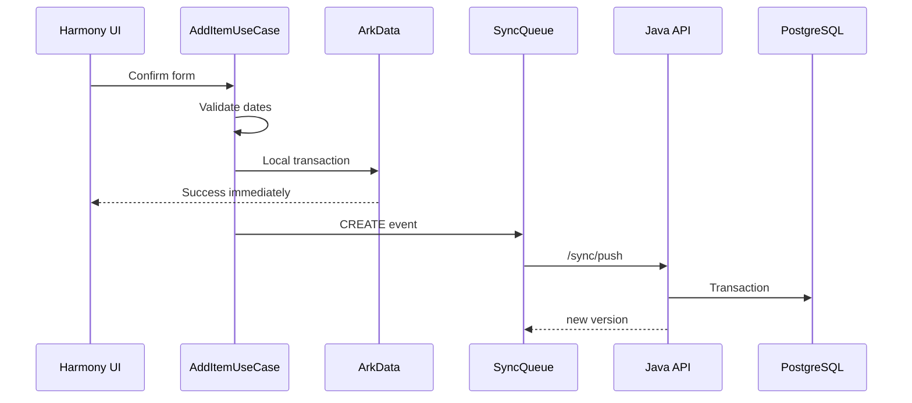

前端 Gate：

- 本地保存成功即 UI 成功。
- 网络失败不回滚用户本地数据。

后端 Gate：

- requestId 幂等。
- version 正确。

## 7.2 拍照识别

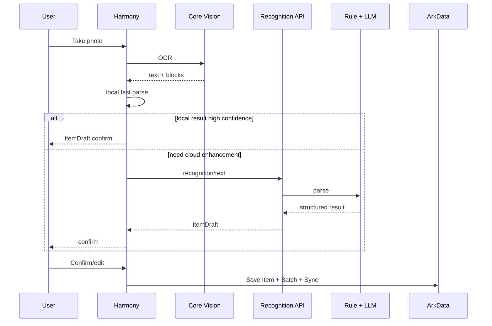

## 7.3 语音新增

```text
User
↓
Core Speech
↓
ASR text
↓
RecognitionOrchestrator
↓
Recognition/text API
↓
ItemDraft
↓
Confirm
↓
Local Save
```

语音和 OCR 在 `Recognition/text` 以后共享同一算法。

---

# 8. OpenAPI 与 Contract First

## 8.1 原则

跨团队开发顺序：

```text
需求/规则
↓
OpenAPI + JSON Schema
↓
Mock
↓
前后端并行
↓
Contract Test
↓
联调
```

禁止：

> 后端写完 Controller 后再口头告诉前端字段。

## 8.2 API 最小集合

```text
POST   /api/v1/items
GET    /api/v1/items
GET    /api/v1/items/{id}
PATCH  /api/v1/items/{id}
DELETE /api/v1/items/{id}

POST   /api/v1/items/{id}/consume
POST   /api/v1/items/{id}/discard

GET    /api/v1/dashboard

POST   /api/v1/recognition/text
POST   /api/v1/recognition/image   optional

POST   /api/v1/suggestions

POST   /api/v1/sync/push
GET    /api/v1/sync/pull

GET    /api/v1/preferences
PUT    /api/v1/preferences
```

## 8.3 OpenAPI CI

PR 检查：

```text
openapi syntax
breaking change
generated client compile
example validation
```

Unknown enum：

前端必须 FALLBACK。

---

# 9. Local-First 与同步的完整实现

## 9.1 写路径

```text
UI
↓
Local Transaction
  ├─ Entity
  └─ SyncQueue
↓
UI success
↓
Background Sync
```

## 9.2 读路径

```text
Page
↓
Local Repository
↓
ArkData
```

不是：

```text
Page
↓
HTTP
↓
Loading
↓
Server
```

## 9.3 Sync Event

```json
{
  "id": "event-uuid",
  "requestId": "uuid",
  "entityType": "ITEM",
  "entityId": "item-uuid",
  "operation": "UPDATE",
  "baseVersion": 3,
  "payload": {},
  "createdAt": "..."
}
```

## 9.4 Conflict

服务端：

```text
client baseVersion = 3
server version = 5
↓
409 SYNC_CONFLICT
```

前端保存：

```text
Local Draft
+
Server Latest
```

V1 UI 可以：

```text
使用云端版本
保留本地修改重新提交
```

不静默覆盖。

## 9.5 Delete

使用软删除：

```text
deletedAt
```

客户端删除同样产生 Sync Event。

---

# 10. Reminder 与 Push 的团队实现边界

## 10.1 Local Reminder

负责：

```text
7/3/1 日
30/7/1 日
PAO
到期日
```

归前端。

## 10.2 Server Push

负责：

```text
家庭共享
跨设备事件
AI 异步完成
账号安全
运营
本地提醒可选兜底
```

归后端。

## 10.3 Push 聚合

一个用户多个临期物品不建议发 10 条运营式 Push。

聚合：

```text
今天有 5 件物品需要关注
```

再 Deep Link 到列表。

## 10.4 幂等

```text
userId:itemId:date:messageType
```

DB Unique。

---

# 11. 性能实现责任

## 11.1 前端

- 首页避免一次加载几千行。
- ArkData 查询分页。
- 大量数据库操作放适当异步任务。
- 图片压缩/质量检测后 OCR。
- Sync batch。
- Jitter。
- UI 不等待云同步。

HarmonyOS 当前 ArkData 文档对大数据量查询建议分批，单次查询数据量不超过约 5000 条，并建议在合适的并发任务中执行。项目本身应使用更小的 UI 分页。

## 11.2 后端

- Stateless。
- HikariCP。
- PostgreSQL 索引。
- Dashboard Redis。
- Recognition 限流。
- AI Bulkhead。
- Push Worker。
- k6。
- Actuator/Prometheus。

## 11.3 算法

算法性能指标也必须测：

```text
normalizer ms
rule parser ms
LLM latency
E2E recognition latency
token/image cost
```

算法不能只提交 Accuracy。

---

# 12. 安全与隐私实现

## 12.1 图片

默认：

```text
Device Photo
↓
On-device OCR
↓
Text
```

仅业务必要且用户允许时上传原图。

## 12.2 日志

禁止：

```text
Token
Password
完整家庭照片
完整敏感 OCR 文本
过敏信息全文
```

可以：

```text
traceId
entityId
operation
errorCode
latency
provider
model
promptVersion
```

## 12.3 Push Payload

不放敏感库存详情。

通知点击后由 App 按授权加载数据。

---

# 13. 三团队测试体系

## 13.1 测试金字塔

```text
E2E
↑
Contract / Integration
↑
Unit
```

## 13.2 前端测试表

| 模块 | 必测 |
|---|---|
| Expiry | 跨月/跨年/闰年/今天到期/昨天过期 |
| Repository | local transaction |
| Sync | retry/idempotency/conflict |
| OCR Adapter | success/timeout/error |
| Reminder | schedule/cancel/rebuild |
| UI | low confidence/date conflict/offline |

## 13.3 后端测试表

| 模块 | 必测 |
|---|---|
| Item | CRUD/version/soft delete |
| Batch | date validation |
| Sync | duplicate/409 |
| Recognition | rule/AI timeout/schema invalid |
| Suggestion | safety rule |
| Outbox | transaction/retry |
| Push | retry/idempotency/DLQ |
| Dashboard | cache invalidation |

## 13.4 算法测试表

| 模块 | 必测 |
|---|---|
| Normalize | OCR confusion |
| Date Regex | all supported formats |
| Association | multiple dates |
| Shelf Life | DAY/MONTH/YEAR/PAO |
| LLM | schema/null/hallucination |
| Fusion | source disagreement |
| Validator | conflict/invalid chronology |
| Benchmark | regression |

---

# 14. CI/CD 分工

## 14.1 Harmony CI

```text
compile
lint
unit test
shared expiry test
OpenAPI client compile
```

## 14.2 Backend CI

```text
mvn test
architecture test
PostgreSQL integration test
Flyway migrate
OpenAPI validation
shared expiry test
recognition contract test
```

## 14.3 Algorithm CI

```text
schema validation
rule unit tests
benchmark smoke subset
prompt format check
evaluation report
```

完整 500~1000 图片 Benchmark 可以：

```text
PR smoke
Nightly full
Release full
```

---

# 15. M1~M6 三团队并行实施计划

## M1：基础数据链路

目标：

```text
手动新增
→ ArkData
→ Sync
→ PostgreSQL
→ 查询回显
```

### 前端

- App skeleton。
- ArkData Migration。
- Item/Batch Entity。
- Local Repository。
- AddItemPage。
- SyncQueue 最小实现。
- REST Client。

### 后端

- Spring Boot skeleton。
- Flyway。
- Item/Batch Domain。
- CRUD API。
- Sync Push 最小接口。
- OpenAPI。

### 算法

- 暂不阻塞 M1。
- 定义 `recognition-schema.json` 草案。
- 建立 Benchmark 目录。

### M1 Gate

```text
离线新增成功
网络恢复自动同步
服务端能查询
重复同步不重复创建
```

---

## M2：生命周期与 Dashboard

### 前端

- ExpiryService ArkTS。
- 首页临期排序。
- Consume/Discard。
- shared expiry test。

### 后端

- ExpiryDomainService。
- ConsumptionRecord。
- Dashboard。
- shared expiry test。

### 算法

- 日期测试集协助扩展。
- 多日期/保质期规则定义。

### Gate

ArkTS 与 Java 对同一 `expiry-test-cases.json` 结果 100% 一致。

---

## M3：提醒

### 前端

- ReminderPolicy。
- ReminderScheduler Adapter。
- Permission UX。
- rebuild。
- reminder_record。

### 后端

- ReminderSetting 同步。
- 可选服务端 reminder metadata。
- 不负责替代本地核心提醒。

### 算法

- 无核心在线依赖。

### Gate

应用退出/离线情况下，已成功注册的提醒仍可按目标平台能力工作。

---

## M4：拍照 OCR + 规则识别

### 前端

- Camera。
- Core Vision Adapter。
- OcrDocument。
- RecognitionPage。
- ConfirmPage。

### 后端

- `/recognition/text`。
- RecognitionRecord。
- TextNormalizer。
- Rule Engine runtime。

### 算法

- date-keywords。
- regex。
- shelf-life parser。
- field association。
- first Benchmark 200+。

### Gate

```text
拍照
→ OCR
→ 日期解析
→ ItemDraft
→ 确认
→ 保存
```

不要求 LLM 才能跑通。

---

## M5：LLM + 语音

### 前端

- Speech Adapter。
- Voice UI。
- LLM 结果确认状态。

### 后端

- AiModelGateway。
- Provider Adapter。
- structured output。
- timeout/bulkhead/rate limit。

### 算法

- Prompt V1。
- Schema V1。
- Confidence Fusion。
- Validator。
- Benchmark 500~1000。

### Gate

- 模型失败可降级。
- Schema 错误不会进入正式数据。
- 低置信度不会自动保存。
- DATE_CONFLICT 强制确认。

---

## M6：Suggestion + 统计 + 生产化

### 前端

- Suggestion UI。
- Statistics。
- Push deeplink。
- 体验优化。

### 后端

- SuggestionEngine。
- SafetyRule。
- Redis Dashboard。
- Outbox。
- Push Worker。
- Metrics。
- k6。

### 算法

- category prompts。
- safety rules。
- suggestion evaluation。
- error analysis。

### Gate

完整闭环：

```text
录入
→ 到期状态
→ 提醒
→ 建议
→ 消耗/丢弃
→ 统计
```

---

# 16. Contract Freeze

避免三团队并行时不断互相阻塞，设置以下冻结点。

## CF-1 Domain Contract

冻结：

```text
Item
Batch
LifecycleStatus
ExpiryStatus
ShelfLifeUnit
SourceType
```

完成后任何变更走 ADR/Schema Change。

## CF-2 REST Contract

冻结：

```text
items
recognition
sync
```

前端开始生成/实现 Client。

## CF-3 Recognition Contract

冻结：

```text
ItemDraft
FieldValue
warnings
confidence
source
algorithmVersion
promptVersion
```

算法和前端可独立开发。

## CF-4 Reminder Contract

冻结：

```text
ReminderSetting
ReminderPlan
ReminderRecord
```

## CF-5 Push Contract

冻结：

```text
messageType
payload
deeplink
idempotency
```

---

# 17. 联调环境与 Mock

## 17.1 前端不等后端

后端提供 OpenAPI 后立即提供 Mock Server。

前端使用：

```text
MockRemoteDataSource
RealRemoteDataSource
```

通过 build profile 切换。

## 17.2 后端不等真实 AI

```java
public class MockAiModelGateway
    implements AiModelGateway {
}
```

支持：

```text
success
500ms
timeout
429
invalid schema
```

## 17.3 算法不等 App

算法工具输入：

```text
OCR text fixture
```

直接测试 Recognition Pipeline。

---

# 18. 关键状态机

## 18.1 Item

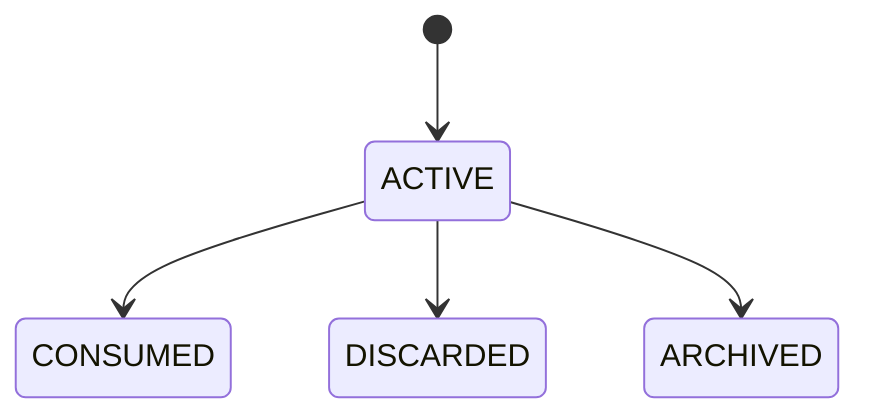

## 18.2 Recognition

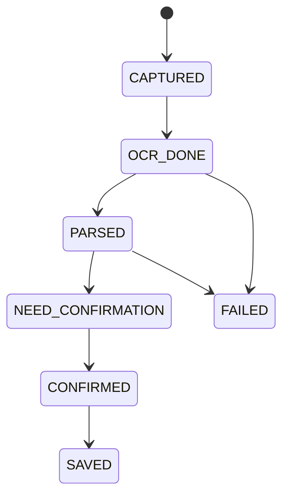

## 18.3 Sync

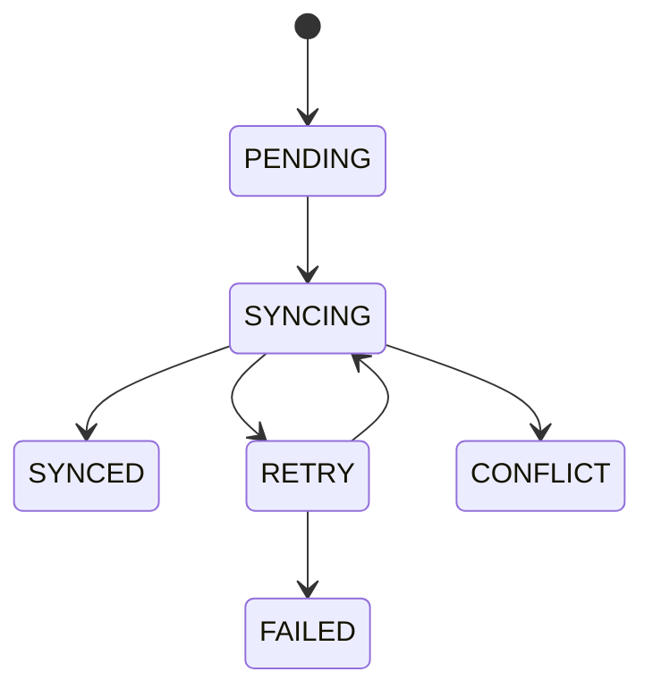

## 18.4 Push

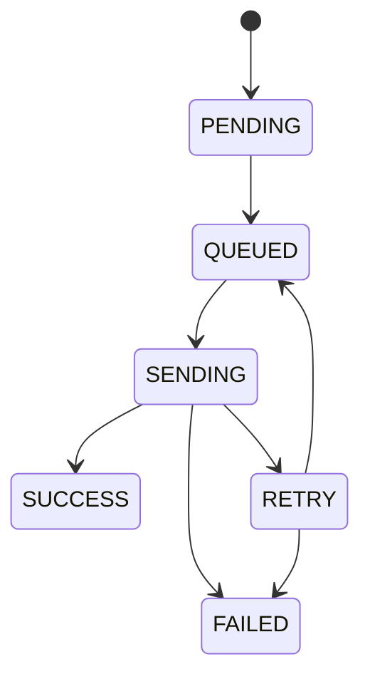

---

# 19. Definition of Done：前端

一个前端 Feature 完成必须：

- UI 正常态。
- Loading。
- Empty。
- Offline。
- Permission denied。
- API error。
- 本地 DB error。
- 单元测试。
- 埋点/日志。
- 不泄露敏感信息。
- OpenAPI 对齐。
- Local-First 行为符合规范。
- 需要提醒的变更能够 rebuild。
- 需要同步的写操作一定产生 sync_queue。

---

# 20. Definition of Done：后端

- Controller 无业务算法。
- Application Service 有明确事务。
- Domain 无 JPA/HTTP Provider 依赖。
- Migration。
- OpenAPI。
- Bean Validation。
- Error Code。
- Unit Test。
- Integration Test。
- Metrics。
- TraceId。
- 幂等。
- 权限/用户隔离。
- 不记录敏感内容。
- 外部 AI/Push 有 timeout。
- 异步副作用使用 Outbox 时符合设计。
- 性能关键 SQL 有索引/Explain 验证。

---

# 21. Definition of Done：算法

- Schema 已更新。
- Rule version。
- Prompt version。
- Benchmark 跑完。
- Field Metrics。
- E2E Success。
- Latency。
- Cost。
- Failure Taxonomy。
- 新旧版本对比。
- 关键日期无 LLM 算术。
- 低置信策略。
- DATE_CONFLICT。
- 未知值不编造。
- Evidence 可追踪。
- 发布版本已同步后端配置。

---

# 22. 推荐第一批开发 Ticket

## 前端

```text
FE-001 ArkData DatabaseManager
FE-002 Item/Batch Schema
FE-003 ItemDao/BatchDao
FE-004 LocalFirstItemRepository
FE-005 AddItem manual UI
FE-006 ExpiryService
FE-007 Home projection
FE-008 SyncQueue
FE-009 SyncWorker
FE-010 OCR Adapter
FE-011 Recognition Confirm UI
FE-012 Reminder Adapter
FE-013 Speech Adapter
```

## 后端

```text
BE-001 Spring Boot skeleton
BE-002 Flyway V1
BE-003 Item Domain
BE-004 Batch Domain
BE-005 Item CRUD API
BE-006 Sync API
BE-007 ExpiryDomainService
BE-008 Dashboard
BE-009 Recognition API
BE-010 AiModelGateway
BE-011 Suggestion
BE-012 Redis Cache
BE-013 Outbox
BE-014 Push Worker
BE-015 Metrics/Actuator
BE-016 k6
```

## 算法

```text
ALG-001 Recognition Schema
ALG-002 TextNormalizer
ALG-003 Date Keyword Dictionary
ALG-004 Date Regex
ALG-005 ShelfLife Parser
ALG-006 Date Association
ALG-007 Category Rules
ALG-008 LLM Prompt V1
ALG-009 Confidence Fusion
ALG-010 RecognitionValidator
ALG-011 Benchmark 200
ALG-012 Benchmark 500~1000
ALG-013 Suggestion Safety Rules
ALG-014 Evaluation Tool
```

---

# 23. 每周协作机制

## 周一 Contract Review

只讨论：

```text
Schema
OpenAPI
Domain Rule
Algorithm Contract
Breaking Change
```

## 周中 Integration

固定联调：

```text
Frontend develop
Backend staging
Algorithm current release
```

## 周五 Quality Review

检查：

```text
bug
benchmark
performance
sync conflicts
recognition failures
reminder failures
```

---

# 24. 生产前联合验收

## 场景 1：完全离线

```text
断网
→ 手动新增
→ 首页出现
→ 状态计算
→ 注册提醒
```

通过。

## 场景 2：离线后恢复

```text
离线新增 10 项
→ 联网
→ 分批同步
→ 服务端无重复
```

通过。

## 场景 3：OCR 高置信

```text
拍照
→ OCR
→ Rule
→ ItemDraft
→ Confirm
```

## 场景 4：OCR 歧义

```text
多个日期
→ LLM/Rule
→ warnings
→ 用户确认
```

## 场景 5：AI Provider 故障

```text
AI timeout
→ CRUD 正常
→ OCR/手动可用
→ 提示降级
```

## 场景 6：日期冲突

必须强制确认。

## 场景 7：提醒

应用退出后目标提醒仍按已验证平台能力工作。

## 场景 8：Push 高峰

大量 Server Push：

```text
Outbox
→ Queue
→ Worker
→ Rate Limit
```

不会占满核心 HTTP 线程。

## 场景 9：并发

目标峰值 Load Test 通过。

---

# 25. 官方能力实现注意事项

## 25.1 ArkData

HarmonyOS 当前 ArkData 关系型数据库 API 使用：

```ts
import { relationalStore } from '@kit.ArkData';
```

核心对象包括：

```text
RdbStore
RdbPredicates
ResultSet / LiteResultSet
Transaction
```

大数据量查询应分页/分批，不把几千条以上数据一次映射到 UI。

## 25.2 Core Vision

当前通用文字识别：

```ts
import { textRecognition } from '@kit.CoreVisionKit';
```

能力包括：

```text
init
recognizeText
getSupportedLanguages
release
```

OCR Adapter 必须负责生命周期和异常码转换。

## 25.3 Reminder

代理提醒可在应用退后台或进程终止后由系统执行，但存在开放能力和权限管控。

因此 M3 不能只做模拟器逻辑，必须：

```text
目标 HarmonyOS 版本
+
真机
+
开放能力状态
```

联合验证。

## 25.4 Push

Push Kit 由云端到 HarmonyOS 设备。

生产 Provider Adapter 需要处理：

```text
auth
TLS
payload size
provider error code
rate limit
retry
token invalidation
```

具体限制以项目上线时 Huawei Push Kit 官方文档为准，不能把当前某个批量大小写死进 Domain。

## 25.5 Spring Boot Observability

后端建议启用：

```text
spring-boot-starter-actuator
micrometer-registry-prometheus
```

只暴露运维必要 Endpoint，并做好访问控制。

## 25.6 Spring AI

若采用 Spring AI Structured Output：

```text
typed entity
+
schema validation
+
provider-native schema（模型支持时）
```

仍必须经过 SmartExpiry 自己的业务 Validator。

---

# 26. 参考实现版本管理

建议创建统一 Release Manifest：

```yaml
release: "2026.10.1"

frontend:
  version: "1.0.0"

backend:
  version: "1.0.0"

contracts:
  openapi: "1.0.0"
  recognitionSchema: "1.0.0"

algorithm:
  recognition: "1.0.0"
  dateRules: "1.0.0"
  categoryRules: "1.0.0"
  recognitionPrompt: "1.0.0"
  suggestionPrompt: "1.0.0"

sharedTests:
  expiryCases: "1.0.0"
  recognitionBenchmark: "1.0.0"
```

出问题时可以快速知道生产组合。

---

# 27. 不推荐的实现方式

## 前端

不推荐：

```text
页面直接 SQL
页面直接 HTTP
保存等待云端
ExpiryStatus 写死存库
每次打开页面全表扫描
```

## 后端

不推荐：

```text
Controller 直接 JpaRepository
Controller 调 LLM
业务事务里等待 Push
Redis 当 Item 真值
所有功能一个 Service 类
无限增大 Hikari Pool
```

## 算法

不推荐：

```text
所有 OCR 文本直接扔 LLM
让 LLM 算生产日期 + 保质期
模型结果直接入库存
Prompt 没版本
没有 Benchmark
只看整体 Accuracy
```

---

# 28. 最终工程目标

整个系统应形成以下闭环：

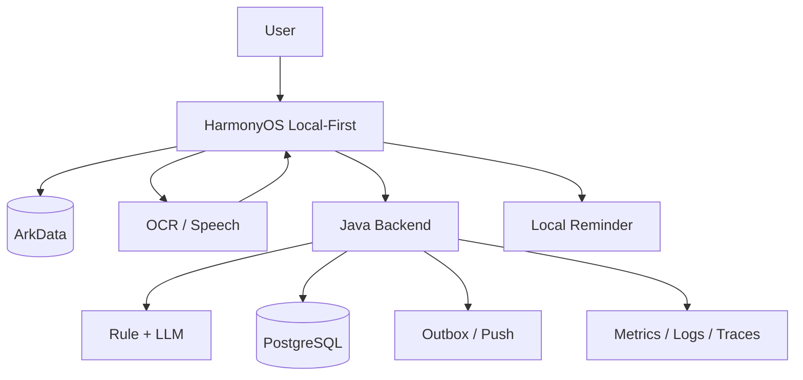

前端负责：

> 即时、离线、设备能力、确认和提醒。

后端负责：

> 数据一致性、同步、AI 编排、异步任务、Push 和生产可靠性。

算法负责：

> 把不可靠的 OCR/ASR/LLM 输出转化为**可解释、可校验、可回归**的 ItemDraft 和 Suggestion。

三团队最终共享的是：

```text
Domain Contract
OpenAPI
JSON Schema
Shared Test Cases
Benchmark
Release Manifest
```

而不是靠口头约定联调。

---

# 附录 A. 前后端 Recognition DTO

## A.1 Request

```json
{
  "inputType": "OCR_TEXT",
  "rawText": "生产日期 2026.10.02 保质期28天 纯牛奶",
  "locale": "zh-CN",
  "client": {
    "appVersion": "1.0.0",
    "deviceId": "anonymous-device-id"
  },
  "localCandidates": {
    "dates": [
      {
        "value": "2026-10-02",
        "evidence": "生产日期 2026.10.02",
        "confidence": 0.97
      }
    ]
  }
}
```

## A.2 Response

```json
{
  "code": 0,
  "message": "success",
  "data": {
    "draftId": "uuid",
    "productName": {
      "value": "纯牛奶",
      "confidence": 0.96,
      "source": "OCR_LLM",
      "evidence": "纯牛奶"
    },
    "category": {
      "value": "FOOD",
      "confidence": 0.95,
      "source": "RULE_LLM"
    },
    "productionDate": {
      "value": "2026-10-02",
      "confidence": 0.98,
      "source": "RULE",
      "evidence": "生产日期 2026.10.02"
    },
    "expiryDate": {
      "value": "2026-10-30",
      "confidence": 0.99,
      "source": "CALCULATED"
    },
    "shelfLife": {
      "value": 28,
      "unit": "DAY",
      "confidence": 0.97
    },
    "warnings": [],
    "requiresConfirmation": true,
    "algorithmVersion": "recognition-v1.0.0",
    "promptVersion": "recognition-prompt-v1"
  },
  "traceId": "..."
}
```

---

# 附录 B. Recognition Algorithm Java 接口

```java
public interface TextNormalizer {
    NormalizedText normalize(String rawText);
}

public interface RecognitionRuleEngine {
    RuleRecognitionResult parse(
        NormalizedText text,
        Locale locale
    );
}

public interface AiRecognitionParser {
    AiRecognitionResult parse(
        NormalizedText text,
        RuleRecognitionResult candidates
    );
}

public interface ConfidenceFusionService {
    ItemDraft fuse(
        RuleRecognitionResult rules,
        AiRecognitionResult ai
    );
}

public interface RecognitionValidator {
    RecognitionValidation validate(ItemDraft draft);
}
```

---

# 附录 C. 算法评测 Python 参考

```python
from dataclasses import dataclass
from pathlib import Path
import json

@dataclass
class Metrics:
    total: int = 0
    category_correct: int = 0
    production_date_correct: int = 0
    expiry_date_correct: int = 0
    e2e_correct: int = 0

def normalize_name(value: str | None) -> str:
    if value is None:
        return ""
    return "".join(value.lower().split())

def evaluate(expected: dict, predicted: dict, m: Metrics) -> None:
    m.total += 1

    if expected.get("category") == predicted.get("category"):
        m.category_correct += 1

    if expected.get("productionDate") == predicted.get("productionDate"):
        m.production_date_correct += 1

    if expected.get("expiryDate") == predicted.get("expiryDate"):
        m.expiry_date_correct += 1

    critical = (
        normalize_name(expected.get("productName")) ==
        normalize_name(predicted.get("productName"))
        and expected.get("category") == predicted.get("category")
        and expected.get("expiryDate") == predicted.get("expiryDate")
    )

    if critical:
        m.e2e_correct += 1
```

实际评测需要进一步支持：

```text
name fuzzy metric
field missing
multiple acceptable labels
failure taxonomy
latency
cost
```

---

# 附录 D. 推荐配置

```yaml
smartexpiry:
  recognition:
    auto-fill-threshold: 0.90
    confirm-threshold: 0.60
    date-conflict-tolerance-days: 1
    ai-timeout: 8s

  sync:
    batch-size: 50
    max-retry: 8
    jitter-seconds: 300

  dashboard:
    cache-ttl: 60s

  push:
    enabled: true
    batch-size: 100
    max-retry: 6
```

所有参数是起始参考，最终由测试和线上数据校准。

---

# 附录 E. 参考资料

1. Technical Design V1.2：本实现文档的架构基线。
2. HarmonyOS ArkData / relationalStore 官方 API 文档。
3. HarmonyOS Core Vision Kit `textRecognition` 官方 API 文档。
4. HarmonyOS Core Speech Kit / `speechRecognizer` 官方能力文档。
5. HarmonyOS 代理提醒 `reminderAgentManager` 官方文档与开放能力说明。
6. HarmonyOS Push Kit 服务端接口官方文档。
7. Spring Boot SQL Database / HikariCP 官方文档。
8. Spring Boot Actuator / Micrometer / Prometheus 官方文档。
9. Spring AI Structured Output 官方文档。

---

# 结语

本参考实现的第一优先级不是增加技术组件，而是确保前端、后端和算法团队可以**并行开发且不会互相猜字段、猜规则、猜状态**。

建议团队真正开始编码时，先完成以下 5 个冻结件：

```text
1. openapi.yaml
2. recognition-schema.json
3. expiry-test-cases.json
4. Item/Batch Domain Contract
5. M1 数据库 Migration
```

然后再同时推进 HarmonyOS、Java 和算法实现。
