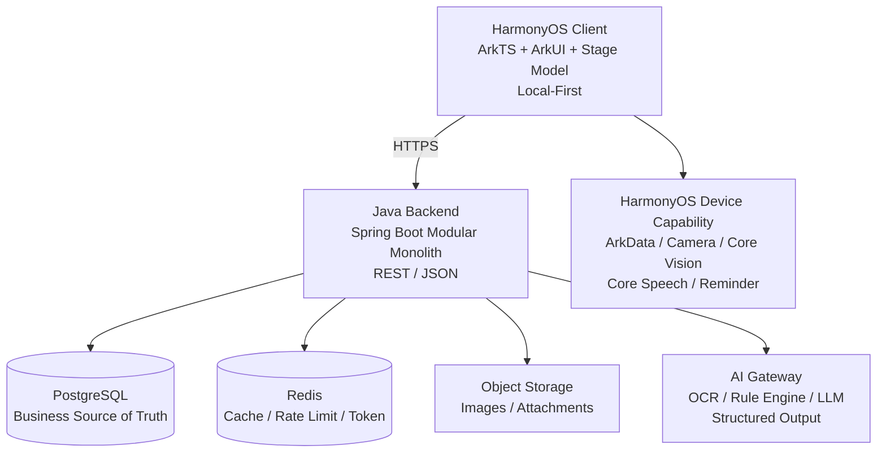
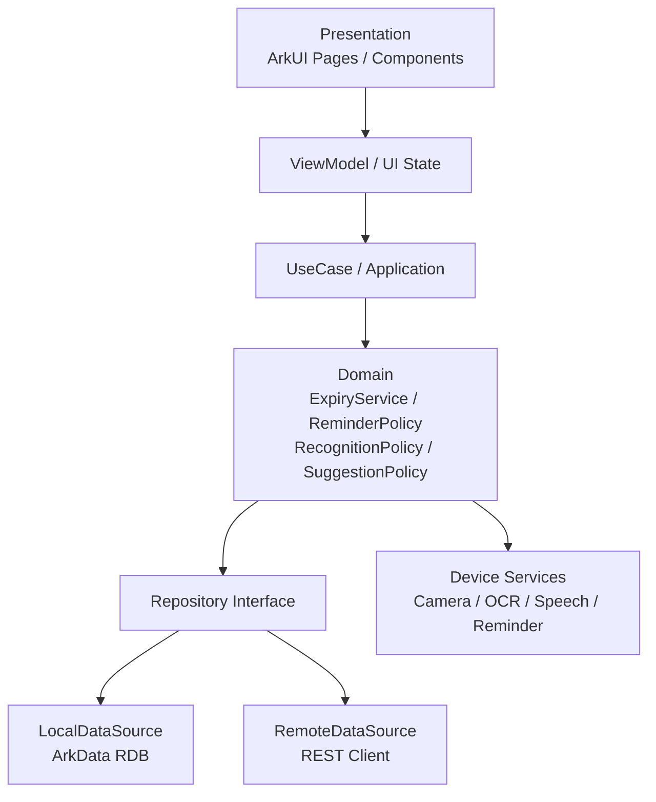
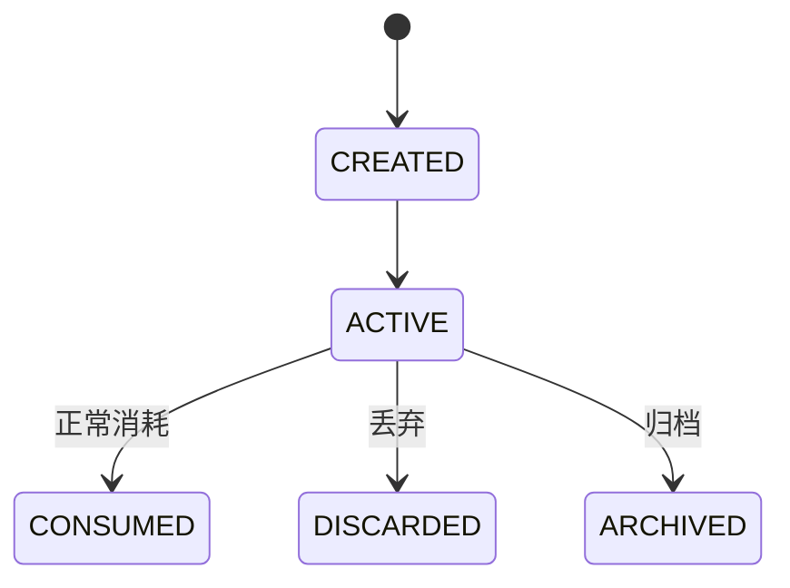
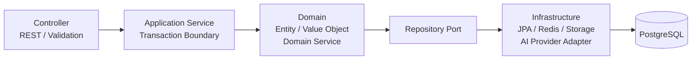
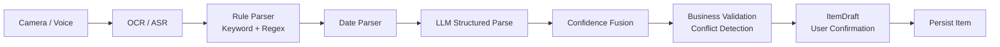
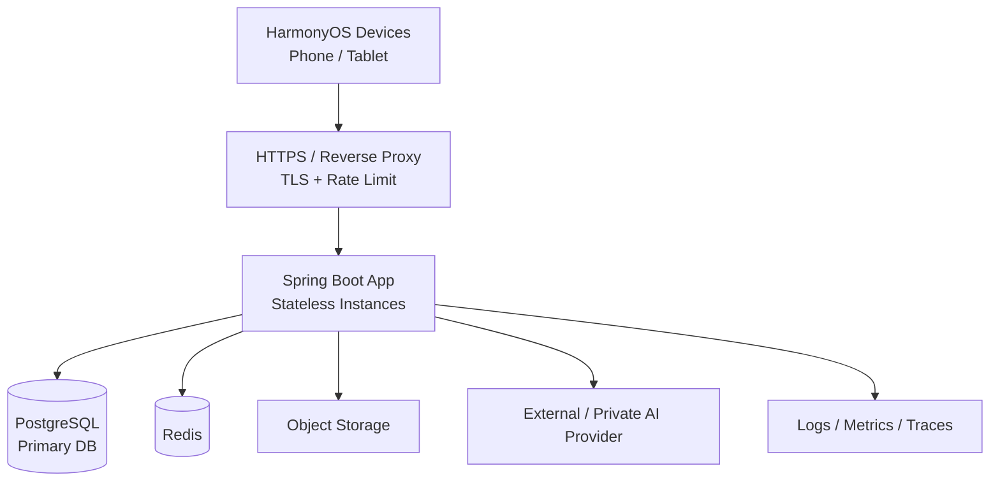

> 归档说明（2026-10-03）：本文为设计/参考实现基线，正文保留版本历史。功能实现与发布状态请查阅[版本索引](README.md)和[本仓库工程变更](CHANGELOG.md)；设计中的生产能力与代码骨架不表示已经上线或完成验收。

# 智能保质期管理

## HarmonyOS ArkTS + Java 后端技术设计文档

**Technical Design V1.0**

> Markdown 版说明：架构图已转换为 Mermaid，便于在 GitHub/GitLab、IDE 与文档仓库中直接维护和版本对比。

| **文档状态** | 团队评审基线                                             |
|--------------|----------------------------------------------------------|
| **客户端**   | HarmonyOS NEXT / ArkTS / ArkUI / Stage 模型              |
| **后端**     | Java 21 / Spring Boot 4.x / PostgreSQL / Redis           |
| **架构风格** | Local-First + MVVM/Clean Architecture + Modular Monolith |
| **版本日期** | 2026-10-02                                               |
| **适用对象** | 产品、客户端、后端、算法、测试、运维/云服务              |

用途：方案评审、任务拆分、接口联调、测试验收、迭代决策

# 0. 文档控制
## 0.1 修订记录
| **版本** | **日期**   | **状态** | **主要内容**                                                      | **维护人**    |
|----------|------------|----------|-------------------------------------------------------------------|---------------|
| V1.0     | 2026-10-02 | 评审基线 | 完成产品边界、前后端架构、数据模型、API、AI、提醒、测试和协作规范 | 架构/产品团队 |

## 0.2 阅读对象与责任边界
| **角色**         | **重点阅读章节**   | **主要产出**                                |
|------------------|--------------------|---------------------------------------------|
| 产品经理         | 1、2、5、15、16    | 范围、流程、验收标准、优先级                |
| HarmonyOS 客户端 | 3、4、6、9、10、11 | ArkTS 工程、ArkData、系统能力、联调         |
| Java 后端        | 3、7、8、9、12、13 | Spring Boot 模块、API、DB、同步、AI Gateway |
| 算法/AI          | 10、11、14         | OCR、日期解析、结构化输出、建议生成、指标   |
| 测试             | 5、8、11、14、15   | 测试矩阵、接口测试、端到端验收              |
| 运维/云服务      | 12、13、14         | 环境、部署、监控、安全、容量                |

## 0.3 本文档的关键约定
- V1 以“物品录入 → 到期计算 → 临期提醒 → 处理建议 → 已用完/丢弃”闭环为成功标准。

- 商城、家庭实时协作、复杂推荐不作为 V1 上线阻塞项；仅保留扩展点。

- 关键业务规则由确定性代码实现；LLM 只负责识别补充、语义理解和自然语言生成。

- 保质期日期使用自然日期语义；Java 使用 LocalDate，创建/更新时间使用 Instant。

- 客户端采用 Local-First：核心 CRUD、状态计算和本地提醒在离线状态仍可工作。

## 0.4 章节目录
1\. 产品与业务目标

2\. V1 范围与非目标

3\. 总体技术架构

4\. HarmonyOS 客户端设计

5\. 页面与交互流程

6\. 核心领域模型与状态机

7\. Java 后端架构

8\. 数据库设计

9\. REST API 设计

10\. 智能录入与 AI 识别

11\. 保质期/提醒/建议引擎

12\. 本地优先与同步

13\. 安全、隐私与部署

14\. 可观测性与测试

15\. 团队协作与研发规范

16\. 里程碑与验收

附录 A. 数据库 DDL

附录 B. 关键代码骨架

附录 C. 参考资料

# 1. 产品与业务目标
本产品定位为面向个人/家庭的 HarmonyOS 原生智能物品生命周期管理应用。核心价值不是“记录一个过期日期”，而是降低录入成本、在正确时间提醒用户，并提供可执行的处理建议，从而减少食品、化妆品、宠物粮及其他物品的临期浪费。

## 1.1 产品闭环
> 购买/获得物品  
> ↓  
> 拍照 / 语音 / 手动 / 条码录入  
> ↓  
> 结构化识别 + 用户确认  
> ↓  
> 本地保存 + 云端异步同步  
> ↓  
> 自动计算有效到期日与状态  
> ↓  
> 临期/过期提醒  
> ↓  
> 智能处理建议  
> ↓  
> 已用完 / 丢弃 / 稍后处理  
> ↓  
> 消耗统计 → 补货决策

## 1.2 V1 业务目标与度量
| **目标**       | **建议指标**                              | **说明**                   |
|----------------|-------------------------------------------|----------------------------|
| 降低录入成本   | 常规物品录入 \< 10 秒                     | 以拍照/语音/模板为主要手段 |
| 保证日期可信   | 到期日期字段准确率 ≥ 95%（评测集）        | 低置信度必须人工确认       |
| 提高临期处理率 | 临期后被及时消耗/处理的比例持续提升       | 作为核心北极星指标之一     |
| 体现用户价值   | 展示及时消耗、丢弃、避免浪费件数          | V1 先做件数，金额 V1.5     |
| 保证离线可用   | 无网仍可 CRUD、查询、状态计算、已调度提醒 | 云端不是核心链路单点       |

## 1.3 核心设计原则
| **原则**               | **工程含义**                                                         |
|------------------------|----------------------------------------------------------------------|
| Local-First            | ArkData 是客户端即时数据源，网络只负责同步和增强能力。               |
| 确定性优先             | 日期计算、状态计算、过敏过滤、安全规则不用 LLM。                     |
| AI 可解释              | 识别结果携带 confidence、evidence、source，并生成 ItemDraft 供确认。 |
| 生命周期与到期状态分离 | “已用完”不与“过期”混在一个枚举，方便统计与扩展。                     |
| 模块化单体优先         | Java V1 不引入微服务复杂度，按领域模块隔离，后续可拆分。             |
| 隐私最小化             | 端侧 OCR 优先；能上传文本就不上传原始图片。                          |

# 2. V1 范围与非目标
## 2.1 P0 功能范围
- 物品 CRUD：统一管理食品、化妆品、宠物粮、其他及自定义分类。

- 日期信息：生产日期、保质期、到期日期、开封日期、开封后使用期限。

- 状态计算：正常、临期、已过期；生命周期为在库、已用完、已丢弃、已归档。

- 录入：手动、拍照 OCR + AI 结构化识别、语音输入；条码可作为 P1 或弱化实现。

- 提醒：分类默认提前天数 + 用户可配置；核心提醒优先使用 HarmonyOS 本地系统能力。

- 智能建议：按食品、化妆品、宠物粮和其他生成处理建议；安全规则优先于模型。

- 首页/推荐页：突出临期和已过期物品，提供快速操作。

- 基础统计：库存数量、临期/过期数量、及时消耗和丢弃件数。

- 本地数据 + 云同步基础：允许 V1 首发关闭账号/同步开关，但数据模型预留 version/deletedAt。

## 2.2 V1 非目标
- 不建设完整电商交易平台；V1 只预留补货清单/商品推荐接口。

- 不建设复杂家庭多人实时协作；V1 只保证同步模型未来可扩展。

- 不使用 Kubernetes、Kafka、服务注册中心等分布式基础设施。

- 不让 LLM 做食品安全判断、医学判断或直接决定关键日期。

- 不将服务端 Push 作为核心保质期提醒的唯一来源。

## 2.3 版本路线
| **版本** | **重点能力**                                                                   |
|----------|--------------------------------------------------------------------------------|
| V1.0     | CRUD、日期/状态、首页、ArkData、本地提醒、OCR、AI 结构化、语音、基础建议、统计 |
| V1.5     | 条码、过敏/偏好、多物品组合建议、金额统计、模板快速录入                        |
| V2.0     | 账号、云同步增强、家庭共享、多设备冲突处理                                     |
| V3.0     | 消费预测、补货推荐、精选商城、个性化推荐                                       |

# 3. 总体技术架构

*图 3-1 总体技术架构*

## 3.1 技术栈基线
| **层级**         | **技术/组件**                                                       | **选择理由**                                       |
|------------------|---------------------------------------------------------------------|----------------------------------------------------|
| HarmonyOS 客户端 | ArkTS、ArkUI、Stage 模型                                            | HarmonyOS 原生主力技术栈；适合复杂应用和状态共享。 |
| 客户端本地数据   | ArkData RelationalStore                                             | 结构化数据 CRUD、本地优先、事务与索引。            |
| 设备 AI/能力     | Camera、Core Vision Kit、Core Speech Kit、Background Tasks/Reminder | 相机、OCR、语音和系统提醒。                        |
| 后端             | Java 21 + Spring Boot 4.x                                           | 成熟生态、强类型、事务与长期维护能力。             |
| 数据访问         | Spring Data JPA + PostgreSQL                                        | V1 业务关系明确，JPA 足以支撑快速开发。            |
| 缓存/限流        | Redis                                                               | 仅用于缓存、限流、Token/会话等，不存主业务真值。   |
| 数据库迁移       | Flyway                                                              | 禁止生产依赖 ddl-auto=update。                     |
| AI 接入          | Spring AI 或自研 AiModelGateway Adapter                             | 结构化输出、模型供应商可替换。                     |
| 对象存储         | OBS/S3/MinIO 兼容接口                                               | 图片与附件不直接进入关系数据库。                   |

## 3.2 关键架构决策（ADR 摘要）
| **ADR** | **决策**                    | **原因**                        | **后果**                    |
|---------|-----------------------------|---------------------------------|-----------------------------|
| ADR-001 | 客户端 Local-First          | 核心体验不能因断网失效          | 需要 sync_queue 和冲突处理  |
| ADR-002 | Java 模块化单体             | V1 避免微服务运维与一致性复杂度 | 按领域包隔离，预留拆分边界  |
| ADR-003 | Item 与 InventoryBatch 分离 | 同一商品可能存在多个到期批次    | UI 可弱化批次，模型必须保留 |
| ADR-004 | 到期状态不持久化            | 状态随日期自然变化              | 查询/展示时动态计算         |
| ADR-005 | AI 只生成 ItemDraft         | 避免错误数据直接污染库存        | 用户确认成为关键交互        |
| ADR-006 | 核心临期提醒在端侧          | 避免依赖网络和服务端 Push       | 服务端保存策略/辅助提醒     |

# 4. HarmonyOS 客户端设计

*图 4-1 客户端分层*

## 4.1 客户端架构
客户端采用 MVVM + Clean Architecture + Repository。页面只消费 ViewModel 状态；业务规则下沉至 UseCase/Domain；Repository 对本地 ArkData 与远程 REST 做隔离。

## 4.2 推荐工程目录
> entry/src/main/ets/  
> ├── entryability/  
> ├── pages/  
> │ ├── HomePage.ets  
> │ ├── InventoryPage.ets  
> │ ├── AddItemPage.ets  
> │ ├── ItemDetailPage.ets  
> │ ├── RecognitionPage.ets  
> │ ├── SuggestionPage.ets  
> │ ├── StatisticsPage.ets  
> │ └── ProfilePage.ets  
> ├── components/  
> ├── viewmodel/  
> ├── domain/  
> │ ├── model/  
> │ ├── usecase/  
> │ ├── service/  
> │ └── rule/  
> ├── data/  
> │ ├── local/  
> │ ├── remote/  
> │ ├── repository/  
> │ └── mapper/  
> ├── ai/  
> ├── reminder/  
> ├── database/  
> └── common/

## 4.3 本地数据职责
| **数据**             | **本地是否权威** | **说明**                                                 |
|----------------------|------------------|----------------------------------------------------------|
| Item / Batch         | 是（即时）       | 保存后 UI 立即可见；云端同步异步执行。                   |
| ReminderSetting      | 是               | 离线可修改；同步到服务端作为跨设备配置。                 |
| ExpiryStatus         | 否（派生）       | 根据 expiryDate/effectiveExpireDate + 当前日期动态计算。 |
| AI RecognitionRecord | 缓存/审计        | 可仅保存摘要与字段结果，原始图片按隐私策略处理。         |
| Suggestion           | 缓存             | 允许过期后重新生成，不作为业务真值。                     |

## 4.4 客户端 Repository 契约
> export interface ItemRepository {  
> create(item: Item): Promise\<Item\>  
> update(item: Item): Promise\<void\>  
> delete(id: string): Promise\<void\>  
> getById(id: string): Promise\<Item \| undefined\>  
> query(query: ItemQuery): Promise\<Item\[\]\>  
> }

## 4.5 客户端离线行为
| **场景**           | **离线行为**                                                           |
|--------------------|------------------------------------------------------------------------|
| 新增/修改/删除物品 | 写 ArkData + 写 sync_queue，操作立即成功。                             |
| 临期状态           | 本地 ExpiryService 计算。                                              |
| 系统提醒           | 已注册的本地提醒继续工作。                                             |
| AI 云端增强        | 显示“当前离线，可手动确认/稍后识别”；端侧 OCR 可继续使用时则保留 OCR。 |
| 商城/云推荐        | 降级为本地补货清单或不可用状态。                                       |

# 5. 页面与交互流程
## 5.1 一级信息架构
> 首页 物品 + 建议 我的  
> （中央录入入口）

| **产品约束** V1 不让“商城”占据一级导航。补货/精选商城从“建议”或“已用完 → 补货”链路进入，避免工具产品被感知为广告入口。 |
|------------------------------------------------------------------------------------------------------------------------|

## 5.2 首页
- 顶部：今日需要处理的物品数量。

- 核心卡片：即将过期 / 已过期；默认展示最紧急 10~20 项。

- 今日建议：优先处理的单物品或组合建议。

- 库存概览：食品、化妆品、宠物粮、其他。

- 快速动作：查看建议、已用完、稍后提醒。

## 5.3 新增物品流程
> 点击 +  
> ├─ 拍照添加 → OCR/AI → ItemDraft → 用户确认 → Save  
> ├─ 语音添加 → ASR → Intent Parse → ItemDraft → 用户确认 → Save  
> ├─ 扫码添加 → 商品候选 → 日期补充 → Save  
> └─ 手动添加 → 表单校验 → Save

## 5.4 手动表单字段
| **字段**   | **必填** | **规则/说明**                |
|------------|----------|------------------------------|
| 名称       | 是       | 1~80 字符                    |
| 分类       | 是       | 系统分类或自定义分类         |
| 品牌       | 否       | 用于搜索/推荐                |
| 数量/单位  | 否       | 默认 1                       |
| 生产日期   | 条件     | 与保质期组合可推导到期日期   |
| 保质期     | 条件     | 仅填写保质期无法确定到期时间 |
| 到期日期   | 条件     | 可单独填写                   |
| 开封日期   | 否       | 化妆品/开封后期限场景        |
| 开封后期限 | 否       | PAO，如 6M/12M               |
| 存放位置   | 否       | 冰箱/橱柜等                  |
| 估算价格   | 否       | V1.5 用于浪费金额            |
| 备注       | 否       | 自由文本                     |

## 5.5 日期表单校验
| **输入组合**          | **系统行为**                               |
|-----------------------|--------------------------------------------|
| 生产日期 + 保质期     | 计算到期日期，并展示“系统推导”。           |
| 生产日期 + 到期日期   | 可反算保质期，仅作为辅助展示。             |
| 仅到期日期            | 允许保存。                                 |
| 仅保质期              | 禁止最终保存，要求补生产日期或到期日期。   |
| 开封日期 + 开封后期限 | 计算开封有效日期，并与原到期日期取更早值。 |

# 6. 核心领域模型与状态机
## 6.1 核心实体关系
> User  
> ├─ Preference  
> ├─ Category  
> ├─ Item 1 ── N InventoryBatch  
> │ ├─ ReminderRecord  
> │ └─ ConsumptionRecord  
> ├─ RecognitionRecord  
> ├─ Suggestion  
> └─ SyncRecord

## 6.2 Item 与 InventoryBatch
Item 表示“商品/物品身份”，InventoryBatch 表示“库存批次”。例如同一品牌牛奶 3 盒可能存在不同生产日期或到期日期，因此到期、数量和开封信息应归属批次。V1 UI 可以将批次弱化为一个合并列表，但数据库模型不要合并。

## 6.3 生命周期状态

*图 6-1 Item 生命周期状态*

| **枚举**  | **含义**                   |
|-----------|----------------------------|
| ACTIVE    | 物品/批次仍在库存中        |
| CONSUMED  | 正常使用完                 |
| DISCARDED | 丢弃                       |
| ARCHIVED  | 仅保留历史，不参与库存计算 |

## 6.4 到期状态
| **枚举**    | **判定**                         |
|-------------|----------------------------------|
| UNKNOWN     | 无法确定有效到期日期             |
| NORMAL      | remainingDays \> reminderDays    |
| NEAR_EXPIRY | 0 ≤ remainingDays ≤ reminderDays |
| EXPIRED     | remainingDays \< 0               |

| **重要** ExpiryStatus 不持久化到数据库。它是由日期 + 当前时间 + 提醒策略派生的状态，否则每天都需要批量更新且容易出现脏状态。 |
|------------------------------------------------------------------------------------------------------------------------------|

## 6.5 有效到期日期
> effectiveExpireDate =  
> min(  
> originalExpiryDate,  
> openedDate + afterOpenDuration  
> )

若某一分支缺失，则使用可确定的日期；如果两者都缺失，则 ExpiryStatus=UNKNOWN。月份/年份使用日历语义（plusMonths/plusYears），不要简单换算为固定天数。

## 6.6 ItemDraft
AI/语音识别不能直接创建正式 Item，统一先生成 ItemDraft。ItemDraft 保存每个字段的值、置信度、证据与来源；用户确认后再转为 Item/InventoryBatch。

> interface ItemDraft {  
> name?: string  
> category?: string  
> productionDate?: number  
> expiryDate?: number  
> shelfLifeValue?: number  
> shelfLifeUnit?: ShelfLifeUnit  
> quantity?: number  
> fieldsConfidence: Map\<string, number\>  
> }

# 7. Java 后端架构

*图 7-1 Java 后端分层*

## 7.1 Java 技术栈
| **组件**    | **建议**                                   |
|-------------|--------------------------------------------|
| JDK         | Java 21                                    |
| Spring Boot | 4.x 稳定版                                 |
| Web         | Spring MVC / spring-boot-starter-web       |
| Validation  | Jakarta Bean Validation                    |
| Persistence | Spring Data JPA + PostgreSQL               |
| Migration   | Flyway                                     |
| Security    | Spring Security（账号上线后启用 JWT/OIDC） |
| Cache       | Redis                                      |
| AI          | Spring AI 或自研 AiModelGateway            |
| Mapping     | MapStruct（可选）                          |
| Build       | Maven                                      |

## 7.2 模块化单体包结构
> com.example.smartexpiry  
> ├── common  
> │ ├── api  
> │ ├── exception  
> │ ├── config  
> │ ├── security  
> │ └── util  
> ├── auth  
> ├── user  
> ├── category  
> ├── item  
> ├── inventory  
> ├── expiry  
> ├── recognition  
> ├── suggestion  
> ├── reminder  
> ├── preference  
> ├── statistics  
> ├── sync  
> ├── shopping  
> └── infrastructure

## 7.3 模块内部结构
> item/  
> ├── controller/  
> ├── application/  
> │ ├── command/  
> │ └── query/  
> ├── domain/  
> │ ├── model/  
> │ ├── repository/  
> │ └── service/  
> └── infrastructure/  
> ├── persistence/  
> └── mapper/

## 7.4 层级职责
| **层**              | **允许做什么**                                        | **禁止做什么**                             |
|---------------------|-------------------------------------------------------|--------------------------------------------|
| Controller          | HTTP 参数、Bean Validation、鉴权上下文、Response 封装 | 日期业务计算、直接访问 JPA、调用模型供应商 |
| Application Service | 业务编排、事务边界、跨聚合调用                        | 耦合 HTTP/JSON 细节                        |
| Domain              | 实体、值对象、规则、领域服务                          | 依赖 Controller/JPA 实现/外部 SDK          |
| Repository Port     | 定义领域所需的数据访问契约                            | 暴露 JpaRepository 到业务层                |
| Infrastructure      | JPA、Redis、对象存储、AI Provider Adapter             | 承载核心业务规则                           |

## 7.5 事务边界
事务建议放在 Application Service。创建物品至少包含 Item、Batch、提醒计划记录和同步变更，要求在一个本地数据库事务内原子提交。外部 AI/对象存储调用应尽量放在事务之前或使用补偿策略，避免长事务。

> @Service  
> @RequiredArgsConstructor  
> public class ItemApplicationService {  
>   
> @Transactional  
> public ItemResponse create(CreateItemRequest request) {  
> // 1. build Item  
> // 2. build InventoryBatch  
> // 3. persist  
> // 4. write reminder/sync metadata  
> // 5. return response  
> }  
> }

## 7.6 日期类型规范
| **语义**                      | **Java 类型**               | **数据库类型**             |
|-------------------------------|-----------------------------|----------------------------|
| 生产/到期/开封日期            | LocalDate                   | DATE                       |
| createdAt/updatedAt/deletedAt | Instant                     | TIMESTAMP WITH TIME ZONE   |
| 用户提醒时刻（如 09:00）      | LocalTime + ZoneId/用户时区 | TIME + timezone preference |

# 8. 数据库设计
## 8.1 核心表清单
| **表**                  | **职责**            | **V1**     |
|-------------------------|---------------------|------------|
| user                    | 账号/用户标识       | 可选       |
| category                | 系统/自定义分类     | 是         |
| item                    | 物品身份            | 是         |
| inventory_batch         | 数量与日期批次      | 是         |
| reminder_setting        | 分类提醒策略        | 是         |
| reminder_record         | 已注册/触发提醒记录 | 是         |
| recognition_record      | AI/OCR 审计与评测   | 是         |
| consumption_record      | 已用完/丢弃行为     | 是         |
| preference              | 用户偏好/过敏扩展   | 是（基础） |
| suggestion              | 建议缓存/审计       | 可选       |
| sync_queue / sync_event | 客户端/服务端同步   | 预留       |
| shopping_list           | 补货清单            | P1/P2      |

## 8.2 Item 数据字典
| **字段**         | **类型**      | **约束**     | **说明**                           |
|------------------|---------------|--------------|------------------------------------|
| id               | varchar/uuid  | PK           | 全局唯一                           |
| name             | varchar(80)   | NOT NULL     | 物品名称                           |
| category_id      | varchar       | NOT NULL, FK | 分类                               |
| brand            | varchar(80)   | NULL         | 品牌                               |
| barcode          | varchar(64)   | NULL         | 条码                               |
| image_url        | text          | NULL         | 对象存储地址                       |
| lifecycle_status | varchar(24)   | NOT NULL     | ACTIVE/CONSUMED/DISCARDED/ARCHIVED |
| source_type      | varchar(24)   | NOT NULL     | MANUAL/CAMERA/VOICE/BARCODE        |
| estimated_price  | numeric(12,2) | NULL         | 估算价格                           |
| version          | bigint        | NOT NULL     | 乐观锁/同步版本                    |
| created_at       | timestamptz   | NOT NULL     | 创建时间                           |
| updated_at       | timestamptz   | NOT NULL     | 更新时间                           |
| deleted_at       | timestamptz   | NULL         | 软删除                             |

## 8.3 InventoryBatch 数据字典
| **字段**         | **类型**     | **说明**       |
|------------------|--------------|----------------|
| id               | varchar/uuid | 批次 ID        |
| item_id          | varchar/uuid | 所属 Item      |
| quantity         | numeric      | 库存数量       |
| unit             | varchar      | 盒/瓶/g 等     |
| production_date  | date         | 生产日期       |
| expiry_date      | date         | 原始到期日期   |
| shelf_life_value | int          | 保质期数值     |
| shelf_life_unit  | varchar      | DAY/MONTH/YEAR |
| opened_date      | date         | 开封日期       |
| after_open_value | int          | 开封后期限数值 |
| after_open_unit  | varchar      | DAY/MONTH/YEAR |
| location         | varchar      | 存放位置       |
| created_at       | timestamptz  | 创建时间       |
| updated_at       | timestamptz  | 更新时间       |

## 8.4 RecognitionRecord
| **字段**                           | **说明**                                   |
|------------------------------------|--------------------------------------------|
| id / user_id / item_id             | 关联识别任务与最终物品                     |
| input_type                         | IMAGE / TEXT / VOICE                       |
| ocr_provider / ai_provider / model | 供应商与模型追踪                           |
| prompt_version                     | Prompt 版本                                |
| raw_text                           | OCR/ASR 原始文本；敏感场景可脱敏或不持久化 |
| structured_result                  | 结构化 JSON                                |
| overall_confidence                 | 综合置信度                                 |
| processing_ms                      | 处理耗时                                   |
| status                             | SUCCESS/NEED_CONFIRMATION/FAILED           |
| created_at                         | 创建时间                                   |

## 8.5 索引建议
> CREATE INDEX idx_item_category ON item(category_id);  
> CREATE INDEX idx_item_updated ON item(updated_at);  
> CREATE INDEX idx_item_lifecycle ON item(lifecycle_status);  
> CREATE INDEX idx_batch_item ON inventory_batch(item_id);  
> CREATE INDEX idx_batch_expiry ON inventory_batch(expiry_date);  
> CREATE INDEX idx_consumption_item ON consumption_record(item_id);  
> CREATE INDEX idx_recognition_created ON recognition_record(created_at);

## 8.6 数据库迁移策略
- 生产环境使用 Flyway；禁止依赖 Hibernate ddl-auto=update。

- 建议 ddl-auto=validate；结构变更必须以 migration 文件进入 Git。

- 迁移文件采用 V1\_\_init.sql、V2\_\_add_xxx.sql 命名。

- 有破坏性变更时执行“扩展字段 → 双写/迁移 → 切换读取 → 删除旧字段”的兼容策略。

# 9. REST API 设计
## 9.1 API 规范
| **项**    | **规范**                                           |
|-----------|----------------------------------------------------|
| Base Path | /api/v1                                            |
| 协议      | HTTPS + JSON                                       |
| 时间      | 日期 YYYY-MM-DD；时间戳 ISO-8601 UTC               |
| 认证      | V1 可选；启用后 Authorization: Bearer \<token\>    |
| 分页      | page/pageSize 或 cursor；V1 列表可先 page/pageSize |
| 幂等      | 同步/上传等关键接口使用 requestId/idempotencyKey   |
| 错误      | 业务 code + message + traceId                      |

## 9.2 通用响应
> {  
> "code": 0,  
> "message": "success",  
> "data": {},  
> "traceId": "..."  
> }

## 9.3 核心接口清单
| **Method** | **Path**                   | **说明**                   |
|------------|----------------------------|----------------------------|
| POST       | /api/v1/items              | 创建物品                   |
| GET        | /api/v1/items              | 分页查询/筛选物品          |
| GET        | /api/v1/items/{id}         | 详情                       |
| PATCH      | /api/v1/items/{id}         | 修改                       |
| DELETE     | /api/v1/items/{id}         | 软删除                     |
| POST       | /api/v1/items/{id}/consume | 标记已用完/部分消耗        |
| POST       | /api/v1/items/{id}/discard | 丢弃                       |
| GET        | /api/v1/dashboard          | 首页聚合                   |
| POST       | /api/v1/recognition/text   | OCR/语音文本结构化         |
| POST       | /api/v1/recognition/image  | 服务端图片识别（可选增强） |
| POST       | /api/v1/suggestions        | 生成处理建议               |
| GET        | /api/v1/preferences        | 读取偏好                   |
| PUT        | /api/v1/preferences        | 更新偏好                   |
| POST       | /api/v1/sync/push          | 上行同步                   |
| GET        | /api/v1/sync/pull          | 下行同步                   |

## 9.4 创建物品示例
> POST /api/v1/items  
>   
> {  
> "name": "纯牛奶",  
> "categoryId": "food",  
> "brand": "示例品牌",  
> "quantity": 1,  
> "unit": "盒",  
> "productionDate": "2026-10-02",  
> "expiryDate": "2026-10-30",  
> "sourceType": "CAMERA"  
> }

## 9.5 查询参数
| **参数** | **示例**    | **说明**            |
|----------|-------------|---------------------|
| category | food        | 分类                |
| status   | near_expiry | 服务端动态过滤/计算 |
| keyword  | 牛奶        | 名称/品牌搜索       |
| sort     | expiry_asc  | 最近到期优先        |
| page     | 1           | 页码                |
| pageSize | 20          | 建议上限 100        |

## 9.6 错误码建议
| **范围** | **领域**  | **示例**                                                                          |
|----------|-----------|-----------------------------------------------------------------------------------|
| 100xxx   | 通用      | 100001 VALIDATION_ERROR                                                           |
| 200xxx   | 用户/认证 | 200001 UNAUTHORIZED                                                               |
| 300xxx   | 物品      | 300001 ITEM_NOT_FOUND；300002 INVALID_EXPIRY_DATE                                 |
| 400xxx   | 识别/AI   | 400001 OCR_FAILED；400002 LOW_CONFIDENCE；400003 DATE_CONFLICT；400004 AI_TIMEOUT |
| 500xxx   | 提醒      | 500001 REMINDER_SCHEDULE_FAILED                                                   |
| 600xxx   | 同步      | 600001 SYNC_CONFLICT                                                              |

# 10. 智能录入与 AI 识别

*图 10-1 识别 Pipeline*

## 10.1 识别链路
1.  采集：Camera 或语音。

2.  端侧能力优先：Core Vision OCR / Core Speech ASR。

3.  规则提取：日期关键词、Regex、保质期单位、包装常见缩写。

4.  日期解析：把 2026.10.02、20261002、EXP/MFG 等转换为标准候选。

5.  LLM 结构化：只补充语义关联和字段归属，不直接做关键日期算术。

6.  置信度融合：规则、OCR、LLM 证据融合为字段级 confidence。

7.  业务校验：日期冲突、缺失字段、范围异常。

8.  生成 ItemDraft，用户确认后保存。

## 10.2 结构化输出 Schema
> {  
> "productName": {  
> "value": "示例纯牛奶",  
> "confidence": 0.96,  
> "evidence": "示例纯牛奶",  
> "source": "OCR_LLM"  
> },  
> "category": {  
> "value": "FOOD",  
> "confidence": 0.97,  
> "source": "LLM"  
> },  
> "productionDate": {  
> "value": "2026-10-02",  
> "confidence": 0.98,  
> "evidence": "生产日期 2026.10.02",  
> "source": "RULE"  
> },  
> "shelfLife": {  
> "value": 28,  
> "unit": "DAY",  
> "confidence": 0.97  
> },  
> "expiryDate": {  
> "value": "2026-10-30",  
> "confidence": 0.99,  
> "source": "CALCULATED"  
> }  
> }

## 10.3 置信度策略
| **区间**    | **UI/业务处理**                       |
|-------------|---------------------------------------|
| ≥ 0.90      | 自动填入；关键日期仍展示确认来源。    |
| 0.60 ~ 0.90 | 黄色高亮，要求用户重点确认。          |
| \< 0.60     | 不作为可靠值，要求人工补充/重新拍摄。 |

## 10.4 日期关键词与格式
- 关键词：生产日期、制造日期、MFG、有效期至、EXP、Best Before、保质期。

- 格式：YYYY-MM-DD、YYYY/MM/DD、YYYY.MM.DD、YYYYMMDD、中文年月日。

- 保质期：N 天 / N 月 / N 年；月份必须用日历月份语义。

- 多日期：保留全部候选及上下文证据，由规则 + AI 分类；冲突时要求用户确认。

## 10.5 日期冲突校验
当包装同时出现生产日期、保质期和到期日期时，服务端根据确定性 DateCalculator 重新计算期望到期日期。若与识别到期日期差异超过允许阈值（建议 1 天，具体按业务决定），返回 DATE_CONFLICT，不自动选择。

## 10.6 Java AI Gateway 抽象
> public interface AiModelGateway {  
> \<T\> T structuredGenerate(  
> String systemPrompt,  
> String userPrompt,  
> Class\<T\> responseType  
> );  
> }

业务层只依赖 AiModelGateway。Spring AI、云模型、自建模型都通过 Adapter 实现。这样模型供应商、模型版本和费用策略可以独立演进。

## 10.7 Prompt 管理
> resources/prompts/  
> ├── recognition-system.txt  
> ├── suggestion-food.txt  
> ├── suggestion-cosmetics.txt  
> ├── suggestion-pet-food.txt  
> └── suggestion-other.txt

- Prompt 必须版本化（promptVersion）。

- 识别记录保存 model/provider/promptVersion，便于回归与 A/B。

- 禁止在 Controller 中硬编码 Prompt。

# 11. 保质期、提醒与建议引擎
## 11.1 Expiry Engine
> remainingDays = DAYS.between(today, effectiveExpireDate)  
>   
> if remainingDays \< 0:  
> EXPIRED  
> else if remainingDays \<= reminderDays:  
> NEAR_EXPIRY  
> else:  
> NORMAL

## 11.2 客户端与服务端规则一致性
ArkTS 与 Java 都需要支持离线/在线状态计算。为避免两端规则漂移，建议建立共享的 expiry-test-cases.json，由两端各自加载同一组用例执行单元测试。规则改变时必须同时更新测试集。

> \[  
> {  
> "today": "2026-10-01",  
> "expiry": "2026-10-05",  
> "reminderDays": 7,  
> "expected": "NEAR_EXPIRY"  
> }  
> \]

## 11.3 Reminder Engine
| **组件**          | **职责**                                         |
|-------------------|--------------------------------------------------|
| ReminderPolicy    | 输入分类、有效到期日、用户配置，生成提醒时间点。 |
| ReminderScheduler | 调用 HarmonyOS 系统能力注册/取消提醒。           |
| ReminderManager   | 物品新增/修改/删除/消耗后统一重建提醒。          |

## 11.4 默认提醒策略
| **分类** | **默认提醒**  |
|----------|---------------|
| 食品     | 7 / 3 / 1 天  |
| 化妆品   | 30 / 7 / 1 天 |
| 宠物粮   | 14 / 7 / 3 天 |
| 其他     | 7 / 3 / 1 天  |

以上仅为默认配置，不写死在页面逻辑中。最终来源为系统默认 + 用户覆盖 + 特殊商品覆盖。

## 11.5 修改物品后的提醒重建
> Update Item/Batch  
> ↓  
> Cancel previous reminders  
> ↓  
> Calculate effectiveExpireDate  
> ↓  
> Generate ReminderPlan  
> ↓  
> Schedule local reminders  
> ↓  
> Persist reminder metadata

## 11.6 智能建议
> Inventory Context  
> + Expiry Context  
> + Category  
> + User Preference / Allergy  
> + Safety Rules  
> ↓  
> SuggestionContext  
> ↓  
> LLM Natural Language Generation

| **安全边界** 食品已经过期时，规则层应阻止模型生成“闻一闻还能吃”“再吃几天”等安全性不确定建议。LLM 负责表述，不负责推翻业务安全规则。 |
|-------------------------------------------------------------------------------------------------------------------------------------|

## 11.7 建议类型
| **类别** | **建议方向**                                 |
|----------|----------------------------------------------|
| 食品     | 优先消耗、简单搭配/食谱、库存组合            |
| 化妆品   | 尽快使用、检查颜色/气味/质地、开封后期限提示 |
| 宠物粮   | 优先消耗当前包装、减少开新包装、检查储存     |
| 其他     | 通用处理/补货建议                            |

# 12. 本地优先与同步
## 12.1 客户端写入模型
> User Action  
> ↓  
> ArkData transaction  
> ├─ write business entity  
> └─ write sync_queue  
> ↓  
> UI updates immediately  
> ↓  
> Background sync when network available

## 12.2 SyncQueue 字段
| **字段**       | **说明**                      |
|----------------|-------------------------------|
| id             | 本地变更 ID                   |
| entity_type    | ITEM / BATCH / PREFERENCE ... |
| entity_id      | 业务实体 ID                   |
| operation      | CREATE / UPDATE / DELETE      |
| entity_version | 提交前版本                    |
| payload        | 变更快照/字段                 |
| created_at     | 本地创建时间                  |
| retry_count    | 重试次数                      |
| status         | PENDING/SYNCED/FAILED         |

## 12.3 同步 API
> POST /api/v1/sync/push  
> GET /api/v1/sync/pull?cursor=\<cursor\>

## 12.4 版本与冲突
推荐每个可同步实体保存 version。客户端基于 version 提交更新；服务端版本不一致时返回 409 Conflict。V1 可提供“服务端最新 + 客户端草稿”让客户端选择；家庭共享上线后再引入字段级合并或更复杂策略。

| **条件**                         | **处理**                          |
|----------------------------------|-----------------------------------|
| client.version == server.version | 接受更新，server.version + 1      |
| client.version \< server.version | 409 SYNC_CONFLICT，返回服务器最新 |
| 删除 vs 修改冲突                 | V1 以显式冲突处理，不静默覆盖     |

# 13. 安全、隐私与部署
## 13.1 隐私数据分类
| **数据**      | **风险**              | **策略**                                        |
|---------------|-----------------------|-------------------------------------------------|
| 商品图片      | 可能包含家庭环境/票据 | 端侧 OCR 优先；服务端上传需用户知情且设置保留期 |
| 语音          | 可能包含个人信息      | 优先只保留转写文本；原始音频默认不长期保存      |
| 过敏清单      | 健康相关敏感信息      | 最小化使用、加密传输、严格访问控制              |
| 库存/购买记录 | 生活习惯信息          | 账号隔离、日志脱敏、最小权限                    |

## 13.2 权限申请
- Camera：用户点击拍照添加时再请求。

- Microphone：用户点击语音添加时再请求。

- Notification/Reminder：首次启用提醒时解释价值后请求。

- 禁止首屏连续申请全部权限。

## 13.3 后端安全
- HTTPS 全链路；服务端禁止记录 Token、原始密码和敏感图片内容。

- 启用账号后使用 Spring Security；访问令牌短期、刷新令牌可撤销。

- 上传接口校验 MIME、尺寸、扩展名和内容；对象存储使用不可猜测 key。

- AI 调用使用 Provider Adapter，密钥只在服务端 Secret/配置中心。

- 关键修改记录 traceId / audit metadata。

## 13.4 部署拓扑

*图 13-1 V1 部署拓扑*

## 13.5 环境
| **环境** | **用途**      | **数据**                                      |
|----------|---------------|-----------------------------------------------|
| local    | 开发者本机    | Docker PostgreSQL/Redis/MinIO，可使用 Mock AI |
| dev      | 持续集成/联调 | 测试数据，允许频繁清理                        |
| staging  | 发布前验证    | 配置尽量接近生产；脱敏测试集                  |
| prod     | 正式用户      | 高可用、备份、告警、审计                      |

## 13.6 容量基线（V1 建议）
早期优先保证稳定和可观测，不做过度预估。业务表以结构化小记录为主；图片放对象存储。首页和到期查询需有 expiry/category 索引。Spring Boot 服务保持无状态，后续可水平扩容。

# 14. 可观测性与测试
## 14.1 日志与链路
| **类型**    | **必须包含**                                                   | **禁止包含**             |
|-------------|----------------------------------------------------------------|--------------------------|
| HTTP Access | method/path/status/latency/traceId/userId hash                 | Token、完整 Request Body |
| 业务日志    | entityId、operation、result、errorCode                         | 过敏详情、完整 OCR 文本  |
| AI 日志     | provider/model/promptVersion/latency/token usage/result status | 无必要的原始图片/语音    |

## 14.2 指标
| **领域** | **指标**                                                                |
|----------|-------------------------------------------------------------------------|
| 产品     | 录入成功率、平均录入耗时、临期处理率、提醒打开率、7/30 日留存           |
| 识别     | OCR Recall、日期准确率、名称准确率、类别准确率、E2E Recognition Success |
| 服务     | API P95/P99、错误率、DB 连接池、AI 调用耗时/失败率、同步冲突率          |
| 客户端   | 崩溃率、页面首屏耗时、ArkData 失败率、提醒注册失败率                    |

## 14.3 单元测试重点
| **模块**             | **必须覆盖**                                          |
|----------------------|-------------------------------------------------------|
| ExpiryService        | 今天到期、昨天过期、临期边界、跨月/跨年、闰年、PAO    |
| DateParser           | 不同分隔符、YYYYMMDD、MFG/EXP、保质期天/月/年、多日期 |
| ReminderPolicy       | 7/3/1 生成、过期不重复、修改后重建、时区              |
| RecognitionValidator | 低置信度、日期冲突、缺字段                            |
| Repository           | 软删除、分页、并发 version、事务回滚                  |
| Sync                 | 重复 push 幂等、version 冲突、失败重试                |

## 14.4 AI Benchmark
- 建立 500~1000 张包装图片评测集，覆盖食品/化妆品/宠物粮。

- 覆盖反光、模糊、小字体、喷码、多个日期、中英日韩繁等典型困难场景（以实际支持语言为准）。

- 字段级评测之外，建立 End-to-End Success：名称/类别/关键日期均正确才算成功。

- Prompt 或模型版本变更必须跑回归集，禁止仅凭少量人工样例上线。

## 14.5 集成与端到端测试
| **层级**   | **场景**                                                               |
|------------|------------------------------------------------------------------------|
| API 集成   | 创建 Item + Batch、修改日期、consume/discard、dashboard 聚合、同步冲突 |
| 客户端联调 | 离线新增→上线同步、端侧 OCR→服务端解析、提醒修改重建                   |
| E2E        | 拍照商品→识别→确认→首页临期→提醒→已用完→统计                           |

# 15. 团队协作与研发规范
## 15.1 RACI 建议
| **事项**            | **产品** | **客户端** | **后端** | **AI** | **测试** |
|---------------------|----------|------------|----------|--------|----------|
| 业务规则定义        | A/R      | C          | C        | C      | C        |
| ArkTS 页面/本地数据 | C        | A/R        | C        | C      | C        |
| API/后端领域        | C        | C          | A/R      | C      | C        |
| OCR/AI Schema       | C        | C          | C        | A/R    | C        |
| 提醒策略            | A        | R          | C        | C      | C        |
| 测试验收            | C        | C          | C        | C      | A/R      |
| 发布 Gate           | A        | R          | R        | R      | R        |

## 15.2 Git 与分支
- main：可发布基线；受保护。

- develop：可选；小团队也可 trunk-based，关键是 PR + CI。

- feature/\<ticket\>-\<name\>：功能分支；fix/\<ticket\>-\<name\>：缺陷。

- 数据库 migration、API 变更、Schema 变更必须在 PR 描述中显式标记。

## 15.3 API 协作规则
- 接口先定义 OpenAPI/Swagger，再由前后端并行开发。

- 字段名、枚举、日期格式不允许口头约定；全部进入 API Schema。

- 破坏性 API 变更必须新版本或至少提供兼容窗口。

- 客户端对服务端未知枚举提供 UNKNOWN/FALLBACK，避免新版本服务端导致旧客户端崩溃。

## 15.4 Definition of Done
| **类别** | **完成条件**                                |
|----------|---------------------------------------------|
| 功能     | 主路径 + 异常路径实现；需求验收通过         |
| 代码     | Code Review；无阻断级静态检查；关键模块单测 |
| 数据     | Migration 可在空库和升级库执行              |
| API      | OpenAPI 已更新；错误码/示例齐全             |
| 观测     | 必要日志/指标存在且脱敏                     |
| 文档     | 架构/接口/规则变化同步回本文档或 ADR        |

## 15.5 评审会议建议
- 产品评审：确认 V1 范围、状态定义、日期逻辑、首页优先级。

- 技术评审：确认 Local-First、Item/Batch、API、Java 包结构、AI Gateway、提醒能力申请风险。

- 接口评审：锁定 Item/Recognition/Sync 三组 Schema。

- 测试评审：锁定日期边界用例与 AI Benchmark。

# 16. 里程碑与验收
## 16.1 推荐研发顺序
| **里程碑**      | **范围**                                                 | **验收**                                  |
|-----------------|----------------------------------------------------------|-------------------------------------------|
| M1 基础数据链路 | ArkData、PostgreSQL/Flyway、Item/Batch、Repository、CRUD | HarmonyOS 创建→本地显示→后端入库→查询回显 |
| M2 生命周期     | Expiry Engine、状态、ConsumptionRecord、Dashboard        | 临期/过期边界正确，已用完/丢弃可统计      |
| M3 提醒         | ReminderPolicy、系统提醒、修改重建                       | 离线情况下已注册提醒仍工作                |
| M4 智能录入     | Camera、OCR、DateParser、Recognition API                 | 拍照得到可确认 ItemDraft                  |
| M5 AI/语音      | 结构化 LLM、ASR、置信度/冲突校验                         | 识别失败可降级，低置信度不自动保存        |
| M6 建议与统计   | Suggestion Engine、统计页、体验优化                      | 完整 V1 闭环可端到端验收                  |

## 16.2 V1 发布 Gate
| **Gate**   | **最低要求**                                                       |
|------------|--------------------------------------------------------------------|
| 业务闭环   | 手动/拍照/语音至少两种智能录入方式稳定；CRUD、提醒、处理、统计闭环 |
| 日期正确性 | 核心边界用例全部通过；AI 低置信度/冲突均要求确认                   |
| 稳定性     | 无 P0/P1 阻断缺陷；核心页面崩溃问题清零                            |
| 数据安全   | 关键日志脱敏；上传权限/隐私说明完成；服务端密钥不进客户端          |
| 提醒能力   | 目标 HarmonyOS 版本与能力申请已验证；失败有降级策略                |
| 回归       | 客户端、后端、AI Benchmark 均完成回归                              |

## 16.3 V1 最终验收场景
> 用户拍照/语音/手动添加一个物品  
> ↓  
> 系统生成 ItemDraft 并完成用户确认  
> ↓  
> 客户端本地保存并可离线查询  
> ↓  
> 服务端异步同步成功  
> ↓  
> 有效到期日期和临期状态正确  
> ↓  
> 在配置时间触发提醒  
> ↓  
> 用户查看处理建议  
> ↓  
> 标记“已用完”或“已丢弃”  
> ↓  
> 首页/统计正确反映处理结果

# 附录 A. 核心数据库 DDL（示例）
> CREATE TABLE item (  
> id VARCHAR(64) PRIMARY KEY,  
> name VARCHAR(80) NOT NULL,  
> category_id VARCHAR(64) NOT NULL,  
> brand VARCHAR(80),  
> barcode VARCHAR(64),  
> image_url TEXT,  
> lifecycle_status VARCHAR(24) NOT NULL,  
> source_type VARCHAR(24) NOT NULL,  
> estimated_price NUMERIC(12,2),  
> version BIGINT NOT NULL DEFAULT 0,  
> created_at TIMESTAMPTZ NOT NULL,  
> updated_at TIMESTAMPTZ NOT NULL,  
> deleted_at TIMESTAMPTZ  
> );  
>   
> CREATE TABLE inventory_batch (  
> id VARCHAR(64) PRIMARY KEY,  
> item_id VARCHAR(64) NOT NULL REFERENCES item(id),  
> quantity NUMERIC(12,3) NOT NULL DEFAULT 1,  
> unit VARCHAR(32),  
> production_date DATE,  
> expiry_date DATE,  
> shelf_life_value INT,  
> shelf_life_unit VARCHAR(16),  
> opened_date DATE,  
> after_open_value INT,  
> after_open_unit VARCHAR(16),  
> location VARCHAR(80),  
> created_at TIMESTAMPTZ NOT NULL,  
> updated_at TIMESTAMPTZ NOT NULL  
> );  
>   
> CREATE TABLE consumption_record (  
> id VARCHAR(64) PRIMARY KEY,  
> item_id VARCHAR(64) NOT NULL,  
> batch_id VARCHAR(64),  
> action VARCHAR(24) NOT NULL,  
> quantity NUMERIC(12,3),  
> reason VARCHAR(32),  
> created_at TIMESTAMPTZ NOT NULL  
> );

# 附录 B. 关键代码骨架
## B.1 Java DTO
> public record CreateItemRequest(  
> @NotBlank String name,  
> @NotBlank String categoryId,  
> String brand,  
> BigDecimal quantity,  
> String unit,  
> LocalDate productionDate,  
> LocalDate expiryDate,  
> Integer shelfLifeValue,  
> ShelfLifeUnit shelfLifeUnit  
> ) {}

## B.2 ExpiryDomainService
> @Component  
> public class ExpiryDomainService {  
>   
> public long remainingDays(LocalDate expiryDate, LocalDate today) {  
> return ChronoUnit.DAYS.between(today, expiryDate);  
> }  
>   
> public ExpiryStatus calculateStatus(  
> LocalDate expiryDate,  
> int reminderDays,  
> LocalDate today) {  
>   
> long days = remainingDays(expiryDate, today);  
> if (days \< 0) return ExpiryStatus.EXPIRED;  
> if (days \<= reminderDays) return ExpiryStatus.NEAR_EXPIRY;  
> return ExpiryStatus.NORMAL;  
> }  
> }

## B.3 Spring Controller
> @RestController  
> @RequestMapping("/api/v1/items")  
> @RequiredArgsConstructor  
> public class ItemController {  
>   
> private final ItemApplicationService itemService;  
>   
> @PostMapping  
> public ApiResponse\<ItemResponse\> create(  
> @Valid @RequestBody CreateItemRequest request) {  
> return ApiResponse.success(itemService.create(request));  
> }  
> }

## B.4 识别结构化 Java Record
> public record RecognitionField\<T\>(  
> T value,  
> double confidence,  
> String evidence,  
> RecognitionSource source  
> ) {}  
>   
> public record ProductRecognition(  
> RecognitionField\<String\> productName,  
> RecognitionField\<String\> category,  
> RecognitionField\<LocalDate\> productionDate,  
> RecognitionField\<LocalDate\> expiryDate,  
> RecognitionField\<Integer\> shelfLifeValue  
> ) {}

## B.5 推荐 Maven 依赖（方向）
> spring-boot-starter-web  
> spring-boot-starter-validation  
> spring-boot-starter-data-jpa  
> spring-boot-starter-security \# 账号上线时启用  
> spring-boot-starter-data-redis \# 按需  
> postgresql  
> flyway-core  
> spring-ai-\* \# 采用 Spring AI 时  
> mapstruct \# 可选  
> lombok \# 可选，谨慎使用 @Data

# 附录 C. 参考资料与版本依据
以下链接用于团队核对 HarmonyOS 与 Spring 的当前能力/版本。技术版本升级时应重新验证兼容性。

| **编号** | **资料**                                                | **链接**                                                                                               |
|----------|---------------------------------------------------------|--------------------------------------------------------------------------------------------------------|
| R1       | HarmonyOS Stage 模型开发概述                            | https://developer.huawei.com/consumer/cn/arkui/arkui-stage                                             |
| R2       | HarmonyOS ArkTS                                         | https://developer.huawei.com/consumer/cn/arkts                                                         |
| R3       | HarmonyOS ArkUI                                         | https://developer.huawei.com/consumer/cn/arkui/                                                        |
| R4       | HarmonyOS 应用规划：Core Speech / Core Vision / Push 等 | https://developer.huawei.com/consumer/cn/app/planning/                                                 |
| R5       | Core Vision 通用文字识别 API                            | https://developer.huawei.com/consumer/cn/doc/doccenter-references/api/core-vision-text-recognition-api |
| R6       | Core Speech Kit                                         | https://developer.huawei.com/consumer/cn/sdk/core-speech-kit/                                          |
| R7       | HarmonyOS 代理提醒 FAQ / 能力申请说明                   | https://developer.huawei.com/consumer/cn/doc/doccenter-dev-faq/faqs-background-tasks-11                |
| R8       | Spring Boot System Requirements                         | https://docs.spring.io/spring-boot/system-requirements.html                                            |
| R9       | Spring Data JPA Reference                               | https://docs.spring.io/spring-data/jpa/reference/                                                      |
| R10      | Spring Data JPA Transactionality                        | https://docs.spring.io/spring-data/jpa/reference/jpa/transactions.html                                 |
| R11      | Spring AI ChatClient / Structured Output                | https://docs.spring.io/spring-ai/reference/api/chatclient.html                                         |

## C.1 当前版本注意事项（截至 2026-10-02）
- Spring Boot 官方系统要求页面当前显示 4.1.1，最低 Java 17；本方案选择 Java 21 作为团队基线。

- Spring Data JPA 当前稳定文档为 4.1.1；事务建议在业务 Facade/Application Service 形成清晰边界。

- Spring AI ChatClient 支持结构化 entity 输出，并提供 Schema 校验/Provider Structured Output 相关能力；实际模型能力需按供应商验证。

- HarmonyOS Stage 模型官方仍描述为 HarmonyOS NEXT 主推且长期演进模型。

- HarmonyOS 代理提醒存在能力管控和开放能力申请要求；项目早期必须做真机/目标版本验证。

# 结语：团队执行基线
本技术设计的核心不是追求架构复杂度，而是保证四条关键链路可独立验证和逐步增强：智能录入、生命周期计算、可靠提醒、可执行建议。客户端优先保证离线体验，Java 后端保证数据一致性、AI 编排和长期扩展。若后续需求导致架构决策变化，应新增 ADR 或更新本文档，而不是在代码中形成隐式分叉。

| **下一步建议** 以 M1 为起点建立一个可运行的 monorepo/双仓基线：HarmonyOS 工程 + Spring Boot 工程 + OpenAPI + Flyway + 共享 expiry-test-cases.json。第一周优先跑通“手动新增 → 本地保存 → 后端同步 → 查询展示”。 |
|----------------------------------------------------------------------------------------------------------------------------------------------------------------------------------------------------------------|
