> 归档说明（2026-10-03）：本文为设计/参考实现基线，正文保留版本历史。功能实现与发布状态请查阅[版本索引](README.md)和[本仓库工程变更](CHANGELOG.md)；设计中的生产能力与代码骨架不表示已经上线或完成验收。

# 智能保质期管理

## HarmonyOS ArkTS + Java 后端技术设计文档

**Technical Design V1.2**

> Markdown 版说明：架构图已转换为 Mermaid，便于在 GitHub/GitLab、IDE 与文档仓库中直接维护和版本对比。

| **文档状态** | 团队评审基线                                             |
|--------------|----------------------------------------------------------|
| **客户端**   | HarmonyOS NEXT / ArkTS / ArkUI / Stage 模型              |
| **后端**     | Java 21 / Spring Boot 4.x / PostgreSQL / Redis           |
| **架构风格** | Local-First + MVVM/Clean Architecture + Modular Monolith |
| **版本日期** | 2026-10-03                                               |
| **适用对象** | 产品、客户端、后端、算法、测试、运维/云服务              |

用途：方案评审、任务拆分、接口联调、测试验收、迭代决策

# 0. 文档控制
## 0.1 修订记录
| **版本** | **日期**   | **状态** | **主要内容**                                                      | **维护人**    |
|----------|------------|----------|-------------------------------------------------------------------|---------------|
| V1.0     | 2026-10-02 | 评审基线 | 完成产品边界、前后端架构、数据模型、API、AI、提醒、测试和协作规范 | 架构/产品团队 |
| V1.1     | 2026-10-03 | 增强基线 | 新增性能容量压测、高并发治理、Push 消息中心、队列与批量推送设计 | 架构/后端/运维团队 |
| V1.2     | 2026-10-03 | 生产基线 | 新增高可用与容灾、发布回滚、生产运维与告警、成本容量运营，以及关键运行代码骨架 | 架构/后端/测试/运维团队 |

## 0.2 阅读对象与责任边界
| **角色**         | **重点阅读章节**   | **主要产出**                                |
|------------------|--------------------|---------------------------------------------|
| 产品经理         | 1、2、5、15、16    | 范围、流程、验收标准、优先级                |
| HarmonyOS 客户端 | 3、4、6、9、10、11 | ArkTS 工程、ArkData、系统能力、联调         |
| Java 后端        | 3、7、8、9、12、13、17~22 | Spring Boot、API、DB、同步、AI Gateway、高可用、发布与运行 |
| 算法/AI          | 10、11、14         | OCR、日期解析、结构化输出、建议生成、指标   |
| 测试             | 5、8、11、14、15、17~21 | 测试矩阵、接口/E2E、压测、故障演练、发布验证 |
| 运维/云服务      | 12、13、14、17~22   | 环境、部署、监控、安全、容量、容灾、发布、成本 |

## 0.3 本文档的关键约定
- V1 以“物品录入 → 到期计算 → 临期提醒 → 处理建议 → 已用完/丢弃”闭环为成功标准。

- 商城、家庭实时协作、复杂推荐不作为 V1 上线阻塞项；仅保留扩展点。

- 关键业务规则由确定性代码实现；LLM 只负责识别补充、语义理解和自然语言生成。

- 保质期日期使用自然日期语义；Java 使用 LocalDate，创建/更新时间使用 Instant。

- 客户端采用 Local-First：核心 CRUD、状态计算和本地提醒在离线状态仍可工作。

## 0.4 章节目录
1\. 产品与业务目标

2\. V1 范围与非目标

3\. 总体技术架构

4\. HarmonyOS 客户端设计

5\. 页面与交互流程

6\. 核心领域模型与状态机

7\. Java 后端架构

8\. 数据库设计

9\. REST API 设计

10\. 智能录入与 AI 识别

11\. 保质期/提醒/建议引擎

12\. 本地优先与同步

13\. 安全、隐私与部署

14\. 可观测性与测试

15\. 团队协作与研发规范

16\. 里程碑与验收

17\. 性能、容量、压测与高并发设计

18\. Push 消息中心设计

19\. 高可用、故障隔离与容灾设计

20\. 发布、灰度、回滚与数据库变更

21\. 生产运维、SLO、告警与事故响应

22\. 成本、容量运营与 FinOps 基线

附录 A. 数据库 DDL

附录 B. 关键代码骨架

附录 C. 参考资料

附录 D. 生产运行与异步任务代码骨架

附录 E. 运维模板

# 1. 产品与业务目标
本产品定位为面向个人/家庭的 HarmonyOS 原生智能物品生命周期管理应用。核心价值不是“记录一个过期日期”，而是降低录入成本、在正确时间提醒用户，并提供可执行的处理建议，从而减少食品、化妆品、宠物粮及其他物品的临期浪费。

## 1.1 产品闭环
> 购买/获得物品  
> ↓  
> 拍照 / 语音 / 手动 / 条码录入  
> ↓  
> 结构化识别 + 用户确认  
> ↓  
> 本地保存 + 云端异步同步  
> ↓  
> 自动计算有效到期日与状态  
> ↓  
> 临期/过期提醒  
> ↓  
> 智能处理建议  
> ↓  
> 已用完 / 丢弃 / 稍后处理  
> ↓  
> 消耗统计 → 补货决策

## 1.2 V1 业务目标与度量
| **目标**       | **建议指标**                              | **说明**                   |
|----------------|-------------------------------------------|----------------------------|
| 降低录入成本   | 常规物品录入 \< 10 秒                     | 以拍照/语音/模板为主要手段 |
| 保证日期可信   | 到期日期字段准确率 ≥ 95%（评测集）        | 低置信度必须人工确认       |
| 提高临期处理率 | 临期后被及时消耗/处理的比例持续提升       | 作为核心北极星指标之一     |
| 体现用户价值   | 展示及时消耗、丢弃、避免浪费件数          | V1 先做件数，金额 V1.5     |
| 保证离线可用   | 无网仍可 CRUD、查询、状态计算、已调度提醒 | 云端不是核心链路单点       |

## 1.3 核心设计原则
| **原则**               | **工程含义**                                                         |
|------------------------|----------------------------------------------------------------------|
| Local-First            | ArkData 是客户端即时数据源，网络只负责同步和增强能力。               |
| 确定性优先             | 日期计算、状态计算、过敏过滤、安全规则不用 LLM。                     |
| AI 可解释              | 识别结果携带 confidence、evidence、source，并生成 ItemDraft 供确认。 |
| 生命周期与到期状态分离 | “已用完”不与“过期”混在一个枚举，方便统计与扩展。                     |
| 模块化单体优先         | Java V1 不引入微服务复杂度，按领域模块隔离，后续可拆分。             |
| 隐私最小化             | 端侧 OCR 优先；能上传文本就不上传原始图片。                          |

# 2. V1 范围与非目标
## 2.1 P0 功能范围
- 物品 CRUD：统一管理食品、化妆品、宠物粮、其他及自定义分类。

- 日期信息：生产日期、保质期、到期日期、开封日期、开封后使用期限。

- 状态计算：正常、临期、已过期；生命周期为在库、已用完、已丢弃、已归档。

- 录入：手动、拍照 OCR + AI 结构化识别、语音输入；条码可作为 P1 或弱化实现。

- 提醒：分类默认提前天数 + 用户可配置；核心提醒优先使用 HarmonyOS 本地系统能力。

- 智能建议：按食品、化妆品、宠物粮和其他生成处理建议；安全规则优先于模型。

- 首页/推荐页：突出临期和已过期物品，提供快速操作。

- 基础统计：库存数量、临期/过期数量、及时消耗和丢弃件数。

- 本地数据 + 云同步基础：允许 V1 首发关闭账号/同步开关，但数据模型预留 version/deletedAt。

## 2.2 V1 非目标
- 不建设完整电商交易平台；V1 只预留补货清单/商品推荐接口。

- 不建设复杂家庭多人实时协作；V1 只保证同步模型未来可扩展。

- 不使用 Kubernetes、Kafka、服务注册中心等分布式基础设施。

- 不让 LLM 做食品安全判断、医学判断或直接决定关键日期。

- 不将服务端 Push 作为核心保质期提醒的唯一来源。

## 2.3 版本路线
| **版本** | **重点能力**                                                                   |
|----------|--------------------------------------------------------------------------------|
| V1.0     | CRUD、日期/状态、首页、ArkData、本地提醒、OCR、AI 结构化、语音、基础建议、统计 |
| V1.5     | 条码、过敏/偏好、多物品组合建议、金额统计、模板快速录入                        |
| V2.0     | 账号、云同步增强、家庭共享、多设备冲突处理                                     |
| V3.0     | 消费预测、补货推荐、精选商城、个性化推荐                                       |

# 3. 总体技术架构
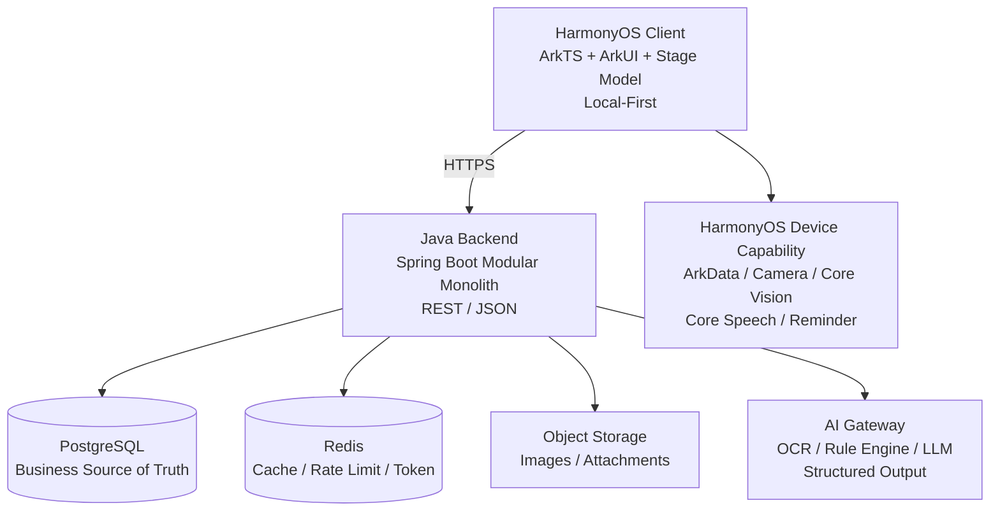

*图 3-1 总体技术架构*

## 3.1 技术栈基线
| **层级**         | **技术/组件**                                                       | **选择理由**                                       |
|------------------|---------------------------------------------------------------------|----------------------------------------------------|
| HarmonyOS 客户端 | ArkTS、ArkUI、Stage 模型                                            | HarmonyOS 原生主力技术栈；适合复杂应用和状态共享。 |
| 客户端本地数据   | ArkData RelationalStore                                             | 结构化数据 CRUD、本地优先、事务与索引。            |
| 设备 AI/能力     | Camera、Core Vision Kit、Core Speech Kit、Background Tasks/Reminder | 相机、OCR、语音和系统提醒。                        |
| 后端             | Java 21 + Spring Boot 4.x                                           | 成熟生态、强类型、事务与长期维护能力。             |
| 数据访问         | Spring Data JPA + PostgreSQL                                        | V1 业务关系明确，JPA 足以支撑快速开发。            |
| 缓存/限流        | Redis                                                               | 仅用于缓存、限流、Token/会话等，不存主业务真值。   |
| 数据库迁移       | Flyway                                                              | 禁止生产依赖 ddl-auto=update。                     |
| AI 接入          | Spring AI 或自研 AiModelGateway Adapter                             | 结构化输出、模型供应商可替换。                     |
| 对象存储         | OBS/S3/MinIO 兼容接口                                               | 图片与附件不直接进入关系数据库。                   |

## 3.2 关键架构决策（ADR 摘要）
| **ADR** | **决策**                    | **原因**                        | **后果**                    |
|---------|-----------------------------|---------------------------------|-----------------------------|
| ADR-001 | 客户端 Local-First          | 核心体验不能因断网失效          | 需要 sync_queue 和冲突处理  |
| ADR-002 | Java 模块化单体             | V1 避免微服务运维与一致性复杂度 | 按领域包隔离，预留拆分边界  |
| ADR-003 | Item 与 InventoryBatch 分离 | 同一商品可能存在多个到期批次    | UI 可弱化批次，模型必须保留 |
| ADR-004 | 到期状态不持久化            | 状态随日期自然变化              | 查询/展示时动态计算         |
| ADR-005 | AI 只生成 ItemDraft         | 避免错误数据直接污染库存        | 用户确认成为关键交互        |
| ADR-006 | 核心临期提醒在端侧          | 避免依赖网络和服务端 Push       | 服务端保存策略/辅助提醒     |

# 4. HarmonyOS 客户端设计
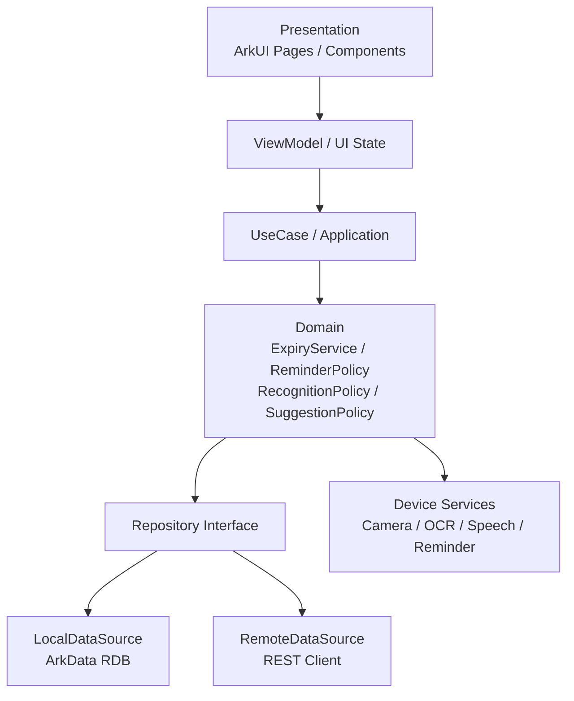

*图 4-1 客户端分层*

## 4.1 客户端架构
客户端采用 MVVM + Clean Architecture + Repository。页面只消费 ViewModel 状态；业务规则下沉至 UseCase/Domain；Repository 对本地 ArkData 与远程 REST 做隔离。

## 4.2 推荐工程目录
> entry/src/main/ets/  
> ├── entryability/  
> ├── pages/  
> │ ├── HomePage.ets  
> │ ├── InventoryPage.ets  
> │ ├── AddItemPage.ets  
> │ ├── ItemDetailPage.ets  
> │ ├── RecognitionPage.ets  
> │ ├── SuggestionPage.ets  
> │ ├── StatisticsPage.ets  
> │ └── ProfilePage.ets  
> ├── components/  
> ├── viewmodel/  
> ├── domain/  
> │ ├── model/  
> │ ├── usecase/  
> │ ├── service/  
> │ └── rule/  
> ├── data/  
> │ ├── local/  
> │ ├── remote/  
> │ ├── repository/  
> │ └── mapper/  
> ├── ai/  
> ├── reminder/  
> ├── database/  
> └── common/

## 4.3 本地数据职责
| **数据**             | **本地是否权威** | **说明**                                                 |
|----------------------|------------------|----------------------------------------------------------|
| Item / Batch         | 是（即时）       | 保存后 UI 立即可见；云端同步异步执行。                   |
| ReminderSetting      | 是               | 离线可修改；同步到服务端作为跨设备配置。                 |
| ExpiryStatus         | 否（派生）       | 根据 expiryDate/effectiveExpireDate + 当前日期动态计算。 |
| AI RecognitionRecord | 缓存/审计        | 可仅保存摘要与字段结果，原始图片按隐私策略处理。         |
| Suggestion           | 缓存             | 允许过期后重新生成，不作为业务真值。                     |

## 4.4 客户端 Repository 契约
> export interface ItemRepository {  
> create(item: Item): Promise\<Item\>  
> update(item: Item): Promise\<void\>  
> delete(id: string): Promise\<void\>  
> getById(id: string): Promise\<Item \| undefined\>  
> query(query: ItemQuery): Promise\<Item\[\]\>  
> }

## 4.5 客户端离线行为
| **场景**           | **离线行为**                                                           |
|--------------------|------------------------------------------------------------------------|
| 新增/修改/删除物品 | 写 ArkData + 写 sync_queue，操作立即成功。                             |
| 临期状态           | 本地 ExpiryService 计算。                                              |
| 系统提醒           | 已注册的本地提醒继续工作。                                             |
| AI 云端增强        | 显示“当前离线，可手动确认/稍后识别”；端侧 OCR 可继续使用时则保留 OCR。 |
| 商城/云推荐        | 降级为本地补货清单或不可用状态。                                       |

# 5. 页面与交互流程
## 5.1 一级信息架构
> 首页 物品 + 建议 我的  
> （中央录入入口）

| **产品约束** V1 不让“商城”占据一级导航。补货/精选商城从“建议”或“已用完 → 补货”链路进入，避免工具产品被感知为广告入口。 |
|------------------------------------------------------------------------------------------------------------------------|

## 5.2 首页
- 顶部：今日需要处理的物品数量。

- 核心卡片：即将过期 / 已过期；默认展示最紧急 10~20 项。

- 今日建议：优先处理的单物品或组合建议。

- 库存概览：食品、化妆品、宠物粮、其他。

- 快速动作：查看建议、已用完、稍后提醒。

## 5.3 新增物品流程
> 点击 +  
> ├─ 拍照添加 → OCR/AI → ItemDraft → 用户确认 → Save  
> ├─ 语音添加 → ASR → Intent Parse → ItemDraft → 用户确认 → Save  
> ├─ 扫码添加 → 商品候选 → 日期补充 → Save  
> └─ 手动添加 → 表单校验 → Save

## 5.4 手动表单字段
| **字段**   | **必填** | **规则/说明**                |
|------------|----------|------------------------------|
| 名称       | 是       | 1~80 字符                    |
| 分类       | 是       | 系统分类或自定义分类         |
| 品牌       | 否       | 用于搜索/推荐                |
| 数量/单位  | 否       | 默认 1                       |
| 生产日期   | 条件     | 与保质期组合可推导到期日期   |
| 保质期     | 条件     | 仅填写保质期无法确定到期时间 |
| 到期日期   | 条件     | 可单独填写                   |
| 开封日期   | 否       | 化妆品/开封后期限场景        |
| 开封后期限 | 否       | PAO，如 6M/12M               |
| 存放位置   | 否       | 冰箱/橱柜等                  |
| 估算价格   | 否       | V1.5 用于浪费金额            |
| 备注       | 否       | 自由文本                     |

## 5.5 日期表单校验
| **输入组合**          | **系统行为**                               |
|-----------------------|--------------------------------------------|
| 生产日期 + 保质期     | 计算到期日期，并展示“系统推导”。           |
| 生产日期 + 到期日期   | 可反算保质期，仅作为辅助展示。             |
| 仅到期日期            | 允许保存。                                 |
| 仅保质期              | 禁止最终保存，要求补生产日期或到期日期。   |
| 开封日期 + 开封后期限 | 计算开封有效日期，并与原到期日期取更早值。 |

# 6. 核心领域模型与状态机
## 6.1 核心实体关系
> User  
> ├─ Preference  
> ├─ Category  
> ├─ Item 1 ── N InventoryBatch  
> │ ├─ ReminderRecord  
> │ └─ ConsumptionRecord  
> ├─ RecognitionRecord  
> ├─ Suggestion  
> └─ SyncRecord

## 6.2 Item 与 InventoryBatch
Item 表示“商品/物品身份”，InventoryBatch 表示“库存批次”。例如同一品牌牛奶 3 盒可能存在不同生产日期或到期日期，因此到期、数量和开封信息应归属批次。V1 UI 可以将批次弱化为一个合并列表，但数据库模型不要合并。

## 6.3 生命周期状态
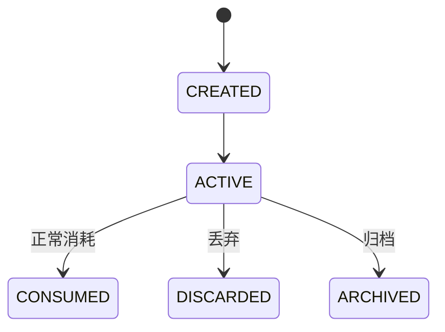

*图 6-1 Item 生命周期状态*

| **枚举**  | **含义**                   |
|-----------|----------------------------|
| ACTIVE    | 物品/批次仍在库存中        |
| CONSUMED  | 正常使用完                 |
| DISCARDED | 丢弃                       |
| ARCHIVED  | 仅保留历史，不参与库存计算 |

## 6.4 到期状态
| **枚举**    | **判定**                         |
|-------------|----------------------------------|
| UNKNOWN     | 无法确定有效到期日期             |
| NORMAL      | remainingDays \> reminderDays    |
| NEAR_EXPIRY | 0 ≤ remainingDays ≤ reminderDays |
| EXPIRED     | remainingDays \< 0               |

| **重要** ExpiryStatus 不持久化到数据库。它是由日期 + 当前时间 + 提醒策略派生的状态，否则每天都需要批量更新且容易出现脏状态。 |
|------------------------------------------------------------------------------------------------------------------------------|

## 6.5 有效到期日期
> effectiveExpireDate =  
> min(  
> originalExpiryDate,  
> openedDate + afterOpenDuration  
> )

若某一分支缺失，则使用可确定的日期；如果两者都缺失，则 ExpiryStatus=UNKNOWN。月份/年份使用日历语义（plusMonths/plusYears），不要简单换算为固定天数。

## 6.6 ItemDraft
AI/语音识别不能直接创建正式 Item，统一先生成 ItemDraft。ItemDraft 保存每个字段的值、置信度、证据与来源；用户确认后再转为 Item/InventoryBatch。

> interface ItemDraft {  
> name?: string  
> category?: string  
> productionDate?: number  
> expiryDate?: number  
> shelfLifeValue?: number  
> shelfLifeUnit?: ShelfLifeUnit  
> quantity?: number  
> fieldsConfidence: Map\<string, number\>  
> }

# 7. Java 后端架构
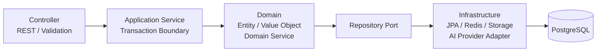

*图 7-1 Java 后端分层*

## 7.1 Java 技术栈
| **组件**    | **建议**                                   |
|-------------|--------------------------------------------|
| JDK         | Java 21                                    |
| Spring Boot | 4.x 稳定版                                 |
| Web         | Spring MVC / spring-boot-starter-web       |
| Validation  | Jakarta Bean Validation                    |
| Persistence | Spring Data JPA + PostgreSQL               |
| Migration   | Flyway                                     |
| Security    | Spring Security（账号上线后启用 JWT/OIDC） |
| Cache       | Redis                                      |
| AI          | Spring AI 或自研 AiModelGateway            |
| Mapping     | MapStruct（可选）                          |
| Build       | Maven                                      |

## 7.2 模块化单体包结构
> com.example.smartexpiry  
> ├── common  
> │ ├── api  
> │ ├── exception  
> │ ├── config  
> │ ├── security  
> │ └── util  
> ├── auth  
> ├── user  
> ├── category  
> ├── item  
> ├── inventory  
> ├── expiry  
> ├── recognition  
> ├── suggestion  
> ├── reminder  
> ├── preference  
> ├── statistics  
> ├── sync  
> ├── shopping  
> └── infrastructure

## 7.3 模块内部结构
> item/  
> ├── controller/  
> ├── application/  
> │ ├── command/  
> │ └── query/  
> ├── domain/  
> │ ├── model/  
> │ ├── repository/  
> │ └── service/  
> └── infrastructure/  
> ├── persistence/  
> └── mapper/

## 7.4 层级职责
| **层**              | **允许做什么**                                        | **禁止做什么**                             |
|---------------------|-------------------------------------------------------|--------------------------------------------|
| Controller          | HTTP 参数、Bean Validation、鉴权上下文、Response 封装 | 日期业务计算、直接访问 JPA、调用模型供应商 |
| Application Service | 业务编排、事务边界、跨聚合调用                        | 耦合 HTTP/JSON 细节                        |
| Domain              | 实体、值对象、规则、领域服务                          | 依赖 Controller/JPA 实现/外部 SDK          |
| Repository Port     | 定义领域所需的数据访问契约                            | 暴露 JpaRepository 到业务层                |
| Infrastructure      | JPA、Redis、对象存储、AI Provider Adapter             | 承载核心业务规则                           |

## 7.5 事务边界
事务建议放在 Application Service。创建物品至少包含 Item、Batch、提醒计划记录和同步变更，要求在一个本地数据库事务内原子提交。外部 AI/对象存储调用应尽量放在事务之前或使用补偿策略，避免长事务。

> @Service  
> @RequiredArgsConstructor  
> public class ItemApplicationService {  
>   
> @Transactional  
> public ItemResponse create(CreateItemRequest request) {  
> // 1. build Item  
> // 2. build InventoryBatch  
> // 3. persist  
> // 4. write reminder/sync metadata  
> // 5. return response  
> }  
> }

## 7.6 日期类型规范
| **语义**                      | **Java 类型**               | **数据库类型**             |
|-------------------------------|-----------------------------|----------------------------|
| 生产/到期/开封日期            | LocalDate                   | DATE                       |
| createdAt/updatedAt/deletedAt | Instant                     | TIMESTAMP WITH TIME ZONE   |
| 用户提醒时刻（如 09:00）      | LocalTime + ZoneId/用户时区 | TIME + timezone preference |

# 8. 数据库设计
## 8.1 核心表清单
| **表**                  | **职责**            | **V1**     |
|-------------------------|---------------------|------------|
| user                    | 账号/用户标识       | 可选       |
| category                | 系统/自定义分类     | 是         |
| item                    | 物品身份            | 是         |
| inventory_batch         | 数量与日期批次      | 是         |
| reminder_setting        | 分类提醒策略        | 是         |
| reminder_record         | 已注册/触发提醒记录 | 是         |
| recognition_record      | AI/OCR 审计与评测   | 是         |
| consumption_record      | 已用完/丢弃行为     | 是         |
| preference              | 用户偏好/过敏扩展   | 是（基础） |
| suggestion              | 建议缓存/审计       | 可选       |
| sync_queue / sync_event | 客户端/服务端同步   | 预留       |
| shopping_list           | 补货清单            | P1/P2      |

## 8.2 Item 数据字典
| **字段**         | **类型**      | **约束**     | **说明**                           |
|------------------|---------------|--------------|------------------------------------|
| id               | varchar/uuid  | PK           | 全局唯一                           |
| name             | varchar(80)   | NOT NULL     | 物品名称                           |
| category_id      | varchar       | NOT NULL, FK | 分类                               |
| brand            | varchar(80)   | NULL         | 品牌                               |
| barcode          | varchar(64)   | NULL         | 条码                               |
| image_url        | text          | NULL         | 对象存储地址                       |
| lifecycle_status | varchar(24)   | NOT NULL     | ACTIVE/CONSUMED/DISCARDED/ARCHIVED |
| source_type      | varchar(24)   | NOT NULL     | MANUAL/CAMERA/VOICE/BARCODE        |
| estimated_price  | numeric(12,2) | NULL         | 估算价格                           |
| version          | bigint        | NOT NULL     | 乐观锁/同步版本                    |
| created_at       | timestamptz   | NOT NULL     | 创建时间                           |
| updated_at       | timestamptz   | NOT NULL     | 更新时间                           |
| deleted_at       | timestamptz   | NULL         | 软删除                             |

## 8.3 InventoryBatch 数据字典
| **字段**         | **类型**     | **说明**       |
|------------------|--------------|----------------|
| id               | varchar/uuid | 批次 ID        |
| item_id          | varchar/uuid | 所属 Item      |
| quantity         | numeric      | 库存数量       |
| unit             | varchar      | 盒/瓶/g 等     |
| production_date  | date         | 生产日期       |
| expiry_date      | date         | 原始到期日期   |
| shelf_life_value | int          | 保质期数值     |
| shelf_life_unit  | varchar      | DAY/MONTH/YEAR |
| opened_date      | date         | 开封日期       |
| after_open_value | int          | 开封后期限数值 |
| after_open_unit  | varchar      | DAY/MONTH/YEAR |
| location         | varchar      | 存放位置       |
| created_at       | timestamptz  | 创建时间       |
| updated_at       | timestamptz  | 更新时间       |

## 8.4 RecognitionRecord
| **字段**                           | **说明**                                   |
|------------------------------------|--------------------------------------------|
| id / user_id / item_id             | 关联识别任务与最终物品                     |
| input_type                         | IMAGE / TEXT / VOICE                       |
| ocr_provider / ai_provider / model | 供应商与模型追踪                           |
| prompt_version                     | Prompt 版本                                |
| raw_text                           | OCR/ASR 原始文本；敏感场景可脱敏或不持久化 |
| structured_result                  | 结构化 JSON                                |
| overall_confidence                 | 综合置信度                                 |
| processing_ms                      | 处理耗时                                   |
| status                             | SUCCESS/NEED_CONFIRMATION/FAILED           |
| created_at                         | 创建时间                                   |

## 8.5 索引建议
> CREATE INDEX idx_item_category ON item(category_id);  
> CREATE INDEX idx_item_updated ON item(updated_at);  
> CREATE INDEX idx_item_lifecycle ON item(lifecycle_status);  
> CREATE INDEX idx_batch_item ON inventory_batch(item_id);  
> CREATE INDEX idx_batch_expiry ON inventory_batch(expiry_date);  
> CREATE INDEX idx_consumption_item ON consumption_record(item_id);  
> CREATE INDEX idx_recognition_created ON recognition_record(created_at);

## 8.6 数据库迁移策略
- 生产环境使用 Flyway；禁止依赖 Hibernate ddl-auto=update。

- 建议 ddl-auto=validate；结构变更必须以 migration 文件进入 Git。

- 迁移文件采用 V1\_\_init.sql、V2\_\_add_xxx.sql 命名。

- 有破坏性变更时执行“扩展字段 → 双写/迁移 → 切换读取 → 删除旧字段”的兼容策略。

# 9. REST API 设计
## 9.1 API 规范
| **项**    | **规范**                                           |
|-----------|----------------------------------------------------|
| Base Path | /api/v1                                            |
| 协议      | HTTPS + JSON                                       |
| 时间      | 日期 YYYY-MM-DD；时间戳 ISO-8601 UTC               |
| 认证      | V1 可选；启用后 Authorization: Bearer \<token\>    |
| 分页      | page/pageSize 或 cursor；V1 列表可先 page/pageSize |
| 幂等      | 同步/上传等关键接口使用 requestId/idempotencyKey   |
| 错误      | 业务 code + message + traceId                      |

## 9.2 通用响应
> {  
> "code": 0,  
> "message": "success",  
> "data": {},  
> "traceId": "..."  
> }

## 9.3 核心接口清单
| **Method** | **Path**                   | **说明**                   |
|------------|----------------------------|----------------------------|
| POST       | /api/v1/items              | 创建物品                   |
| GET        | /api/v1/items              | 分页查询/筛选物品          |
| GET        | /api/v1/items/{id}         | 详情                       |
| PATCH      | /api/v1/items/{id}         | 修改                       |
| DELETE     | /api/v1/items/{id}         | 软删除                     |
| POST       | /api/v1/items/{id}/consume | 标记已用完/部分消耗        |
| POST       | /api/v1/items/{id}/discard | 丢弃                       |
| GET        | /api/v1/dashboard          | 首页聚合                   |
| POST       | /api/v1/recognition/text   | OCR/语音文本结构化         |
| POST       | /api/v1/recognition/image  | 服务端图片识别（可选增强） |
| POST       | /api/v1/suggestions        | 生成处理建议               |
| GET        | /api/v1/preferences        | 读取偏好                   |
| PUT        | /api/v1/preferences        | 更新偏好                   |
| POST       | /api/v1/sync/push          | 上行同步                   |
| GET        | /api/v1/sync/pull          | 下行同步                   |

## 9.4 创建物品示例
> POST /api/v1/items  
>   
> {  
> "name": "纯牛奶",  
> "categoryId": "food",  
> "brand": "示例品牌",  
> "quantity": 1,  
> "unit": "盒",  
> "productionDate": "2026-10-02",  
> "expiryDate": "2026-10-30",  
> "sourceType": "CAMERA"  
> }

## 9.5 查询参数
| **参数** | **示例**    | **说明**            |
|----------|-------------|---------------------|
| category | food        | 分类                |
| status   | near_expiry | 服务端动态过滤/计算 |
| keyword  | 牛奶        | 名称/品牌搜索       |
| sort     | expiry_asc  | 最近到期优先        |
| page     | 1           | 页码                |
| pageSize | 20          | 建议上限 100        |

## 9.6 错误码建议
| **范围** | **领域**  | **示例**                                                                          |
|----------|-----------|-----------------------------------------------------------------------------------|
| 100xxx   | 通用      | 100001 VALIDATION_ERROR                                                           |
| 200xxx   | 用户/认证 | 200001 UNAUTHORIZED                                                               |
| 300xxx   | 物品      | 300001 ITEM_NOT_FOUND；300002 INVALID_EXPIRY_DATE                                 |
| 400xxx   | 识别/AI   | 400001 OCR_FAILED；400002 LOW_CONFIDENCE；400003 DATE_CONFLICT；400004 AI_TIMEOUT |
| 500xxx   | 提醒      | 500001 REMINDER_SCHEDULE_FAILED                                                   |
| 600xxx   | 同步      | 600001 SYNC_CONFLICT                                                              |

# 10. 智能录入与 AI 识别
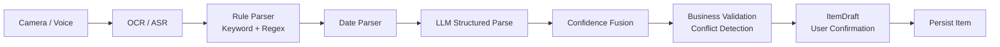

*图 10-1 识别 Pipeline*

## 10.1 识别链路
1.  采集：Camera 或语音。

2.  端侧能力优先：Core Vision OCR / Core Speech ASR。

3.  规则提取：日期关键词、Regex、保质期单位、包装常见缩写。

4.  日期解析：把 2026.10.02、20261002、EXP/MFG 等转换为标准候选。

5.  LLM 结构化：只补充语义关联和字段归属，不直接做关键日期算术。

6.  置信度融合：规则、OCR、LLM 证据融合为字段级 confidence。

7.  业务校验：日期冲突、缺失字段、范围异常。

8.  生成 ItemDraft，用户确认后保存。

## 10.2 结构化输出 Schema
> {  
> "productName": {  
> "value": "示例纯牛奶",  
> "confidence": 0.96,  
> "evidence": "示例纯牛奶",  
> "source": "OCR_LLM"  
> },  
> "category": {  
> "value": "FOOD",  
> "confidence": 0.97,  
> "source": "LLM"  
> },  
> "productionDate": {  
> "value": "2026-10-02",  
> "confidence": 0.98,  
> "evidence": "生产日期 2026.10.02",  
> "source": "RULE"  
> },  
> "shelfLife": {  
> "value": 28,  
> "unit": "DAY",  
> "confidence": 0.97  
> },  
> "expiryDate": {  
> "value": "2026-10-30",  
> "confidence": 0.99,  
> "source": "CALCULATED"  
> }  
> }

## 10.3 置信度策略
| **区间**    | **UI/业务处理**                       |
|-------------|---------------------------------------|
| ≥ 0.90      | 自动填入；关键日期仍展示确认来源。    |
| 0.60 ~ 0.90 | 黄色高亮，要求用户重点确认。          |
| \< 0.60     | 不作为可靠值，要求人工补充/重新拍摄。 |

## 10.4 日期关键词与格式
- 关键词：生产日期、制造日期、MFG、有效期至、EXP、Best Before、保质期。

- 格式：YYYY-MM-DD、YYYY/MM/DD、YYYY.MM.DD、YYYYMMDD、中文年月日。

- 保质期：N 天 / N 月 / N 年；月份必须用日历月份语义。

- 多日期：保留全部候选及上下文证据，由规则 + AI 分类；冲突时要求用户确认。

## 10.5 日期冲突校验
当包装同时出现生产日期、保质期和到期日期时，服务端根据确定性 DateCalculator 重新计算期望到期日期。若与识别到期日期差异超过允许阈值（建议 1 天，具体按业务决定），返回 DATE_CONFLICT，不自动选择。

## 10.6 Java AI Gateway 抽象
> public interface AiModelGateway {  
> \<T\> T structuredGenerate(  
> String systemPrompt,  
> String userPrompt,  
> Class\<T\> responseType  
> );  
> }

业务层只依赖 AiModelGateway。Spring AI、云模型、自建模型都通过 Adapter 实现。这样模型供应商、模型版本和费用策略可以独立演进。

## 10.7 Prompt 管理
> resources/prompts/  
> ├── recognition-system.txt  
> ├── suggestion-food.txt  
> ├── suggestion-cosmetics.txt  
> ├── suggestion-pet-food.txt  
> └── suggestion-other.txt

- Prompt 必须版本化（promptVersion）。

- 识别记录保存 model/provider/promptVersion，便于回归与 A/B。

- 禁止在 Controller 中硬编码 Prompt。

# 11. 保质期、提醒与建议引擎
## 11.1 Expiry Engine
> remainingDays = DAYS.between(today, effectiveExpireDate)  
>   
> if remainingDays \< 0:  
> EXPIRED  
> else if remainingDays \<= reminderDays:  
> NEAR_EXPIRY  
> else:  
> NORMAL

## 11.2 客户端与服务端规则一致性
ArkTS 与 Java 都需要支持离线/在线状态计算。为避免两端规则漂移，建议建立共享的 expiry-test-cases.json，由两端各自加载同一组用例执行单元测试。规则改变时必须同时更新测试集。

> \[  
> {  
> "today": "2026-10-01",  
> "expiry": "2026-10-05",  
> "reminderDays": 7,  
> "expected": "NEAR_EXPIRY"  
> }  
> \]

## 11.3 Reminder Engine
| **组件**          | **职责**                                         |
|-------------------|--------------------------------------------------|
| ReminderPolicy    | 输入分类、有效到期日、用户配置，生成提醒时间点。 |
| ReminderScheduler | 调用 HarmonyOS 系统能力注册/取消提醒。           |
| ReminderManager   | 物品新增/修改/删除/消耗后统一重建提醒。          |

## 11.4 默认提醒策略
| **分类** | **默认提醒**  |
|----------|---------------|
| 食品     | 7 / 3 / 1 天  |
| 化妆品   | 30 / 7 / 1 天 |
| 宠物粮   | 14 / 7 / 3 天 |
| 其他     | 7 / 3 / 1 天  |

以上仅为默认配置，不写死在页面逻辑中。最终来源为系统默认 + 用户覆盖 + 特殊商品覆盖。

## 11.5 修改物品后的提醒重建
> Update Item/Batch  
> ↓  
> Cancel previous reminders  
> ↓  
> Calculate effectiveExpireDate  
> ↓  
> Generate ReminderPlan  
> ↓  
> Schedule local reminders  
> ↓  
> Persist reminder metadata

## 11.6 智能建议
> Inventory Context  
> + Expiry Context  
> + Category  
> + User Preference / Allergy  
> + Safety Rules  
> ↓  
> SuggestionContext  
> ↓  
> LLM Natural Language Generation

| **安全边界** 食品已经过期时，规则层应阻止模型生成“闻一闻还能吃”“再吃几天”等安全性不确定建议。LLM 负责表述，不负责推翻业务安全规则。 |
|-------------------------------------------------------------------------------------------------------------------------------------|

## 11.7 建议类型
| **类别** | **建议方向**                                 |
|----------|----------------------------------------------|
| 食品     | 优先消耗、简单搭配/食谱、库存组合            |
| 化妆品   | 尽快使用、检查颜色/气味/质地、开封后期限提示 |
| 宠物粮   | 优先消耗当前包装、减少开新包装、检查储存     |
| 其他     | 通用处理/补货建议                            |

# 12. 本地优先与同步
## 12.1 客户端写入模型
> User Action  
> ↓  
> ArkData transaction  
> ├─ write business entity  
> └─ write sync_queue  
> ↓  
> UI updates immediately  
> ↓  
> Background sync when network available

## 12.2 SyncQueue 字段
| **字段**       | **说明**                      |
|----------------|-------------------------------|
| id             | 本地变更 ID                   |
| entity_type    | ITEM / BATCH / PREFERENCE ... |
| entity_id      | 业务实体 ID                   |
| operation      | CREATE / UPDATE / DELETE      |
| entity_version | 提交前版本                    |
| payload        | 变更快照/字段                 |
| created_at     | 本地创建时间                  |
| retry_count    | 重试次数                      |
| status         | PENDING/SYNCED/FAILED         |

## 12.3 同步 API
> POST /api/v1/sync/push  
> GET /api/v1/sync/pull?cursor=\<cursor\>

## 12.4 版本与冲突
推荐每个可同步实体保存 version。客户端基于 version 提交更新；服务端版本不一致时返回 409 Conflict。V1 可提供“服务端最新 + 客户端草稿”让客户端选择；家庭共享上线后再引入字段级合并或更复杂策略。

| **条件**                         | **处理**                          |
|----------------------------------|-----------------------------------|
| client.version == server.version | 接受更新，server.version + 1      |
| client.version \< server.version | 409 SYNC_CONFLICT，返回服务器最新 |
| 删除 vs 修改冲突                 | V1 以显式冲突处理，不静默覆盖     |

# 13. 安全、隐私与部署
## 13.1 隐私数据分类
| **数据**      | **风险**              | **策略**                                        |
|---------------|-----------------------|-------------------------------------------------|
| 商品图片      | 可能包含家庭环境/票据 | 端侧 OCR 优先；服务端上传需用户知情且设置保留期 |
| 语音          | 可能包含个人信息      | 优先只保留转写文本；原始音频默认不长期保存      |
| 过敏清单      | 健康相关敏感信息      | 最小化使用、加密传输、严格访问控制              |
| 库存/购买记录 | 生活习惯信息          | 账号隔离、日志脱敏、最小权限                    |

## 13.2 权限申请
- Camera：用户点击拍照添加时再请求。

- Microphone：用户点击语音添加时再请求。

- Notification/Reminder：首次启用提醒时解释价值后请求。

- 禁止首屏连续申请全部权限。

## 13.3 后端安全
- HTTPS 全链路；服务端禁止记录 Token、原始密码和敏感图片内容。

- 启用账号后使用 Spring Security；访问令牌短期、刷新令牌可撤销。

- 上传接口校验 MIME、尺寸、扩展名和内容；对象存储使用不可猜测 key。

- AI 调用使用 Provider Adapter，密钥只在服务端 Secret/配置中心。

- 关键修改记录 traceId / audit metadata。

## 13.4 部署拓扑
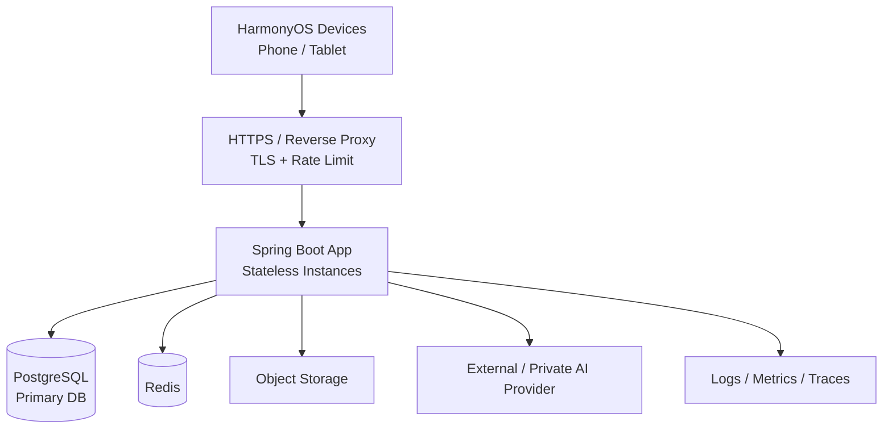

*图 13-1 V1 部署拓扑*

## 13.5 环境
| **环境** | **用途**      | **数据**                                      |
|----------|---------------|-----------------------------------------------|
| local    | 开发者本机    | Docker PostgreSQL/Redis/MinIO，可使用 Mock AI |
| dev      | 持续集成/联调 | 测试数据，允许频繁清理                        |
| staging  | 发布前验证    | 配置尽量接近生产；脱敏测试集                  |
| prod     | 正式用户      | 高可用、备份、告警、审计                      |

## 13.6 容量基线（V1 建议）
早期优先保证稳定和可观测，不做过度预估。业务表以结构化小记录为主；图片放对象存储。首页和到期查询需有 expiry/category 索引。Spring Boot 服务保持无状态，后续可水平扩容。

# 14. 可观测性与测试
## 14.1 日志与链路
| **类型**    | **必须包含**                                                   | **禁止包含**             |
|-------------|----------------------------------------------------------------|--------------------------|
| HTTP Access | method/path/status/latency/traceId/userId hash                 | Token、完整 Request Body |
| 业务日志    | entityId、operation、result、errorCode                         | 过敏详情、完整 OCR 文本  |
| AI 日志     | provider/model/promptVersion/latency/token usage/result status | 无必要的原始图片/语音    |

## 14.2 指标
| **领域** | **指标**                                                                |
|----------|-------------------------------------------------------------------------|
| 产品     | 录入成功率、平均录入耗时、临期处理率、提醒打开率、7/30 日留存           |
| 识别     | OCR Recall、日期准确率、名称准确率、类别准确率、E2E Recognition Success |
| 服务     | API P95/P99、错误率、DB 连接池、AI 调用耗时/失败率、同步冲突率          |
| 客户端   | 崩溃率、页面首屏耗时、ArkData 失败率、提醒注册失败率                    |

## 14.3 单元测试重点
| **模块**             | **必须覆盖**                                          |
|----------------------|-------------------------------------------------------|
| ExpiryService        | 今天到期、昨天过期、临期边界、跨月/跨年、闰年、PAO    |
| DateParser           | 不同分隔符、YYYYMMDD、MFG/EXP、保质期天/月/年、多日期 |
| ReminderPolicy       | 7/3/1 生成、过期不重复、修改后重建、时区              |
| RecognitionValidator | 低置信度、日期冲突、缺字段                            |
| Repository           | 软删除、分页、并发 version、事务回滚                  |
| Sync                 | 重复 push 幂等、version 冲突、失败重试                |

## 14.4 AI Benchmark
- 建立 500~1000 张包装图片评测集，覆盖食品/化妆品/宠物粮。

- 覆盖反光、模糊、小字体、喷码、多个日期、中英日韩繁等典型困难场景（以实际支持语言为准）。

- 字段级评测之外，建立 End-to-End Success：名称/类别/关键日期均正确才算成功。

- Prompt 或模型版本变更必须跑回归集，禁止仅凭少量人工样例上线。

## 14.5 集成与端到端测试
| **层级**   | **场景**                                                               |
|------------|------------------------------------------------------------------------|
| API 集成   | 创建 Item + Batch、修改日期、consume/discard、dashboard 聚合、同步冲突 |
| 客户端联调 | 离线新增→上线同步、端侧 OCR→服务端解析、提醒修改重建                   |
| E2E        | 拍照商品→识别→确认→首页临期→提醒→已用完→统计                           |

# 15. 团队协作与研发规范
## 15.1 RACI 建议
| **事项**            | **产品** | **客户端** | **后端** | **AI** | **测试** |
|---------------------|----------|------------|----------|--------|----------|
| 业务规则定义        | A/R      | C          | C        | C      | C        |
| ArkTS 页面/本地数据 | C        | A/R        | C        | C      | C        |
| API/后端领域        | C        | C          | A/R      | C      | C        |
| OCR/AI Schema       | C        | C          | C        | A/R    | C        |
| 提醒策略            | A        | R          | C        | C      | C        |
| 测试验收            | C        | C          | C        | C      | A/R      |
| 发布 Gate           | A        | R          | R        | R      | R        |

## 15.2 Git 与分支
- main：可发布基线；受保护。

- develop：可选；小团队也可 trunk-based，关键是 PR + CI。

- feature/\<ticket\>-\<name\>：功能分支；fix/\<ticket\>-\<name\>：缺陷。

- 数据库 migration、API 变更、Schema 变更必须在 PR 描述中显式标记。

## 15.3 API 协作规则
- 接口先定义 OpenAPI/Swagger，再由前后端并行开发。

- 字段名、枚举、日期格式不允许口头约定；全部进入 API Schema。

- 破坏性 API 变更必须新版本或至少提供兼容窗口。

- 客户端对服务端未知枚举提供 UNKNOWN/FALLBACK，避免新版本服务端导致旧客户端崩溃。

## 15.4 Definition of Done
| **类别** | **完成条件**                                |
|----------|---------------------------------------------|
| 功能     | 主路径 + 异常路径实现；需求验收通过         |
| 代码     | Code Review；无阻断级静态检查；关键模块单测 |
| 数据     | Migration 可在空库和升级库执行              |
| API      | OpenAPI 已更新；错误码/示例齐全             |
| 观测     | 必要日志/指标存在且脱敏                     |
| 文档     | 架构/接口/规则变化同步回本文档或 ADR        |

## 15.5 评审会议建议
- 产品评审：确认 V1 范围、状态定义、日期逻辑、首页优先级。

- 技术评审：确认 Local-First、Item/Batch、API、Java 包结构、AI Gateway、提醒能力申请风险。

- 接口评审：锁定 Item/Recognition/Sync 三组 Schema。

- 测试评审：锁定日期边界用例与 AI Benchmark。

# 16. 里程碑与验收
## 16.1 推荐研发顺序
| **里程碑**      | **范围**                                                 | **验收**                                  |
|-----------------|----------------------------------------------------------|-------------------------------------------|
| M1 基础数据链路 | ArkData、PostgreSQL/Flyway、Item/Batch、Repository、CRUD | HarmonyOS 创建→本地显示→后端入库→查询回显 |
| M2 生命周期     | Expiry Engine、状态、ConsumptionRecord、Dashboard        | 临期/过期边界正确，已用完/丢弃可统计      |
| M3 提醒         | ReminderPolicy、系统提醒、修改重建                       | 离线情况下已注册提醒仍工作                |
| M4 智能录入     | Camera、OCR、DateParser、Recognition API                 | 拍照得到可确认 ItemDraft                  |
| M5 AI/语音      | 结构化 LLM、ASR、置信度/冲突校验                         | 识别失败可降级，低置信度不自动保存        |
| M6 建议与统计   | Suggestion Engine、统计页、体验优化                      | 完整 V1 闭环可端到端验收                  |

## 16.2 V1 发布 Gate
| **Gate**   | **最低要求**                                                       |
|------------|--------------------------------------------------------------------|
| 业务闭环   | 手动/拍照/语音至少两种智能录入方式稳定；CRUD、提醒、处理、统计闭环 |
| 日期正确性 | 核心边界用例全部通过；AI 低置信度/冲突均要求确认                   |
| 稳定性     | 无 P0/P1 阻断缺陷；核心页面崩溃问题清零                            |
| 数据安全   | 关键日志脱敏；上传权限/隐私说明完成；服务端密钥不进客户端          |
| 提醒能力   | 目标 HarmonyOS 版本与能力申请已验证；失败有降级策略                |
| 回归       | 客户端、后端、AI Benchmark 均完成回归                              |

## 16.3 V1 最终验收场景
> 用户拍照/语音/手动添加一个物品  
> ↓  
> 系统生成 ItemDraft 并完成用户确认  
> ↓  
> 客户端本地保存并可离线查询  
> ↓  
> 服务端异步同步成功  
> ↓  
> 有效到期日期和临期状态正确  
> ↓  
> 在配置时间触发提醒  
> ↓  
> 用户查看处理建议  
> ↓  
> 标记“已用完”或“已丢弃”  
> ↓  
> 首页/统计正确反映处理结果

# 17. 性能、容量、压测与高并发设计

本章用于补充 V1 在生产环境中的容量规划、性能验证、白天峰值流量治理与高并发处理策略。目标不是在早期引入复杂分布式体系，而是在现有“Spring Boot 模块化单体 + PostgreSQL + Redis + Local-First”基础上建立可测量、可扩容、可降级的容量工程能力。

## 17.1 设计目标与原则

| **目标** | **设计要求** |
|----------|--------------|
| 容量可量化 | 不以“机器配置看起来够用”为依据，使用 RPS、并发、P95/P99、错误率、DB 连接池等指标形成容量基线。 |
| 峰值可承受 | 白天业务高峰、Push 回流、同步集中触发时，核心 CRUD / Dashboard 仍保持可用。 |
| 可水平扩容 | Spring Boot 保持无状态，可通过反向代理/负载均衡增加实例。 |
| 先削峰再扩容 | Local-First、缓存、异步队列、Jitter 优先于盲目增加机器。 |
| AI 与主链路隔离 | AI Provider 延迟、限流或故障不能拖垮核心库存与提醒 API。 |
| 数据库受保护 | 应用实例扩容不能导致 PostgreSQL 连接数、慢查询和锁竞争失控。 |
| 性能可回归 | 关键接口的性能 Threshold 进入 CI / 发布 Gate。 |
| 逐步演进 | V1.1 不要求 Kubernetes/Kafka；先使用当前 Redis、无状态实例和独立 Worker 解决大部分问题。 |

## 17.2 性能指标与 SLO 建议

性能指标应以接口类型分别统计，避免将轻量 CRUD 与 AI 长耗时接口混为一个总体平均值。

| **指标** | **V1.1 建议目标** | **说明** |
|----------|-------------------|----------|
| 核心 API P50 | < 120 ms | Item / Batch / Preference 等非 AI 接口。 |
| 核心 API P95 | < 300 ms | 作为压测主要放行指标。 |
| 核心 API P99 | < 800 ms | 短时抖动允许，但不可持续恶化。 |
| 核心 API 5xx | < 0.5% | 压测目标；业务校验 4xx 不计入服务错误。 |
| Dashboard P95 | < 500 ms | 聚合查询允许略高于普通 CRUD。 |
| Redis P99 | < 10 ms | 同机房/同区域部署前提下的建议目标。 |
| PostgreSQL 慢查询 | 原则上 < 200 ms | 超出需结合执行计划、索引和数据量判断。 |
| HikariCP 活跃连接率 | 稳态 < 70~80% | 长时间接近 100% 视为高风险。 |
| JVM Heap | 稳态 < 70% | 关注 GC 前后的趋势而非单点值。 |
| AI 成功率 | 独立定义 | 不与核心 API SLO 合并。 |
| Push 成功率 | 独立定义 | 见第 18 章。 |

> 以上阈值是 V1.1 的工程起始值，不代表真实生产容量。最终上线阈值必须结合目标服务器规格、真实数据规模和压测结果调整。

## 17.3 容量模型

容量规划以峰值时段而不是全天平均值为基准。

建议使用以下估算：

> DailyRequests = DAU × AvgRequestsPerUserPerDay  
> PeakWindowRequests = DailyRequests × PeakTrafficRatio  
> PeakRPS = PeakWindowRequests ÷ PeakWindowSeconds  
> TargetRPS = PeakRPS × SafetyFactor

示例：

> DAU = 100,000  
> AvgRequestsPerUserPerDay = 20  
> DailyRequests = 2,000,000  
> 30% 请求集中在最忙的 2 小时  
> PeakRPS ≈ 2,000,000 × 0.3 ÷ 7200 ≈ 83 RPS  
> SafetyFactor = 3  
> TargetRPS ≈ 250 RPS

压测至少覆盖 1×、2×、3× 目标峰值，以得到安全余量和拐点。

## 17.4 压测环境要求

禁止直接使用开发者本机的结果作为生产容量结论。建议：

| **环境项** | **要求** |
|------------|----------|
| 应用实例 | 与生产同 JDK 主版本、相同 JVM 参数策略。 |
| PostgreSQL | 与生产同大版本，准备接近生产规模的数据量。 |
| Redis | 与生产相同网络拓扑和持久化/高可用策略。 |
| 网络 | 压测机与服务端分离，避免压测端成为瓶颈。 |
| AI | 主压测使用 Mock Provider；真实 Provider 单独压测。 |
| 对象存储 | 大文件上传场景单独测试，不与普通 CRUD 混合。 |
| 日志 | 压测时保留必要访问日志，但禁止 DEBUG 级别海量日志影响结论。 |
| 数据 | 使用脱敏/合成数据，覆盖真实索引基数、用户量和批次数量。 |

staging 环境应尽可能接近生产拓扑；压测前记录机器规格、实例数、连接池、JVM 参数、数据库配置和数据规模，保证结果可复现。

## 17.5 业务流量模型

压测不能只调用单一接口。建议构造接近真实行为的混合流量：

| **场景** | **建议占比起点** | **特点** |
|----------|------------------|----------|
| GET /api/v1/items | 25% | 高频读、分页、筛选。 |
| GET /api/v1/dashboard | 25% | 聚合查询、热点明显。 |
| POST /api/v1/items | 10% | Item + Batch 事务写入。 |
| PATCH /api/v1/items/{id} | 10% | 更新 + version 校验。 |
| POST /api/v1/sync/push | 10% | 批量写与幂等。 |
| GET /api/v1/sync/pull | 10% | 游标增量查询。 |
| Recognition | 5% | AI/IO 重；主压测使用 Mock。 |
| Suggestions | 5% | AI 重；与核心接口隔离统计。 |

实际比例应在上线后根据 Access Log / Metrics 校准。

## 17.6 压测类型

### 17.6.1 Load Test

验证目标峰值负载下系统是否稳定，例如：

> 250 RPS，持续 30~60 分钟。

关注 P95/P99、错误率、CPU、Heap、HikariCP、数据库等待、Redis、GC。

### 17.6.2 Stress Test

逐步提升负载寻找系统拐点：

> 50 → 100 → 200 → 400 → 800 RPS

记录第一个出现以下情况的负载级别：

- P99 持续超过阈值。
- 5xx 明显上升。
- HikariCP 长时间接近耗尽。
- PostgreSQL CPU / IO / Locks 明显失控。
- JVM Full GC 或线程堆积。

该拐点用于定义单实例/当前集群的上限，不作为正常运行目标。

### 17.6.3 Spike Test

模拟 Push 后用户集中回流、活动页打开、网络恢复后批量同步：

> 100 RPS → 1000 RPS，持续 30~120 秒 → 回落至 100 RPS。

验收重点是系统能否恢复，而不仅是峰值期间是否零错误。

### 17.6.4 Soak Test

持续 6~12 小时或更长时间运行中等负载，发现：

- 内存泄漏。
- 数据库/HTTP 连接泄漏。
- Redis 连接异常。
- 线程数量持续增长。
- 慢查询随数据增长恶化。
- 日志磁盘膨胀。

## 17.7 k6 压测基线

推荐使用 k6 作为 V1.1 的首选 API 压测工具。项目目录建议：

> performance/  
> ├── k6/  
> │   ├── common.js  
> │   ├── load.js  
> │   ├── stress.js  
> │   ├── spike.js  
> │   └── soak.js  
> ├── data/  
> │   └── users.json  
> └── README.md

示例：

```javascript
import http from 'k6/http';
import { check, sleep } from 'k6';

export const options = {
  scenarios: {
    peak_load: {
      executor: 'constant-arrival-rate',
      rate: 250,
      timeUnit: '1s',
      duration: '30m',
      preAllocatedVUs: 100,
      maxVUs: 1000,
    },
  },
  thresholds: {
    http_req_failed: ['rate<0.005'],
    http_req_duration: ['p(95)<300', 'p(99)<800'],
  },
};

export default function () {
  const baseUrl = __ENV.BASE_URL;
  const res = http.get(`${baseUrl}/api/v1/dashboard`, {
    headers: {
      Authorization: `Bearer ${__ENV.TOKEN}`,
    },
  });

  check(res, {
    'status is 200': r => r.status === 200,
  });

  sleep(0.1);
}
```

压测脚本必须参数化 BASE_URL、Token、用户数据和目标 RPS，禁止把生产密钥写入仓库。

## 17.8 可观测性

现有第 14 章指标基础上，增加性能专项指标：

| **层级** | **建议指标** |
|----------|--------------|
| HTTP | RPS、active requests、P50/P95/P99、4xx、5xx、timeout。 |
| JVM | Heap/Non-Heap、GC pause、线程数、CPU、process uptime。 |
| Tomcat | active threads、max threads、request backlog。 |
| HikariCP | active、idle、pending、max、connection acquire time。 |
| PostgreSQL | connections、TPS、slow query、locks、deadlocks、buffer hit、IO。 |
| Redis | ops/s、latency、connected clients、evictions、memory。 |
| AI | provider latency、429、timeout、token usage、queue depth。 |
| Queue | enqueue rate、consume rate、lag、retry、dead letter。 |
| Push | 见第 18 章。 |

多实例场景建议使用 Prometheus Histogram 聚合接口延迟，再计算整体 P95/P99；不要简单平均各实例已经计算好的 P95。

## 17.9 高峰流量治理顺序

遇到白天流量升高时，建议按以下顺序治理，而不是第一时间拆微服务：

> 1. 减少请求：Local-First / 客户端缓存 / 合并请求  
> 2. 减少数据库访问：Redis / 查询优化 / 索引  
> 3. 异步化：AI / Push / 统计 / 非关键写后处理  
> 4. 限流与降级：保护核心链路  
> 5. Spring Boot 水平扩容  
> 6. PostgreSQL 专项扩展  
> 7. 达到真实瓶颈后再评估更复杂分布式架构

## 17.10 Spring Boot 水平扩容

Spring Boot 继续保持 Stateless：

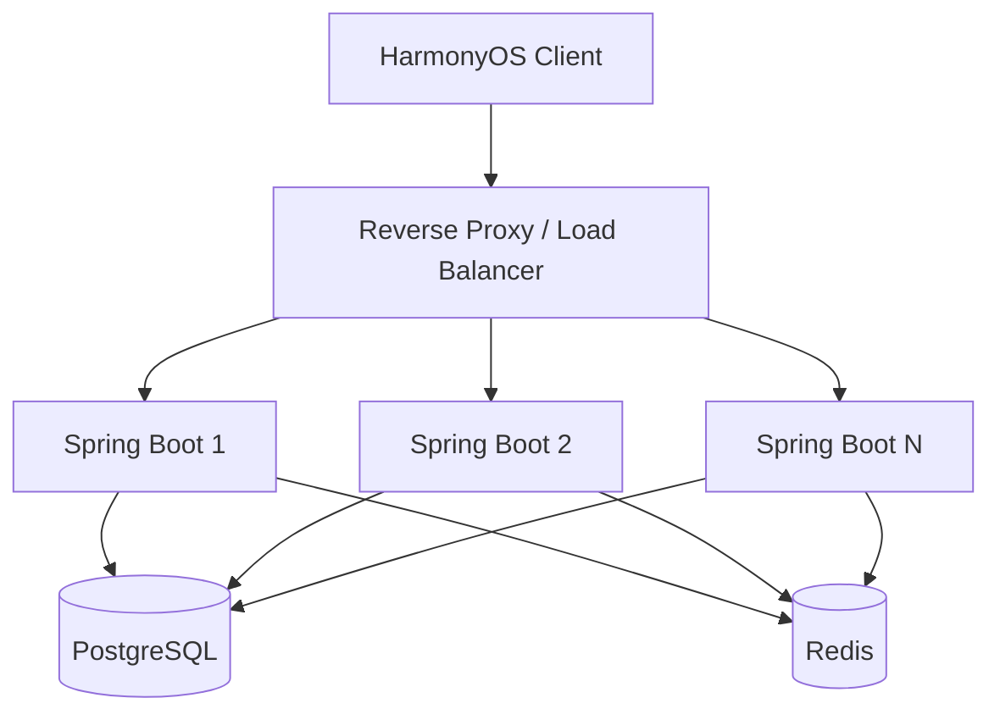

要求：

- 不在 JVM 本地保存必须跨实例共享的 Session/任务状态。
- Token/Session 如需服务端状态，放 Redis 或认证服务。
- 定时任务必须避免多实例重复执行，使用数据库抢占、Redis 锁或任务分片。
- 文件放对象存储，不能写本地磁盘后假设下一请求仍落在同实例。

## 17.11 数据库连接池保护

应用实例扩容必须与数据库连接上限联动。

例如：

> 6 个 App Instance × Hikari maxPoolSize 50 = 最多 300 个应用连接。

如果 PostgreSQL 无法安全承受 300 个并发连接，增加 App 实例反而会放大故障。

建议：

- 为不同环境明确 `maximumPoolSize`。
- 预留运维、迁移和后台任务连接。
- 监控 `hikaricp_connections_pending`。
- 优先优化慢查询和事务时长，而不是单纯增加连接数。
- 必要时在成熟阶段评估 PgBouncer 等连接复用方案。

## 17.12 Dashboard 与热点查询缓存

`GET /api/v1/dashboard` 属于典型热点接口，可采用短 TTL Redis 缓存：

> Client → Spring Boot → Redis  
> HIT → 返回  
> MISS → PostgreSQL → 回填 Redis → 返回

建议：

- 用户维度缓存 Key：`dashboard:{userId}:{version}`。
- TTL 起始可设置 30~120 秒，并结合业务更新主动失效。
- Item/Batch 修改、consume/discard 后删除相关 Dashboard 缓存。
- Redis 故障时自动回源 DB，但必须有限流避免缓存雪崩击穿数据库。
- 缓存只存派生结果，不作为业务真值。

## 17.13 限流、隔离与降级

### 17.13.1 接口限流

可使用反向代理 + Redis Token Bucket/Sliding Window：

| **接口** | **策略** |
|----------|----------|
| Item CRUD | 用户级基础限流，保证正常交互不受影响。 |
| Recognition | 更严格限流，防止 AI 成本和线程耗尽。 |
| Suggestions | 用户级/设备级限流，可缓存相同输入结果。 |
| Sync | 批量接口限制单批大小和频率。 |
| Upload | 限制文件大小、并发上传和用户配额。 |

### 17.13.2 Bulkhead 隔离

AI、Push、对象存储调用使用独立线程池/连接池，不能与核心 HTTP 线程无限共享资源。

### 17.13.3 降级优先级

当系统进入高负载：

> P0：Item CRUD / Batch / Expiry / Sync 基础能力  
> P1：Dashboard 轻量版 / 本地提醒策略同步  
> P2：AI Suggestion / 推荐内容  
> P3：非关键统计、运营类 Push、商城推荐

优先降级 P3/P2，保护 P0。

## 17.14 客户端同步削峰

Local-First 已减少实时依赖，还应避免网络恢复后大量设备在同一秒同步。

客户端 Background Sync 建议增加 Jitter：

> baseDelay + random(0, 300 seconds)

并使用指数退避：

> 1s → 2s → 4s → 8s → 30s → 60s ...

服务端 `sync/push` 必须支持幂等；单次 Payload 设置合理上限，超大队列分批上传。

## 17.15 AI 压测隔离

### 17.15.1 后端主压测

使用 `MockAiModelGateway` 固定模拟：

- 100 ms 正常响应。
- 500 ms 慢响应。
- 2 s 超时边界。
- 429 / 5xx 异常。

用于测试 Spring Boot、线程池、队列、Redis、DB 的稳定性。

### 17.15.2 AI Provider 专项测试

真实 AI Provider 单独验证：

- 最大并发。
- QPS / RPM / Token 配额。
- 429 限流行为。
- Timeout。
- 重试策略。
- 单次成本 / 每千用户成本。

不得把第三方 AI 限流直接解释为应用服务器性能上限。

## 17.16 自动扩容建议

V1.1 可以先使用云主机/容器平台自带实例组能力，不要求 Kubernetes。

扩容信号可综合：

- CPU > 65% 持续 5 分钟。
- P95 持续接近 SLO。
- active request / thread pool 利用率持续偏高。
- Hikari pending > 0 时禁止仅靠继续扩 App，先检查 DB。

缩容必须设置冷却时间，避免流量轻微波动造成频繁伸缩。

## 17.17 容量等级建议

| **等级** | **用户规模参考** | **目标峰值** | **应用形态** | **Push** |
|----------|------------------|--------------|--------------|----------|
| Dev | < 1K | < 10 RPS | 1 App | Mock / Local |
| V1 | < 10K | 50~100 RPS | 1~2 App | Local 优先 |
| V1.5 | 10K~100K | 100~500 RPS | 2~4 App | Queue + Worker |
| V2 | 100K~1M | 500~3000 RPS | 4~N App | Worker Cluster |
| Large Scale | > 1M | 以真实数据计算 | Auto Scaling | 分布式队列/分片 |

该表仅用于定义压测档位，不表示用户规模与 RPS 存在固定线性关系。

## 17.18 性能发布 Gate

新增发布 Gate：

| **Gate** | **最低要求** |
|----------|--------------|
| Load Test | 目标峰值 1× 持续 30 分钟通过。 |
| Safety Margin | 目标峰值 2× 不出现系统性雪崩。 |
| Spike | 瞬时 3~5× 后能够自动恢复。 |
| Soak | 至少完成一次 6 小时稳定性测试。 |
| Error Rate | 核心接口 5xx < 0.5%。 |
| Latency | 核心接口 P95/P99 满足项目 SLO。 |
| DB | 无长期连接池耗尽、严重锁等待和不可接受慢查询。 |
| Memory | 无持续不可回收增长。 |
| AI | Provider 故障时核心 CRUD 不受影响。 |
| Report | 保存压测配置、版本、机器规格、数据规模、图表和结论。 |

---

# 18. Push 消息中心设计

本章定义服务端大规模消息推送的架构边界。核心原则仍然保持第 11 章的设计：**保质期核心提醒优先使用 HarmonyOS 本地系统能力；服务端 Push 用于云端事件、跨设备事件、运营通知、兜底和需要中心化控制的消息。**

## 18.1 Push 的产品定位

不得将所有到期提醒统一迁移到服务端 Push。建议按以下方式分工：

| **消息类型** | **默认通道** | **原因** |
|--------------|--------------|----------|
| 7/3/1 天临期提醒 | Local Reminder | 离线可用，降低服务端压力。 |
| 到期日提醒 | Local Reminder | 核心能力不依赖网络。 |
| 开封后 PAO 提醒 | Local Reminder | 与本地物品状态强相关。 |
| 家庭共享变更 | Server Push | 来自其他设备/成员。 |
| 跨设备同步事件 | Server Push | 需要云端通知其他终端。 |
| AI 长任务完成 | Server Push | 云端异步任务结束后通知。 |
| 账号与安全通知 | Server Push | 服务端事件。 |
| 运营/活动/商城通知 | Server Push | 中心化运营策略。 |
| 本地提醒失败兜底 | Server Push（可选） | 必须有明确兜底策略与去重。 |

## 18.2 Push 总体架构

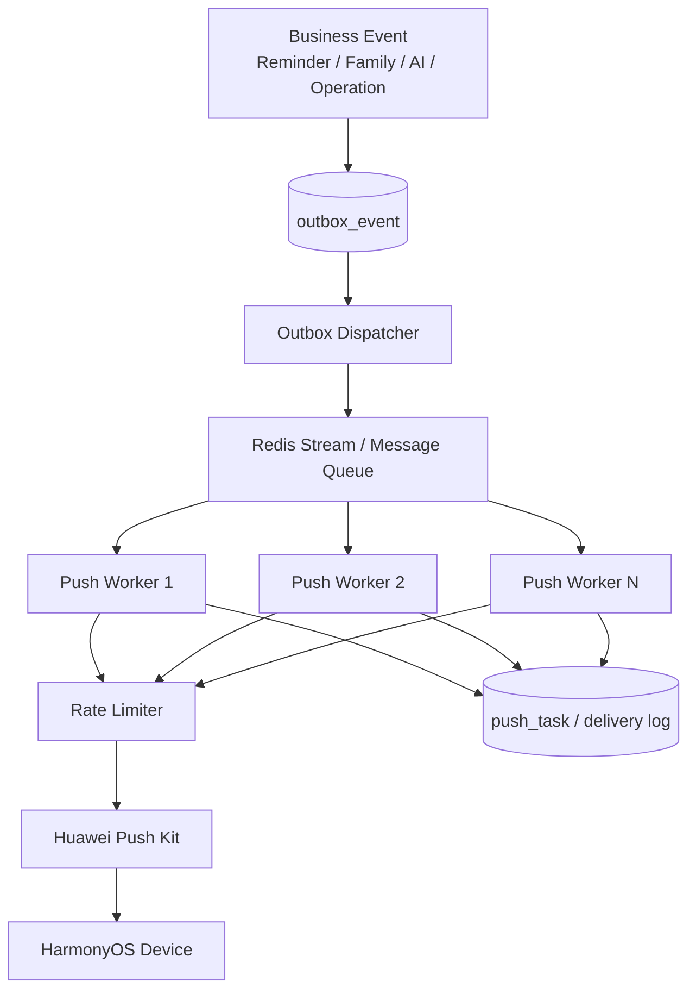

架构要求：

- HTTP Controller 不直接循环发送大量 Push。
- 业务事务只负责产生事件，不等待全部 Push 完成。
- PostgreSQL 保存 Push 任务/事件真值。
- Redis Stream / 队列负责削峰和消费协作，不作为唯一业务真值。
- Push Worker 可以独立扩容。

## 18.3 为什么使用 Outbox

例如“家庭成员新增物品”业务需要：

> 1. PostgreSQL 保存业务数据  
> 2. 给其他家庭成员发送通知

如果先提交 DB 再直接调用 Push Provider，Push 调用失败可能造成事件丢失；如果先 Push 再提交 DB，又可能出现用户收到通知但业务数据回滚。

因此建议在同一数据库事务中写入：

> Business Entity + outbox_event

事务提交后，由 Outbox Dispatcher 异步读取事件并投递队列。

这样保证“业务已发生”与“待发送事件存在”保持一致。

## 18.4 模块结构

在现有 Java 模块中增加：

> notification/  
> ├── application/  
> │   ├── PushApplicationService.java  
> │   ├── PushTaskCreator.java  
> │   └── PushRetryService.java  
> ├── domain/  
> │   ├── PushTask.java  
> │   ├── PushMessage.java  
> │   ├── PushChannel.java  
> │   ├── PushStatus.java  
> │   └── PushPolicy.java  
> ├── infrastructure/  
> │   ├── provider/  
> │   │   ├── PushProvider.java  
> │   │   └── HuaweiPushProvider.java  
> │   ├── queue/  
> │   │   └── RedisStreamPushQueue.java  
> │   ├── persistence/  
> │   └── scheduler/  
> └── worker/  
>     └── PushWorker.java

并增加通用：

> outbox/  
> ├── OutboxEvent.java  
> ├── OutboxRepository.java  
> └── OutboxDispatcher.java

## 18.5 PushProvider 抽象

业务层不得直接依赖华为具体 REST URL。

```java
public interface PushProvider {

    PushSendResult send(PushMessage message,
                        List<String> deviceTokens);
}
```

实现：

```java
@Component
public class HuaweiPushProvider implements PushProvider {
    // Auth / HTTP Client / Provider Error Mapping
}
```

好处：

- Provider SDK/API 更新不会污染业务层。
- 测试环境可以使用 MockPushProvider。
- 将来支持其他平台时不需要改 Domain。

## 18.6 Push 数据模型

### 18.6.1 device_push_token

| **字段** | **说明** |
|----------|----------|
| id | 主键。 |
| user_id | 用户 ID。 |
| device_id | 设备 ID/客户端实例标识。 |
| provider | HUAWEI。 |
| push_token | Push Token，加密/受控存储。 |
| app_version | 客户端版本。 |
| os_version | OS 版本。 |
| timezone | 用户/设备时区。 |
| enabled | 用户是否允许该类通知。 |
| last_seen_at | 最近活跃时间。 |
| invalidated_at | Token 已失效时间。 |
| created_at / updated_at | 审计字段。 |

### 18.6.2 push_task

| **字段** | **说明** |
|----------|----------|
| id | Push Task ID。 |
| user_id | 目标用户。 |
| device_id | 目标设备，可为空表示后续展开。 |
| message_type | EXPIRY_FALLBACK / FAMILY / AI_COMPLETED / SECURITY / OPERATION 等。 |
| title | 标题模板/渲染结果。 |
| payload | JSON，必须控制大小并避免敏感数据。 |
| scheduled_at | 计划发送时间。 |
| priority | HIGH / NORMAL / LOW。 |
| status | PENDING / QUEUED / SENDING / SUCCESS / RETRY / FAILED / CANCELLED。 |
| retry_count | 已重试次数。 |
| next_retry_at | 下次重试时间。 |
| idempotency_key | 幂等键。 |
| provider_message_id | Provider 返回 ID。 |
| last_error_code | 最近错误。 |
| created_at / updated_at / sent_at | 审计时间。 |

### 18.6.3 outbox_event

| **字段** | **说明** |
|----------|----------|
| id | Event ID。 |
| aggregate_type | ITEM / FAMILY / RECOGNITION / SYSTEM。 |
| aggregate_id | 聚合根 ID。 |
| event_type | 事件类型。 |
| payload | 事件 JSON。 |
| status | NEW / PUBLISHED / FAILED。 |
| retry_count | 发布重试次数。 |
| created_at | 产生时间。 |
| published_at | 发布完成时间。 |

## 18.7 幂等设计

同一个业务提醒必须生成稳定的幂等键，例如：

> `{userId}:{itemId}:{reminderDate}:{messageType}`

例如：

> `u10086:item-milk-01:2026-10-10:EXPIRY_3_DAY`

数据库添加唯一约束：

```sql
CREATE UNIQUE INDEX uk_push_task_idempotency
ON push_task(idempotency_key);
```

即使 Scheduler、Outbox Dispatcher 或 Worker 重试，也不会创建重复业务通知。

## 18.8 任务生产与调度

### 18.8.1 即时事件

家庭共享、AI 完成等事件：

> Business Transaction  
> → write outbox_event  
> → commit  
> → dispatcher publish  
> → Push Worker

### 18.8.2 定时事件

运营消息或云端兜底提醒：

> Scheduler  
> → 查询 scheduled_at <= now 的任务  
> → 分批 Claim  
> → Queue  
> → Worker

数据库 Claim 推荐使用可避免多 Worker 重复抢占的方式，例如短事务配合状态 CAS，或 PostgreSQL `FOR UPDATE SKIP LOCKED`。

每批处理例如 100~1000 条，必须配置化，不可一次加载几十万任务到 JVM 内存。

## 18.9 Redis Stream 使用边界

V1.1 可优先使用 Redis Stream，因为 Redis 已存在于架构中，可以减少新增组件。

建议：

> Stream：`push:tasks`  
> Consumer Group：`push-workers`  
> Consumer：`worker-{instanceId}`

要求：

- 消费成功后 ACK。
- 监控 Pending Entries List。
- Worker 崩溃后支持超时 Claim。
- Redis Stream 只负责消息传输；push_task/outbox_event 仍保存在 PostgreSQL。
- Redis 故障恢复后可通过数据库重新扫描 PENDING/QUEUED 状态补发。

当未来需要复杂路由、多队列隔离、跨团队消息总线或更大规模吞吐时，再评估 RabbitMQ/Kafka。

## 18.10 Push Worker 执行流程

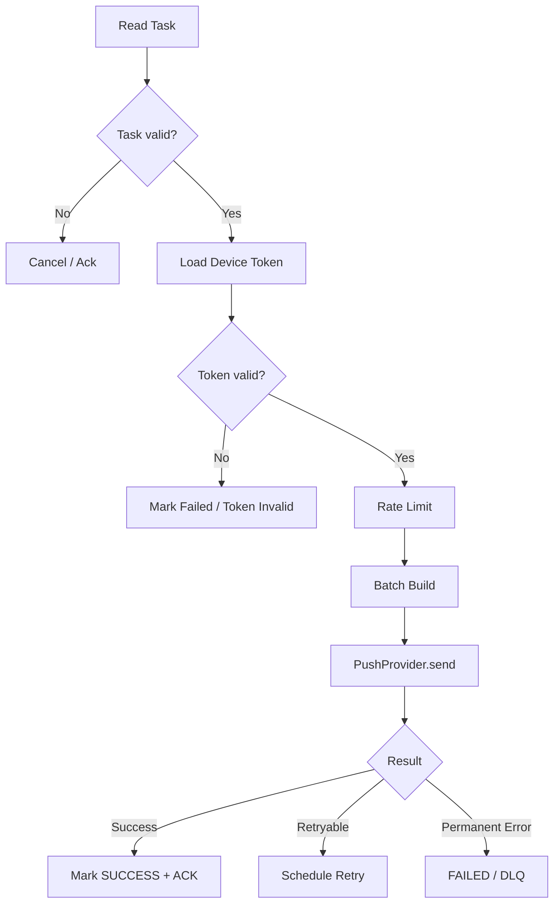

Worker 不应持有数据库长事务等待外部 Push HTTP 调用。

推荐流程：

> 短事务 Claim → 外部 Push → 短事务回写结果。

## 18.11 限流与批量发送

Push Provider 通常存在配额、消息类型限制与限频要求，因此 Worker 必须统一经过 RateLimiter。

建议使用 Redis Token Bucket：

> Provider 级限流  
> + messageType 级限流  
> + tenant/app 级限流（未来）

批量发送大小必须作为 Provider Adapter 配置，不能在业务层硬编码固定 Token 数量，因为不同消息类型、Provider 版本可能存在不同限制。

Provider 返回限流错误时：

- 不立即无限重试。
- 读取 Retry-After（如 Provider 提供）。
- 否则使用指数退避 + Jitter。

## 18.12 重试策略

仅对可恢复错误重试：

| **错误类型** | **处理** |
|--------------|----------|
| 网络超时 | Retry。 |
| Provider 429 | Retry + Backoff。 |
| Provider 5xx | Retry。 |
| 无效 Token | 不重试，失效 Token。 |
| Payload 非法 | 不重试，FAILED。 |
| 权限/配置错误 | 快速失败 + 告警。 |

建议：

> retryDelay = min(maxDelay, baseDelay × 2^retryCount) + randomJitter

示例：

> 1s → 2s → 4s → 8s → 30s → 60s → 5m

最大重试次数按消息类型配置。

## 18.13 Dead Letter

达到最大重试次数后进入 FAILED/DLQ 状态，不无限循环。

DLQ 记录：

- push_task_id。
- message_type。
- provider。
- error_code。
- retry_count。
- first_failed_at。
- last_failed_at。

运维可以：

- 查询失败原因。
- 修复配置后人工重放。
- 对批量失败触发告警。

## 18.14 推送聚合

当同一用户同时有多个临期物品，不建议逐个发送服务器 Push。

例如 5 个物品临期：

> 牛奶 3 天  
> 面包 1 天  
> 酸奶 3 天  
> 鸡蛋 1 天  
> 猫粮 3 天

服务端兜底通知应优先聚合：

> “今天有 5 件物品即将到期，其中 2 件需优先处理。”

点击后通过 Deep Link 进入临期列表。

聚合窗口可以按 `user + messageType + day` 合并，减少打扰和 Push 压力。

## 18.15 Jitter 与流量平滑

禁止 100 万用户都在 `09:00:00` 同时发送。

对非强实时消息：

> actualScheduledAt = preferredTime + random(-15min, +15min)

或按用户 ID 哈希稳定分桶：

> bucket = hash(userId) % 30

将 30 分钟窗口均匀摊平。

Jitter 同时降低：

1. Server → Push Provider 峰值。
2. Push 到达后用户点击导致的 Dashboard 回流峰值。

## 18.16 时区与免打扰

Push Scheduler 必须基于用户/设备 `ZoneId` 计算本地时间。

建议支持：

- preferredNotificationTime。
- quietHoursStart / quietHoursEnd。
- timeZone。
- messageCategory opt-in/opt-out。

非安全类消息不得在免打扰时段强行发送；可以延迟到下一个允许窗口。

关键时间字段仍使用 Instant 存储，调度计算使用 ZoneId 转换。

## 18.17 Token 生命周期

客户端应在以下情况上报 Token：

- 首次获取。
- Token 发生变化。
- 用户重新登录/切换账号。
- App 恢复活跃且服务端记录长期未更新时。

服务端遇到 Provider 明确返回 Token 无效时：

> device_push_token.invalidated_at = now()

后续不再继续重试该 Token。

用户退出账号时应解除 userId 与设备 Token 的绑定，避免消息发送给错误账号。

## 18.18 Push Payload 安全

Push 通知可能在锁屏展示，因此 Payload 禁止直接包含：

- 完整过敏信息。
- 敏感家庭备注。
- 原始 OCR 文本。
- Token/JWT。
- 私密图片 URL。

通知正文只放最少展示信息。需要详情时使用业务 ID + Deep Link，客户端鉴权后再获取。

## 18.19 Push 观测指标

| **指标** | **用途** |
|----------|----------|
| push_task_created_total | 任务产生量。 |
| push_queue_depth | 队列积压。 |
| push_queue_lag_seconds | 最老待处理任务延迟。 |
| push_send_total | 发送调用量。 |
| push_success_total | 成功数。 |
| push_failed_total | 最终失败数。 |
| push_retry_total | 重试数。 |
| push_provider_latency | Provider P95/P99。 |
| push_provider_429_total | Provider 限流。 |
| push_invalid_token_total | 失效 Token。 |
| push_dlq_total | DLQ 数量。 |
| push_open_rate | 产品指标，需结合隐私与平台能力。 |

建议告警：

- queue lag 持续增加。
- success rate 突然下降。
- 429 大量增加。
- invalid token 比例异常。
- DLQ 快速增长。

## 18.20 Push 压测

Push 压测分两层：

### 18.20.1 内部链路压测

使用 MockPushProvider，测试：

> Scheduler / Outbox  
> → Redis Stream  
> → Worker  
> → PostgreSQL 状态回写

例如：

- 10 万 Push Task 在 30 分钟内完成。
- 100 万 Task 的数据库扫描/入队不能 OOM。
- Worker 扩容后吞吐近似线性提升。
- 单 Worker 崩溃后任务可被其他 Worker 接管。

### 18.20.2 Provider 集成压测

只使用测试 App/测试 Token，按官方允许范围验证：

- 鉴权。
- Batch Size。
- 限流。
- 429。
- 错误码映射。
- Token 失效处理。

禁止使用真实用户进行大规模破坏性推送测试。

## 18.21 Push 降级策略

当 Push Provider 不可用：

- 核心 Local Reminder 不受影响。
- Push Task 保持 RETRY。
- 暂停 LOW Priority 任务。
- HIGH Priority 安全类消息优先恢复。
- 超过业务有效期的消息直接 CANCELLED，不补发过时通知。

例如一个“今天临期”的普通提醒在两天后恢复时不应继续发送原文，应重新依据当前状态决定是否还有发送价值。

## 18.22 Push DDL 示例

```sql
CREATE TABLE outbox_event (
    id VARCHAR(64) PRIMARY KEY,
    aggregate_type VARCHAR(32) NOT NULL,
    aggregate_id VARCHAR(64) NOT NULL,
    event_type VARCHAR(64) NOT NULL,
    payload JSONB NOT NULL,
    status VARCHAR(16) NOT NULL,
    retry_count INT NOT NULL DEFAULT 0,
    created_at TIMESTAMPTZ NOT NULL,
    published_at TIMESTAMPTZ
);

CREATE INDEX idx_outbox_status_created
ON outbox_event(status, created_at);

CREATE TABLE push_task (
    id VARCHAR(64) PRIMARY KEY,
    user_id VARCHAR(64) NOT NULL,
    device_id VARCHAR(128),
    message_type VARCHAR(48) NOT NULL,
    payload JSONB NOT NULL,
    priority VARCHAR(16) NOT NULL,
    scheduled_at TIMESTAMPTZ NOT NULL,
    status VARCHAR(16) NOT NULL,
    retry_count INT NOT NULL DEFAULT 0,
    next_retry_at TIMESTAMPTZ,
    idempotency_key VARCHAR(256) NOT NULL,
    provider_message_id VARCHAR(256),
    last_error_code VARCHAR(64),
    created_at TIMESTAMPTZ NOT NULL,
    updated_at TIMESTAMPTZ NOT NULL,
    sent_at TIMESTAMPTZ
);

CREATE UNIQUE INDEX uk_push_task_idempotency
ON push_task(idempotency_key);

CREATE INDEX idx_push_task_schedule
ON push_task(status, scheduled_at);

CREATE INDEX idx_push_task_retry
ON push_task(status, next_retry_at);
```

## 18.23 Worker 配置建议

```yaml
app:
  push:
    worker:
      concurrency: 8
      batch-size: 500
      max-retries: 6
      base-retry-delay: 1s
      max-retry-delay: 5m
    scheduler:
      scan-batch-size: 1000
      fixed-delay: 2s
    jitter:
      enabled: true
      max-minutes: 15
```

所有值必须按压测和 Provider 当前规则调整，不作为硬编码业务常量。

## 18.24 Push 发布 Gate

| **Gate** | **最低要求** |
|----------|--------------|
| Local Reminder | 服务端 Push 故障时核心临期提醒仍可工作。 |
| Idempotency | 相同事件重复处理不产生重复业务通知。 |
| Retry | 网络/429/5xx 可按策略重试。 |
| Permanent Error | 无效 Token/Payload 不无限重试。 |
| DLQ | 超过最大重试后可查询、告警和人工处理。 |
| Queue Recovery | Worker 崩溃后任务不丢失。 |
| Provider Isolation | Push Provider 慢/挂不拖垮核心 API。 |
| Peak Test | 完成设计目标任务量的批量压测。 |
| Jitter | 非实时大批量任务不会同一秒集中发送。 |
| Privacy | Payload 不包含不必要敏感数据。 |
| Observability | 成功率、延迟、积压、429、Retry、DLQ 均有指标。 |

## 18.25 V1.1 推荐落地顺序

建议按以下顺序实现，而不是一次性建设完整消息平台：

> Step 1：继续保持核心临期 Local Reminder  
> ↓  
> Step 2：新增 `PushProvider` + `MockPushProvider`  
> ↓  
> Step 3：新增 `push_task` + 幂等  
> ↓  
> Step 4：新增 Redis Stream + 单 Push Worker  
> ↓  
> Step 5：重试 / Backoff / DLQ  
> ↓  
> Step 6：Outbox  
> ↓  
> Step 7：多 Worker + Rate Limit  
> ↓  
> Step 8：聚合 / Jitter / Quiet Hours  
> ↓  
> Step 9：压测与告警  
> ↓  
> Step 10：达到真实规模后再评估 RabbitMQ/Kafka/Kubernetes

# 19. 高可用、故障隔离与容灾设计

本章定义生产环境的可用性边界、故障域、恢复目标与演练要求。目标不是在 V1.2 一次性建设异地多活，而是保证单实例故障、单节点缓存故障、外部 AI/Push 故障、数据库异常和错误发布时，系统具备明确的隔离、降级与恢复路径。

## 19.1 可用性目标

SmartExpiry 的核心用户价值来自“本地可用 + 云端增强”。因此服务端故障不应直接等价为“应用不可用”。

| **能力** | **服务端不可用时的最低体验** | **可接受恢复方式** |
|----------|------------------------------|--------------------|
| 本地物品查询 | ArkData 正常读取 | 无需等待服务端 |
| 新增/修改物品 | 本地事务成功，进入 sync_queue | 服务恢复后补同步 |
| 到期状态计算 | 客户端 ExpiryService 继续计算 | 无需服务端 |
| 已注册临期提醒 | 本地提醒继续生效 | 无需服务端 |
| 云同步 | 暂停，展示“待同步” | 自动重试 |
| 云端 OCR/AI | 降级为端侧 OCR/手动确认 | 服务恢复后可重试 |
| 服务端 Push | 暂停/延迟，不影响核心本地提醒 | 队列恢复后补发或丢弃低价值消息 |
| 商城/推荐 | 可降级为缓存或不可用状态 | 恢复后重新加载 |

## 19.2 故障域

生产设计至少识别以下故障域，监控和演练必须按故障域而不是按单个进程组织。

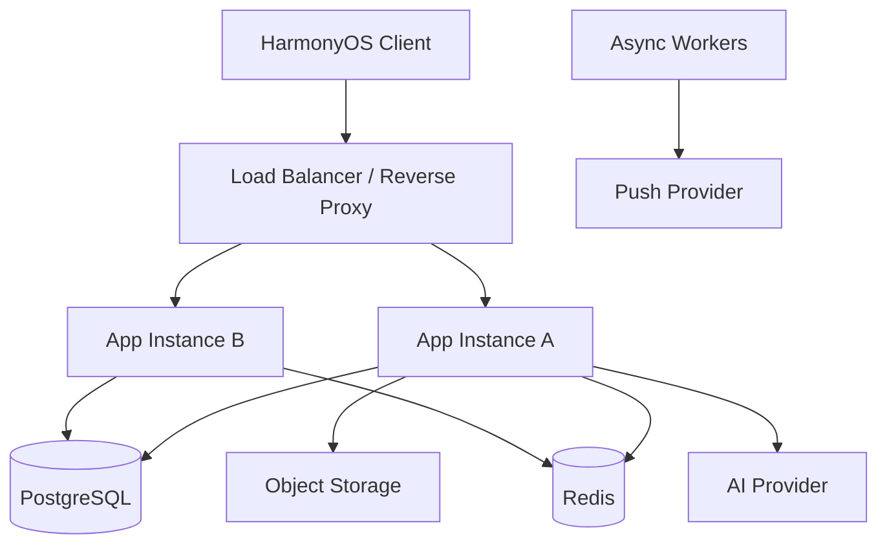

需要独立处理的故障包括：

- 应用单实例崩溃；
- 全部应用实例不可达；
- PostgreSQL 主库不可用、连接数耗尽、慢查询雪崩；
- Redis 不可用或高延迟；
- 对象存储不可用；
- AI Provider 超时、429、错误率上升；
- Push Provider 不可用；
- Worker 消费停滞；
- DNS/TLS/反向代理异常；
- 错误发布或数据库迁移失败。

## 19.3 Spring Boot 高可用

生产环境不应以单个 Spring Boot 进程作为唯一服务实例。最低建议为两个无状态实例，并由负载均衡器执行健康检查。

```text
Client
  ↓
Load Balancer
  ├─ App-01
  └─ App-02
       ↓
PostgreSQL / Redis / Object Storage
```

要求：

1. HTTP Session 不保存业务状态；若未来引入会话，优先 JWT/OIDC 或外部会话存储。
2. 实例启动完成并通过依赖检查后再接流量。
3. 实例停止时先摘流量，再等待在途请求结束。
4. 定时任务必须有单实例执行或分布式锁，禁止多实例重复执行同一批任务。
5. Push/Outbox Worker 可独立扩容，不与 Web 实例绑定吞吐量。

## 19.4 健康检查

健康检查分为 Liveness、Readiness 和 Dependency 三层。

| **检查** | **用途** | **失败后行为** |
|----------|----------|----------------|
| Liveness | JVM/进程是否活着 | 重启进程 |
| Readiness | 当前实例是否可以接收业务流量 | 从负载均衡摘除 |
| DB Dependency | 是否可访问 PostgreSQL | 核心写接口降级/拒绝 |
| Redis Dependency | Redis 是否可访问 | 缓存/限流/Stream 进入降级策略 |
| AI Dependency | AI Provider 是否健康 | AI 接口降级，不影响 CRUD |
| Push Dependency | Push Provider 是否健康 | 停止快速重试，消息留在队列 |

禁止把所有外部依赖都加入 Liveness，否则 AI Provider 短时故障会触发 Spring Boot 进程反复重启。

## 19.5 PostgreSQL 高可用

数据库是服务端业务真值，优先级高于 Redis 和 Worker。生产环境的数据库策略分阶段建设。

| **阶段** | **建议** |
|----------|----------|
| 早期生产 | 托管 PostgreSQL 或具备自动备份的单主实例；启用 PITR 能力时优先启用 |
| 用户增长 | 主库 + Standby/高可用实例；明确故障切换机制 |
| 大规模阶段 | 再评估只读副本、连接代理、分库等，不在 V1.2 预先复杂化 |

核心要求：

- 所有 Schema 由 Flyway 管理；
- 开启自动备份；
- 定期验证备份是否真的能恢复；
- 监控连接数、事务时长、锁等待、复制延迟、磁盘使用率；
- 禁止通过无限扩大 HikariCP 连接池解决慢查询；
- 大批量后台任务必须分页/分批执行。

## 19.6 Redis 故障策略

Redis 在本方案中不是业务真值，因此 Redis 故障的处理原则是“降级而不是数据错误”。

| **Redis 用途** | **Redis 故障时处理** |
|----------------|----------------------|
| Cache | 直接回源 PostgreSQL，同时保护 DB |
| Rate Limit | 对高风险接口可切换进程内保守限流；不能完全放开无限流量 |
| Token/Session | 若未来依赖 Redis 会话，需要单独高可用 |
| Redis Stream Push Queue | 暂停分发并保留 DB Outbox；Redis 恢复后重建流 |
| 分布式锁 | 停止可能重复执行的批任务，避免重复副作用 |

## 19.7 Outbox 恢复保证

Push 与其他异步副作用必须以 PostgreSQL Outbox 为恢复基线。Redis Stream 可提高吞吐，但不作为不可恢复的唯一消息源。

```text
Business Transaction
   ├─ write business data
   └─ write outbox_event
              ↓
Outbox Dispatcher
              ↓
Redis Stream
              ↓
Worker
```

若 Redis 丢失、重启或 Stream 被误删，Dispatcher 可根据 `outbox_event.status=PENDING` 重新投递。

## 19.8 外部 AI Provider 故障隔离

AI Provider 属于增强能力，不得阻塞核心业务线程池。

建议：

- AI 调用设置独立连接池/线程池；
- 明确 connect/read timeout；
- 对 429、5xx、timeout 分类统计；
- 使用 Circuit Breaker 避免持续攻击故障 Provider；
- 可配置主/备 Provider，但切换前必须验证结构化输出 Schema 兼容性；
- 低价值 Suggestion 可直接降级为规则模板；
- Recognition 不确定时回到 ItemDraft + 用户确认，而不是猜测结果。

## 19.9 Push Provider 故障隔离

Push Provider 异常时：

```text
Provider Error
   ↓
Worker 识别错误类型
   ├─ 可重试 → Retry with backoff
   ├─ Token 无效 → 标记 token invalid
   └─ 长时间故障 → 暂停消费 / 延长重试
```

服务端 Push 故障不能导致本地 Reminder 失效。临期主链路仍以客户端已注册提醒为基线。

## 19.10 RTO / RPO 建议

V1.2 建议先定义工程目标，再依据实际预算调整。

| **数据/能力** | **建议 RPO** | **建议 RTO** | **说明** |
|---------------|--------------|--------------|----------|
| PostgreSQL 核心业务数据 | ≤ 15 分钟 | ≤ 60 分钟 | 正式生产目标，可随基础设施能力收紧 |
| 对象存储附件 | ≤ 24 小时或按存储服务 SLA | ≤ 4 小时 | 原始图片不是所有场景必需业务真值 |
| Redis Cache | 可丢失 | ≤ 30 分钟 | 可重建 |
| Push Stream | 可从 Outbox 重建 | ≤ 60 分钟 | Outbox 为恢复来源 |
| AI Suggestion 缓存 | 可丢失 | 按需重建 | 非真值 |
| 客户端未同步变更 | 端侧保留 | 服务恢复后自动同步 | Local-First 降低中心故障影响 |

RPO/RTO 是团队目标，不等价于云厂商 SLA；上线前必须通过演练验证。

## 19.11 备份策略

建议至少覆盖：

```text
PostgreSQL
├─ 每日全量/自动快照
├─ 增量/WAL/PITR（基础设施支持时）
└─ 异地或不同故障域保留

Object Storage
├─ 生命周期策略
└─ 版本化/备份（按业务价值决定）

Configuration
├─ Git
└─ Secret 独立托管
```

数据库备份保留周期按合规、成本和产品要求确定；不要把“有备份任务”视为“可恢复”。

## 19.12 恢复演练

至少每季度执行一次恢复演练，早期也可在 staging 每月演练。

演练必须验证：

1. 从指定时间点恢复 PostgreSQL；
2. 应用连接到恢复库；
3. Flyway Schema 版本一致；
4. 核心 Item/Batch/Reminder 数据可读取；
5. Outbox 能重新分发；
6. 客户端旧版本仍能完成同步；
7. 恢复耗时是否满足 RTO。

## 19.13 故障注入测试

V1.2 推荐在 staging 执行以下演练：

| **故障** | **预期** |
|----------|----------|
| 杀掉一个 Spring Boot 实例 | 其他实例继续处理请求 |
| PostgreSQL 临时不可达 | 写接口快速失败，不无限堆线程 |
| Redis 停止 5 分钟 | Cache 降级；核心数据不丢 |
| AI Provider 超时 | AI API 超时/降级；CRUD 正常 |
| Push Provider 500 | Worker 退避；队列可恢复 |
| Redis Stream 清空 | 可根据 Outbox 重建 |
| 发布错误版本 | 可快速回滚到上一构建 |
| DB Migration 失败 | 发布中止，不继续接流量 |

## 19.14 高可用发布 Gate

生产发布前至少满足：

- Spring Boot 两实例故障切换验证；
- PostgreSQL 备份可恢复验证；
- Redis 故障不会造成业务真值丢失；
- AI/Push 故障不会拖垮核心 CRUD；
- Worker 重启后任务可继续；
- Outbox 重投不会造成重复 Push；
- 至少一次 staging 故障演练通过；
- Recovery Runbook 已评审。

# 20. 发布、灰度、回滚与数据库变更

本章定义从代码合并到生产发布的标准路径，解决“代码能运行但上线风险不可控”的问题。核心原则是：构建产物不可变、环境配置分离、数据库兼容优先、支持快速停止与回滚。

## 20.1 发布流水线

```mermaid
flowchart LR
    A[Pull Request] --> B[Static Check]
    B --> C[Unit Test]
    C --> D[Integration Test]
    D --> E[Build Artifact]
    E --> F[Security / Dependency Scan]
    F --> G[Staging Deploy]
    G --> H[API / E2E / Smoke]
    H --> I[Performance Gate]
    I --> J[Production Approval]
    J --> K[Canary / Rolling]
    K --> L[Post-deploy Verification]
```

## 20.2 构建产物原则

同一次发布的生产包必须来自 CI 生成的唯一不可变产物。

禁止：

```text
staging build
↓
验证通过
↓
production 重新 mvn package
```

推荐：

```text
CI Build once
↓
artifact/image:v1.2.15
├─ deploy staging
└─ promote same artifact to prod
```

环境差异通过配置和 Secret 注入，不通过重新编译产生。

## 20.3 配置管理

配置按敏感性分层。

| **类型** | **示例** | **存放建议** |
|----------|----------|--------------|
| 普通配置 | pageSize、cache TTL、feature flag 默认值 | application.yml / 配置中心 |
| 环境配置 | DB host、Redis host | 环境变量/配置中心 |
| Secret | DB 密码、AI Key、Push Credential | Secret 管理系统 |
| 业务规则 | reminder 默认天数 | 可版本化配置/DB |
| Prompt | AI Prompt | Git 版本化 + promptVersion |

禁止把生产 Secret 提交 Git。

## 20.4 发布策略

早期推荐 Rolling 或小流量 Canary。

### Rolling

```text
App-01 old
App-02 old

↓ deploy App-01

App-01 new
App-02 old

↓ verify

↓ deploy App-02

App-01 new
App-02 new
```

要求新旧版本在短暂共存时 API 和数据库 Schema 兼容。

### Canary

当业务规模上升后，可先让少量流量进入新版本，观察：

- 5xx；
- P95/P99；
- JVM；
- DB；
- Redis；
- Push/AI 错误率；
- 关键业务成功率。

异常则停止扩大流量。

## 20.5 Feature Flag

高风险功能建议使用 Feature Flag 解耦“部署”和“启用”。

适用：

- 新 AI Provider；
- 新 Recognition Prompt；
- 新 Push 聚合策略；
- 商城入口；
- 新同步策略；
- 高风险 Dashboard 聚合查询。

Feature Flag 不能替代代码测试，也不能长期成为不可追踪的分支系统。每个 Flag 需要 owner、创建时间、清理计划。

## 20.6 API 向后兼容

HarmonyOS 客户端无法保证所有用户同时升级，因此服务端必须容忍多个客户端版本并存。

要求：

- 新增字段优先 optional；
- 枚举新增时客户端使用 UNKNOWN/FALLBACK；
- 不直接改变已有字段语义；
- 删除字段前提供兼容窗口；
- 破坏性变更使用 `/api/v2` 或明确迁移策略；
- OpenAPI 进入 CI Diff 检查。

## 20.7 数据库 Expand–Migrate–Contract

生产数据库变更遵循三阶段。

```text
Expand
↓
新增字段/表/索引，旧代码仍兼容

Migrate
↓
新旧版本双读/双写或执行数据回填

Contract
↓
所有实例升级完成后再删除旧字段
```

示例：将 `item.image_url` 拆为附件表时，不要一次 Migration 同时删除旧列并要求新版本立即读取新表。

## 20.8 Flyway 规则

Flyway Migration 要求：

- 文件不可在生产执行后修改；
- 每个 Migration 单一目的；
- 大表加索引评估锁和执行时间；
- 数据回填与 Schema 变更必要时拆分；
- 不在应用启动事务中执行超长数据修复；
- 破坏性 Migration 必须有 ADR/变更说明；
- staging 使用接近生产规模的数据验证执行时间。

## 20.9 回滚分类

回滚分为应用回滚和数据回滚。

| **问题** | **优先策略** |
|----------|--------------|
| Java 代码错误，DB 无破坏性变更 | 回滚应用 |
| Feature 新逻辑异常 | 先关闭 Feature Flag |
| AI Prompt/模型异常 | 切回旧 promptVersion/model |
| Push 策略异常 | 停 Worker/关闭任务生成 |
| DB 新增字段导致问题 | 通常保留新增字段，回滚代码 |
| 已执行数据破坏性变更 | 依据备份/专用修复脚本，不盲目 down migration |

生产数据库不推荐把“自动反向 Migration”作为通用回滚手段。

## 20.10 紧急停止开关

至少预留以下 Kill Switch：

```text
AI_RECOGNITION_ENABLED
AI_SUGGESTION_ENABLED
SERVER_PUSH_ENABLED
PUSH_WORKER_ENABLED
SHOPPING_ENABLED
SYNC_WRITE_ENABLED
```

Kill Switch 必须有权限控制和审计。

## 20.11 发布后验证

发布完成后不以“容器启动成功”作为结束。

至少验证：

```text
/actuator/health
核心 GET
核心 POST
DB transaction
Redis
sync push/pull
Recognition Mock/真实小流量
Outbox
Push Worker
关键 Dashboard
```

并观察一个业务窗口内的错误率与延迟变化。

## 20.12 发布 Gate

正式发布必须满足：

- Unit / Integration / E2E 通过；
- OpenAPI 兼容性检查通过；
- Flyway 在空库和升级库通过；
- staging Smoke 通过；
- 核心 API 性能 Threshold 通过；
- 数据库变更已评估锁风险；
- 生产回滚版本明确；
- Feature Flag/Kill Switch 已配置；
- 关键 Dashboard 与告警可用；
- 发布责任人与回滚责任人明确。

# 21. 生产运维、SLO、告警与事故响应

本章将“监控指标”进一步转化为生产运行机制。目标是减少告警噪声，优先发现真实用户影响，并在事故发生时有统一处理流程。

## 21.1 SLI / SLO 分层

### 核心 API

| **SLI** | **SLO 示例** |
|---------|--------------|
| Availability | 月度成功率 ≥ 99.9%（排除明确客户端 4xx） |
| Latency | 核心 API P95 < 300 ms |
| Error Rate | 5xx < 0.5% |
| Sync Success | 正常网络下最终同步成功率 ≥ 99.5% |

### AI

AI 不与 CRUD 共用 SLO。

| **SLI** | **目标** |
|---------|----------|
| Recognition Provider Success | 按 Provider 单独统计 |
| Recognition E2E Success | 以用户得到可确认 ItemDraft 为准 |
| AI Timeout | 独立告警 |
| Suggestion Availability | 可降级，不作为核心库存可用性的阻断条件 |

### Push

| **SLI** | **目标** |
|---------|----------|
| Queue Lag | 在业务窗口内保持可控 |
| Worker Success | Provider 接受成功率 |
| Retry Backlog | 不持续增长 |
| DLQ | 低于设定阈值 |
| Reminder Coverage | 本地 Reminder + Push 组合观测 |

## 21.2 Golden Signals

后端核心 Dashboard 至少展示：

```text
Traffic
Errors
Latency
Saturation
```

具体映射：

| **维度** | **指标** |
|----------|----------|
| Traffic | RPS、接口调用量、Push tasks/s、AI requests/s |
| Errors | 5xx、业务错误码、DB error、AI 429/5xx、Push failure |
| Latency | HTTP P50/P95/P99、DB query、Redis、AI、Push |
| Saturation | CPU、Heap、GC、线程池、Hikari、DB connections、Queue Lag |

## 21.3 告警级别

建议采用 P0~P3。

| **级别** | **定义** | **示例** | **处理** |
|----------|----------|----------|----------|
| P0 | 大面积核心服务不可用或重大数据风险 | DB 主库不可用且无切换；数据损坏 | 立即响应 |
| P1 | 核心功能显著受影响 | 5xx 持续高、同步大面积失败 | 紧急处理 |
| P2 | 部分增强能力失败或容量逼近 | AI Provider 故障、Push backlog 增长 | 工作时间优先处理 |
| P3 | 趋势/优化类 | 磁盘增长、成本超预算趋势 | 计划处理 |

告警应基于持续时间和影响面，避免单个瞬时异常触发大量通知。

## 21.4 推荐告警

示例：

```text
Core API 5xx > 2% for 5m
Core API P95 > 800ms for 10m
Hikari active/max > 85% for 5m
DB connections > 80% limit for 10m
DB disk > 80%
Redis latency sustained high
Push queue lag > threshold
Outbox pending oldest_age > threshold
AI 429 ratio > threshold
JVM heap > 85% after GC
```

阈值必须在压测与生产基线后校准，不能长期照搬初始值。

## 21.5 Dashboard 分层

推荐至少四块 Dashboard：

### Service Overview
- RPS；
- P95/P99；
- 2xx/4xx/5xx；
- CPU/Memory；
- 实例数量。

### Database
- Connections；
- Query latency；
- Slow query；
- Lock wait；
- Transaction duration；
- Disk。

### Async
- Outbox pending；
- Redis Stream lag；
- Push pending/retry/DLQ；
- Worker throughput。

### AI
- Provider；
- model；
- promptVersion；
- latency；
- 429/5xx；
- token usage；
- E2E recognition success。

## 21.6 日志事件规范

日志统一结构化，不依赖自由文本搜索。

建议字段：

```json
{
  "timestamp": "...",
  "level": "INFO",
  "service": "smartexpiry-backend",
  "env": "prod",
  "traceId": "...",
  "requestId": "...",
  "userIdHash": "...",
  "module": "inventory",
  "operation": "createItem",
  "entityId": "...",
  "result": "SUCCESS",
  "errorCode": null,
  "latencyMs": 42
}
```

敏感数据继续遵循第 13 章隐私要求。

## 21.7 Trace 边界

建议对以下链路创建 span：

```text
HTTP
↓
Application Service
↓
Repository / SQL
↓
Redis
↓
AI Gateway
↓
Outbox
```

异步 Push 使用 `traceId/correlationId` 延续关联，而不是依赖同一线程上下文。

## 21.8 Runbook

每个 P0/P1 告警都必须有 Runbook，至少包含：

```text
症状
↓
确认指标
↓
可能原因
↓
立即止损
↓
恢复步骤
↓
数据校验
↓
升级负责人
↓
复盘要求
```

例如“Push backlog 持续上升”：

1. 检查 Worker 是否存活；
2. 检查 Provider 错误码；
3. 检查 Redis Stream lag；
4. 检查 Outbox Dispatcher；
5. Provider 故障时降低消费/暂停重试；
6. 恢复后逐步提高 Worker 并发；
7. 检查重复发送率与 DLQ。

## 21.9 事故响应流程

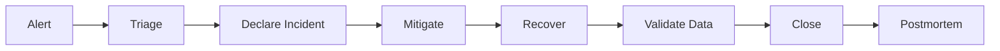

事故处理中优先恢复服务和保护数据，根因分析放在恢复之后。

## 21.10 Postmortem

P0/P1 必须形成无责复盘记录：

- 时间线；
- 用户影响；
- 监控是否及时；
- 根因；
- 促成因素；
- 哪个保护机制未生效；
- 临时措施；
- 永久修复；
- Action Item / Owner / Deadline。

复盘目标是改进系统，不是寻找个人责任。

## 21.11 Error Budget

若核心 API SLO 为 99.9%，可将剩余不可用预算作为发布节奏参考。若某月错误预算快速消耗，应降低高风险发布频率，优先稳定性修复。

V1.2 不要求复杂 SRE 平台，但建议先建立这一决策机制。

## 21.12 运维验收 Gate

- P0/P1 告警有 Owner；
- 关键告警有 Runbook；
- Dashboard 可在 5 分钟内定位 API/DB/Redis/AI/Push 哪一层异常；
- Trace 可从 HTTP 关联到外部调用；
- 日志不含 Token/原始敏感内容；
- staging 至少完成一次完整 Incident Drill；
- Postmortem 模板进入仓库。

# 22. 成本、容量运营与 FinOps 基线

本章关注“系统能扩展”之后的第二个问题：是否能以可控成本扩展。V1.2 不追求复杂 FinOps 平台，而是建立最小成本归因、预算和容量复盘机制。

## 22.1 成本分类

SmartExpiry 主要成本包括：

| **类别** | **驱动因子** |
|----------|--------------|
| Spring Boot Compute | 峰值 RPS、实例数、CPU/Memory |
| PostgreSQL | 数据量、IOPS、连接、备份、高可用 |
| Redis | Cache/Stream 数据量、吞吐 |
| Object Storage | 图片数量、容量、请求、外网流量 |
| AI | 请求次数、模型、Token/Image、重试 |
| Push | 平台能力、消息量及相关服务配额 |
| Observability | 日志量、Metrics cardinality、Trace 采样率 |
| Network | 图片上传下载、API、外部 AI |

## 22.2 单位成本

推荐逐步统计：

```text
Cost / DAU
Cost / MAU
Cost / 1,000 API Requests
AI Cost / Recognition
AI Cost / Suggestion
Storage Cost / Active User
Push Infrastructure Cost / 10,000 Tasks
```

这样才能判断“用户增长”是否对应可预测的基础设施成本。

## 22.3 AI 成本优先治理

AI 可能成为最容易失控的可变成本。

优化顺序：

```text
端侧 OCR
↓
规则/Regex
↓
短 Prompt 结构化模型
↓
复杂 LLM
```

建议：

- 相同输入的重复识别避免重复调用；
- Suggestion 可缓存；
- Prompt 控制上下文长度；
- 记录 tokenUsage / imageCount / provider / model；
- AI Retry 有上限；
- 免费/付费能力未来可按产品策略区分，但业务安全规则不能因成本绕过。

## 22.4 日志成本治理

日志不是越多越好。

生产中：

- Access Log 保留必要字段；
- Debug 默认关闭；
- OCR 原始全文不作为普通日志；
- 大 JSON Payload 不写日志；
- Trace 使用采样；
- 高频成功日志可降低采样率；
- P0/P1 所需关键错误必须保留。

## 22.5 Cache 成本与收益

Redis 缓存只缓存能明确降低 DB 压力的数据。禁止为了“用了 Redis”而缓存所有实体。

优先：

- Dashboard 短 TTL；
- 系统配置；
- 热点只读数据；
- 限流状态。

不建议：

- 把 Item/Batch 真值迁入 Redis；
- 缓存低访问且更新频繁的数据；
- TTL 不可解释的永久缓存。

## 22.6 容量预测

每周或每月维护容量表。

| **指标** | **当前** | **峰值** | **安全上限** | **趋势** |
|----------|----------|----------|------------|----------|
| API RPS | 实测 | 实测 | 压测容量×安全系数 | ↑/→/↓ |
| DB CPU | 实测 | 实测 | 建议阈值 | |
| DB Connections | 实测 | 实测 | max×80% | |
| Redis Memory | 实测 | 实测 | max×70~80% | |
| Push Queue Lag | 实测 | 实测 | SLO | |
| Object Storage | 实测 | - | Budget | |
| AI Requests/day | 实测 | 峰值 | Provider quota | |

## 22.7 安全容量

不要运行在压测极限上。

例如压测稳定容量：

```text
1000 RPS
```

生产目标容量不应直接设置为 1000 RPS。需要保留：

- 流量突发；
- 节假日增长；
- 发布期间性能差异；
- 下游抖动；
- Push 回流；
- 单实例故障后的剩余容量。

初始可使用 50%~70% 稳定压测容量作为生产规划参考，最终由实际 SLO 和成本决定。

## 22.8 日夜容量策略

如果白天请求明显高于夜间，可采用计划扩容 + 指标扩容组合。

```text
06:30 预扩容
↓
白天高峰
↓
核心指标触发额外扩容
↓
23:00 缩容
```

不要等 CPU 已经 95% 才开始扩容。对于可预测峰值，提前扩容更稳。

如果暂未使用 Kubernetes，也可以通过云主机/容器平台的伸缩组或人工计划实现。

## 22.9 成本预算告警

至少配置：

```text
月度总成本预算
AI 日成本预算
Object Storage 增长速度
日志/Trace 成本
异常出网
实例数量异常
```

成本异常也可能是技术故障信号，例如错误重试导致 AI 请求暴涨。

## 22.10 月度容量复盘

每月评审：

1. DAU/MAU 与 API 请求增长；
2. 峰值 RPS；
3. P95/P99；
4. DB/Redis 余量；
5. AI 调用与成本；
6. Push Queue；
7. 事故与错误预算；
8. 下月增长预期；
9. 是否需要提前扩容；
10. 哪些优化能推迟硬件升级。

## 22.11 架构升级触发条件

只有出现明确触发条件才升级复杂架构。

| **候选升级** | **触发条件示例** |
|--------------|------------------|
| Redis → Cluster | 单节点容量/吞吐/高可用成为实际瓶颈 |
| 单 PostgreSQL → HA/Read Replica | RTO/读负载要求超过当前能力 |
| Redis Stream → 专用 MQ/Kafka | 消息规模、重放、订阅模型超过当前方案 |
| 模块化单体 → 微服务 | 团队/发布/资源隔离出现明确边界问题 |
| 手工扩容 → 自动扩缩容 | 峰值频繁变化且人工成本高 |
| 单 Region → 跨 Region | 业务 SLA/RTO 明确要求 |

不因“用户可能会很多”提前引入复杂系统。

## 22.12 V1.2 生产成熟度检查

V1.2 的目标是达到以下状态：

```text
能测容量
+
能扛峰值
+
能异步推送
+
能从故障恢复
+
能安全发布/回滚
+
能及时发现事故
+
能知道钱花在哪里
```

完成这些能力后，再决定是否进入微服务、Kubernetes、Kafka、跨区域容灾等下一阶段。

# 附录 D. 生产运行与异步任务代码骨架

本附录给出 V1.2 的最小实现方向，用于把第 17~22 章从文档约束落到代码。代码是骨架，不替代项目实际异常模型、序列化格式和安全配置。

## D.1 Spring Boot Actuator / Prometheus

推荐依赖：

> spring-boot-starter-actuator  
> micrometer-registry-prometheus

示例配置：

```yaml
management:
  endpoints:
    web:
      exposure:
        include: health,info,prometheus
  endpoint:
    health:
      probes:
        enabled: true
  metrics:
    tags:
      application: smartexpiry-backend
```

生产环境的 Actuator 端点必须受网络与鉴权保护，不能把所有 management endpoint 公开给公网。

## D.2 自定义业务指标

```java
@Component
@RequiredArgsConstructor
public class PushMetrics {

    private final MeterRegistry meterRegistry;

    public void success(String provider, String type) {
        meterRegistry.counter(
            "smartexpiry.push.success",
            "provider", provider,
            "type", type
        ).increment();
    }

    public void failed(String provider, String code) {
        meterRegistry.counter(
            "smartexpiry.push.failed",
            "provider", provider,
            "code", code
        ).increment();
    }
}
```

避免把 `userId`、`itemId` 等高基数字段作为 Metrics Tag。

## D.3 Outbox Entity

```java
@Entity
@Table(name = "outbox_event")
@Getter
@NoArgsConstructor(access = AccessLevel.PROTECTED)
public class OutboxEvent {

    @Id
    private UUID id;

    @Column(nullable = false)
    private String eventType;

    @Column(nullable = false)
    private String aggregateType;

    @Column(nullable = false)
    private String aggregateId;

    @Column(nullable = false, columnDefinition = "text")
    private String payload;

    @Enumerated(EnumType.STRING)
    @Column(nullable = false)
    private OutboxStatus status;

    @Column(nullable = false)
    private int retryCount;

    @Column(nullable = false)
    private Instant createdAt;

    private Instant publishedAt;
}
```

## D.4 Outbox Repository Claim

多 Dispatcher 场景需要避免重复 Claim。PostgreSQL 可使用行锁/`SKIP LOCKED` 实现批量认领，具体 SQL 由 Repository Infrastructure 层维护。

示意：

```sql
SELECT *
FROM outbox_event
WHERE status = 'PENDING'
ORDER BY created_at
FOR UPDATE SKIP LOCKED
LIMIT 100;
```

业务层不要直接拼接这类数据库特定 SQL。

## D.5 Outbox Dispatcher

```java
@Component
@RequiredArgsConstructor
public class OutboxDispatcher {

    private final OutboxRepository outboxRepository;
    private final AsyncEventPublisher publisher;

    @Scheduled(fixedDelayString = "${outbox.dispatch-interval-ms:500}")
    public void dispatch() {
        var events = outboxRepository.claimPending(100);

        for (var event : events) {
            try {
                publisher.publish(event);
                outboxRepository.markPublished(event.getId(), Instant.now());
            } catch (Exception ex) {
                outboxRepository.markRetry(event.getId(), ex.getClass().getSimpleName());
            }
        }
    }
}
```

生产实现还应增加：

- 单批事务边界；
- retry backoff；
- max retry；
- oldest pending age；
- dispatcher metrics；
- shutdown graceful handling。

## D.6 Push Worker

```java
@Component
@RequiredArgsConstructor
public class PushWorker {

    private final PushTaskRepository taskRepository;
    private final PushProvider pushProvider;
    private final PushMetrics pushMetrics;

    public void handle(PushTask task) {
        if (taskRepository.alreadySucceeded(task.getIdempotencyKey())) {
            return;
        }

        try {
            PushResult result = pushProvider.send(task.toMessage());

            if (result.success()) {
                taskRepository.markSuccess(
                    task.getId(),
                    result.providerMessageId(),
                    Instant.now()
                );
                pushMetrics.success(pushProvider.name(), task.getMessageType());
                return;
            }

            handleProviderFailure(task, result);

        } catch (Exception ex) {
            taskRepository.scheduleRetry(task.getId(), nextRetry(task));
        }
    }
}
```

## D.7 指数退避

```java
public Duration retryDelay(int retryCount) {
    long baseSeconds = Math.min(300, 1L << Math.min(retryCount, 8));
    long jitterMillis = ThreadLocalRandom.current().nextLong(0, 1000);
    return Duration.ofSeconds(baseSeconds)
        .plusMillis(jitterMillis);
}
```

注意：具体 Retry 策略需要根据 Provider 错误码区分，Token 无效等永久错误不应继续重试。

## D.8 Graceful Shutdown

Spring Boot 实例关闭时要停止接收新流量，并给正在处理的请求一定完成窗口。

配置方向：

```yaml
server:
  shutdown: graceful

spring:
  lifecycle:
    timeout-per-shutdown-phase: 30s
```

Worker 同样需要停止拉取新任务，再处理或安全释放已 Claim 的任务。

## D.9 Feature Flag 接口

```java
public interface FeatureFlagService {

    boolean isEnabled(String flagName, UserContext context);
}
```

业务代码只依赖该抽象，不把某个第三方 Feature Flag SDK 直接扩散进 Domain。

## D.10 Kill Switch

示例：

```java
if (!featureFlagService.isEnabled("SERVER_PUSH_ENABLED", userContext)) {
    return PushDecision.disabled();
}
```

Kill Switch 操作必须记录：

```text
operator
flag
oldValue
newValue
reason
timestamp
```

## D.11 结构化日志 MDC

```java
@Component
public class TraceFilter extends OncePerRequestFilter {

    @Override
    protected void doFilterInternal(
        HttpServletRequest request,
        HttpServletResponse response,
        FilterChain filterChain
    ) throws ServletException, IOException {

        String traceId = Optional.ofNullable(request.getHeader("X-Trace-Id"))
            .filter(v -> !v.isBlank())
            .orElse(UUID.randomUUID().toString());

        MDC.put("traceId", traceId);

        try {
            response.setHeader("X-Trace-Id", traceId);
            filterChain.doFilter(request, response);
        } finally {
            MDC.remove("traceId");
        }
    }
}
```

不要把 Authorization、完整 OCR 文本、过敏详情等敏感信息放入 MDC。

## D.12 生产配置示例

```yaml
spring:
  datasource:
    hikari:
      maximum-pool-size: 20
      minimum-idle: 5
      connection-timeout: 2000
      validation-timeout: 1000

smartexpiry:
  push:
    enabled: true
    worker:
      concurrency: 4
      batch-size: 100
      max-retry: 6
  outbox:
    batch-size: 100
    dispatch-interval-ms: 500
  ai:
    recognition-timeout: 8s
    suggestion-timeout: 12s
```

以上数值仅作为起始配置，必须通过压测和生产数据校准。

# 附录 E. 运维模板

## E.1 发布检查单

```text
[ ] PR 已评审
[ ] 单元测试通过
[ ] 集成/E2E 通过
[ ] OpenAPI Diff 已检查
[ ] Flyway 空库/升级库已验证
[ ] staging Smoke 通过
[ ] 性能 Gate 通过
[ ] 数据库锁风险已评估
[ ] 回滚版本已确认
[ ] Kill Switch 已确认
[ ] Dashboard 正常
[ ] 告警正常
[ ] 发布负责人明确
```

## E.2 Incident 模板

```text
Incident ID:
Severity:
Start Time:
Detected By:
Incident Commander:

User Impact:

Current Symptoms:

Immediate Mitigation:

Timeline:

Root Cause:

Data Impact:

Recovery Verification:

Follow-up Actions:
- Action:
  Owner:
  Deadline:
```

## E.3 容灾演练记录

```text
Drill:
Date:
Environment:
Failure Injected:

Expected Behavior:

Observed Behavior:

RPO Result:

RTO Result:

Data Verification:

Gaps:

Actions:
```

# 附录 A. 核心数据库 DDL（示例）
> CREATE TABLE item (  
> id VARCHAR(64) PRIMARY KEY,  
> name VARCHAR(80) NOT NULL,  
> category_id VARCHAR(64) NOT NULL,  
> brand VARCHAR(80),  
> barcode VARCHAR(64),  
> image_url TEXT,  
> lifecycle_status VARCHAR(24) NOT NULL,  
> source_type VARCHAR(24) NOT NULL,  
> estimated_price NUMERIC(12,2),  
> version BIGINT NOT NULL DEFAULT 0,  
> created_at TIMESTAMPTZ NOT NULL,  
> updated_at TIMESTAMPTZ NOT NULL,  
> deleted_at TIMESTAMPTZ  
> );  
>   
> CREATE TABLE inventory_batch (  
> id VARCHAR(64) PRIMARY KEY,  
> item_id VARCHAR(64) NOT NULL REFERENCES item(id),  
> quantity NUMERIC(12,3) NOT NULL DEFAULT 1,  
> unit VARCHAR(32),  
> production_date DATE,  
> expiry_date DATE,  
> shelf_life_value INT,  
> shelf_life_unit VARCHAR(16),  
> opened_date DATE,  
> after_open_value INT,  
> after_open_unit VARCHAR(16),  
> location VARCHAR(80),  
> created_at TIMESTAMPTZ NOT NULL,  
> updated_at TIMESTAMPTZ NOT NULL  
> );  
>   
> CREATE TABLE consumption_record (  
> id VARCHAR(64) PRIMARY KEY,  
> item_id VARCHAR(64) NOT NULL,  
> batch_id VARCHAR(64),  
> action VARCHAR(24) NOT NULL,  
> quantity NUMERIC(12,3),  
> reason VARCHAR(32),  
> created_at TIMESTAMPTZ NOT NULL  
> );

# 附录 B. 关键代码骨架
## B.1 Java DTO
> public record CreateItemRequest(  
> @NotBlank String name,  
> @NotBlank String categoryId,  
> String brand,  
> BigDecimal quantity,  
> String unit,  
> LocalDate productionDate,  
> LocalDate expiryDate,  
> Integer shelfLifeValue,  
> ShelfLifeUnit shelfLifeUnit  
> ) {}

## B.2 ExpiryDomainService
> @Component  
> public class ExpiryDomainService {  
>   
> public long remainingDays(LocalDate expiryDate, LocalDate today) {  
> return ChronoUnit.DAYS.between(today, expiryDate);  
> }  
>   
> public ExpiryStatus calculateStatus(  
> LocalDate expiryDate,  
> int reminderDays,  
> LocalDate today) {  
>   
> long days = remainingDays(expiryDate, today);  
> if (days \< 0) return ExpiryStatus.EXPIRED;  
> if (days \<= reminderDays) return ExpiryStatus.NEAR_EXPIRY;  
> return ExpiryStatus.NORMAL;  
> }  
> }

## B.3 Spring Controller
> @RestController  
> @RequestMapping("/api/v1/items")  
> @RequiredArgsConstructor  
> public class ItemController {  
>   
> private final ItemApplicationService itemService;  
>   
> @PostMapping  
> public ApiResponse\<ItemResponse\> create(  
> @Valid @RequestBody CreateItemRequest request) {  
> return ApiResponse.success(itemService.create(request));  
> }  
> }

## B.4 识别结构化 Java Record
> public record RecognitionField\<T\>(  
> T value,  
> double confidence,  
> String evidence,  
> RecognitionSource source  
> ) {}  
>   
> public record ProductRecognition(  
> RecognitionField\<String\> productName,  
> RecognitionField\<String\> category,  
> RecognitionField\<LocalDate\> productionDate,  
> RecognitionField\<LocalDate\> expiryDate,  
> RecognitionField\<Integer\> shelfLifeValue  
> ) {}

## B.5 推荐 Maven 依赖（方向）
> spring-boot-starter-web  
> spring-boot-starter-validation  
> spring-boot-starter-data-jpa  
> spring-boot-starter-security \# 账号上线时启用  
> spring-boot-starter-data-redis \# Cache / Rate Limit / Redis Stream（按需）  
> postgresql  
> flyway-core  
> spring-ai-\* \# 采用 Spring AI 时  
> mapstruct \# 可选  
> lombok \# 可选，谨慎使用 @Data  
> micrometer-registry-prometheus \# 性能/容量监控  
> resilience4j-* \# 可选：限流/熔断/隔离，具体模块需验证 Spring Boot 4 兼容性

# 附录 C. 参考资料与版本依据
以下链接用于团队核对 HarmonyOS 与 Spring 的当前能力/版本。技术版本升级时应重新验证兼容性。

| **编号** | **资料**                                                | **链接**                                                                                               |
|----------|---------------------------------------------------------|--------------------------------------------------------------------------------------------------------|
| R1       | HarmonyOS Stage 模型开发概述                            | https://developer.huawei.com/consumer/cn/arkui/arkui-stage                                             |
| R2       | HarmonyOS ArkTS                                         | https://developer.huawei.com/consumer/cn/arkts                                                         |
| R3       | HarmonyOS ArkUI                                         | https://developer.huawei.com/consumer/cn/arkui/                                                        |
| R4       | HarmonyOS 应用规划：Core Speech / Core Vision / Push 等 | https://developer.huawei.com/consumer/cn/app/planning/                                                 |
| R5       | Core Vision 通用文字识别 API                            | https://developer.huawei.com/consumer/cn/doc/doccenter-references/api/core-vision-text-recognition-api |
| R6       | Core Speech Kit                                         | https://developer.huawei.com/consumer/cn/sdk/core-speech-kit/                                          |
| R7       | HarmonyOS 代理提醒 FAQ / 能力申请说明                   | https://developer.huawei.com/consumer/cn/doc/doccenter-dev-faq/faqs-background-tasks-11                |
| R8       | Spring Boot System Requirements                         | https://docs.spring.io/spring-boot/system-requirements.html                                            |
| R9       | Spring Data JPA Reference                               | https://docs.spring.io/spring-data/jpa/reference/                                                      |
| R10      | Spring Data JPA Transactionality                        | https://docs.spring.io/spring-data/jpa/reference/jpa/transactions.html                                 |
| R11      | Spring AI ChatClient / Structured Output                | https://docs.spring.io/spring-ai/reference/api/chatclient.html                                         |
| R12      | HarmonyOS Push Kit 文档入口                          | https://developer.huawei.com/consumer/cn/doc/HarmonyOS-Guides/push-appendix                           |
| R13      | Grafana k6 API Load Testing                           | https://grafana.com/docs/k6/latest/testing-guides/api-load-testing/                                    |
| R14      | Grafana k6 Thresholds                                 | https://grafana.com/docs/k6/latest/using-k6/thresholds/                                                |
| R15      | Prometheus Histograms and Summaries                   | https://prometheus.io/docs/practices/histograms/                                                       |

## C.1 当前版本注意事项（截至 2026-10-03）
- Spring Boot 官方系统要求页面当前显示 4.1.1，最低 Java 17；本方案选择 Java 21 作为团队基线。

- Spring Data JPA 当前稳定文档为 4.1.1；事务建议在业务 Facade/Application Service 形成清晰边界。

- Spring AI ChatClient 支持结构化 entity 输出，并提供 Schema 校验/Provider Structured Output 相关能力；实际模型能力需按供应商验证。

- HarmonyOS Stage 模型官方仍描述为 HarmonyOS NEXT 主推且长期演进模型。

- HarmonyOS 代理提醒存在能力管控和开放能力申请要求；项目早期必须做真机/目标版本验证。

- 性能测试基线推荐使用 k6 Thresholds 将 P95/P99 和错误率转化为可自动判定的发布条件；具体阈值按项目 SLO 调整。

- 多实例延迟聚合优先使用 Prometheus Histogram；不要简单平均各实例已计算好的 P95/P99。

- HarmonyOS Push Kit 的接口、消息分类、发送频控和单次 Token/消息限制可能随平台版本和消息类型变化，PushProvider 中的 Batch Size、Rate Limit、鉴权和错误码映射必须以当前官方文档为准，不写死在领域层。

# 结语：团队执行基线
本技术设计的核心不是追求架构复杂度，而是保证关键链路可独立验证和逐步增强：智能录入、生命周期计算、可靠提醒、可执行建议，以及生产环境中的容量、异步处理、故障恢复、安全发布和成本控制。客户端优先保证离线体验，Java 后端保证数据一致性、AI 编排和长期扩展。若后续需求导致架构决策变化，应新增 ADR 或更新本文档，而不是在代码中形成隐式分叉。

| **下一步建议** 在现有双仓基线上增加 `ops/` 与 `performance/`：落地 Actuator/Prometheus、k6、Outbox Dispatcher、Push Worker、Flyway 新表、staging 故障演练脚本与发布检查单；仍优先保证 M1~M6 主业务闭环，不因运维能力建设阻塞核心功能。 |
|----------------------------------------------------------------------------------------------------------------------------------------------------------------------------------------------------------------|
