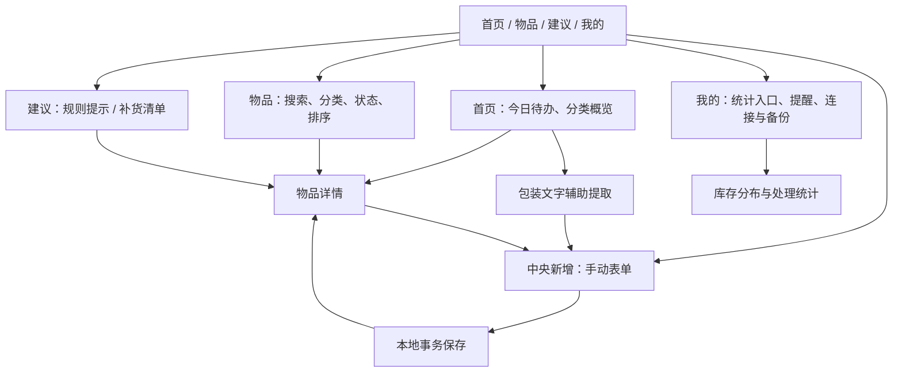

> 状态（2026-10-03）：对应客户端 0.2.0 工作区实现，代码尚未随本次文档提交。此处 V1.1 是前端实施规格编号，章节 17 沿用工作区 V1.0 扩展编号，与 Technical Design V1.2 的第 17 章（性能容量）不同。版本关系见[版本索引](ChangeLog/README.md)。

# 17. 前端交付细化（2026-10-03，V1.1 实施规格）

本节细化原第 4–6、11–12、16 章，区分已经编码的客户端能力、依赖设备验证的能力和后续交付项。不能仅凭页面入口存在就认定功能完成。前端唯一工作目录为 `append/harmonyos`，后端为 `lovestorage`。

## 17.1 用户目标与交付边界

本阶段让用户能够：录入真实物品 → 离线查看与查找 → 按日期发现临期事项 → 查看解释与处理 → 留下历史 → 按需补货。

| 功能 | 本阶段状态 | 完成判定与边界 |
|---|---|---|
| 首页、库存、建议、我的 | 已编码 | 四个一级入口，中央新增按钮；详情、表单、统计为二级页面 |
| 录入/编辑 | 已编码 | 名称、分类、品牌、数量单位、位置、备注、包装日期、生产日期/保质期、开封日期/期限、提醒提前天数 |
| 日期计算 | 已编码 | 包装日期与开封后期限取较早值；按自然日/月/年计算，不固定折算月份 |
| 列表筛选排序 | 已编码 | 名称/品牌/位置搜索；分类、在库/临期/过期/用完/丢弃/归档；到期/更新/名称排序 |
| 详情与生命周期 | 已编码 | 编辑、用完、丢弃、归档、恢复、删除、明天再处理、加入补货 |
| 处理流水与统计 | 已编码 | 使用独立 ConsumptionRecord；时间筛选、用完占比、库存分类分布、最近记录 |
| 本地规则建议 | 已编码 | 明确标注规则来源；优先到期排序，不调用模型、不宣称安全可食用 |
| 补货清单 | 已编码 | 新增、待购物品按名称去重、购买勾选、移除；不自动建立库存 |
| 文本辅助录入 | 已编码 | 粘贴包装文字；仅从明确标签抽取名称/日期/保质期，进入表单人工核对后保存 |
| 系统提醒 | 已编码，待真机验证 | 显式授权、调用代理提醒 API、编辑/处理后重建；权限拒绝或能力不足时明确提示 |
| 旧库升级 | 已编码并纳入主机测试 | v1 → v2 保留物品、远端 ID、删除与同步状态；不清库、不自动注入示例数据 |
| 备份上传 | 兼容现有服务 | 显式手动触发；上传核心字段，扩展字段只保存在本机；不是完整云备份 |
| 多批次管理/自定义分类 | 下一阶段 | 已拆出 batch 表；当前表单每物品一批次，暂不提供批次合并/部分消耗 |
| 相机 OCR/语音/条码/云端 AI | 下一阶段 | 需要设备能力、模型/识别接口与权限流程；不使用假识别结果替代 |
| 双向同步/账号 | 下一阶段 | 增量游标、版本冲突、删除下发、用户隔离尚未实现 |

## 17.2 信息架构与页面规格



| 页面 | 信息层级 | 主动作 | 空/失败/加载状态 |
|---|---|---|---|
| 首页 | 日期与品牌名 → 今日待处理大卡 → 录入入口 → 四类库存 → 优先处理列表 | 临期/过期卡跳库存筛选；物品卡跳详情 | 新用户引导录入；没有待办不显示虚构推荐 |
| 库存 | 搜索 → 分类 → 状态和排序 → 结果数 → 物品卡 | 查看详情、新增 | 显示“无匹配物品”，仍可切换筛选；默认只看在库 |
| 新增/编辑 | 基本信息 → 日期与期限 → 收纳和提醒 → 固定保存按钮 | 保存本机；离开未保存编辑时确认 | 字段错误直接提示；保存中禁止重复提交；长表单可滚动 |
| 详情 | 品类标记/名称 → 状态 → 原始/有效日期 → 建议和备注 → 处理动作 → 流水 | 用完、丢弃、恢复、归档、编辑、稍后、补货、删除 | 不把已用完显示为临期；丢弃/删除有确认 |
| 建议 | 规则来源提示 → 到期优先提示 | 跳详情操作 | 已过期不推荐食用或继续使用；不冒充 AI |
| 补货 | 新增栏 → 待购优先清单 | 勾选、移除 | 零记录引导；相同待购名称去重；勾选只更新购物状态 |
| 统计 | 时间范围 → 用完占比 → 在库分类分布 → 最近操作 | 近 30/90 天或全部 | 无记录显示 0；不凭旧记录的更新时间推测消费时间 |
| 我的 | 本地身份 → 统计 → 系统提醒 → 服务地址与上传进度 → 能力说明 | 保存地址、上传、授权提醒、重建提醒 | 显示部分上传进度、剩余待上传数和具体失败提示 |

导航要求：一级入口保留清晰选中态；详情返回原来的一级入口；系统返回键先退出二级页面再回首页；编辑页返回先确认未保存更改。低高度/键盘场景中表单可滚动且保存按钮位于表单外。目标首轮视觉验收尺寸为 360/390/430vp 宽度，另测大字体与横屏。

## 17.3 视觉与组件规范

- 风格：暖白背景、深绿色主色、留白和清晰字体层级；食品、美妆、宠粮、日用品有不同颜色与文字标记。
- 页面背景 `#F4F6F0`，主要文字 `#173C32`，主按钮 `#28785C`；临期 `#AC6A27`，过期 `#B84A46`。
- 一级标题 25–29vp，卡片标题 17–19vp，正文 13–15vp，辅助说明 11–12vp；状态同时使用文字，不只依赖颜色。
- 主卡圆角 22–24vp，列表卡 16–18vp；页面左右间距 20vp；主要动作目标高度约 48vp。
- 公共组件：SectionTitle、EmptyState、ItemCard。物品卡显示名称、数量单位、位置、到期状态及待上传提示。
- 不使用真实用户不存在的数据填充页面；任何空态、失败态都应能继续录入或重试。

## 17.4 表单与业务规则

| 字段/组合 | 前端规则 |
|---|---|
| 名称 | trim 后 1–80 字；必填 |
| 分类 | 本阶段四个系统分类；切换分类预填默认提醒天数 |
| 数量 | 正数；最多 3 位小数；不能混合不同计量单位做统计求和 |
| 品牌/单位/位置/备注 | 分别最多 120/32/80/500 字 |
| 直接日期 | 严格 YYYY-MM-DD 且为真实自然日期，不接受 2 月 30 日 |
| 推导日期 | 生产日期 + 正整数期限 + DAY/MONTH/YEAR；显示推导的最终日期 |
| 保质期 | 1–1200 的整数；只填写期限不允许最终保存 |
| 生产日期与到期 | 原始到期不能早于生产日期 |
| 开封信息 | 开封不能早于生产、不能晚于今天；开封后期限为正整数且有单位 |
| 有效日期 | min(包装日期, 开封日期+开封期限)；页面与提醒共用纯规则服务 |
| 提醒天数 | 0–365；食品/宠粮/其他默认 7，美妆默认 30 |
| 明天再处理 | 仅写 snoozeUntil；不改变原始到期日、不把过期改为正常，库存仍可查到 |
| 生命周期 | 在库可用完/丢弃/归档；历史记录须先恢复在库后执行新的处理 |
| 恢复在库 | 撤销该物品当前有效用完/丢弃流水，使统计可逆；保留审计行 |
| 删除 | 软删除物品并标记待上传；处理流水保留 |

明确限制：当前用完/丢弃针对整个条目，不支持扣减部分数量；用户应将不同生产/开封信息的批次分别录入，后续增加同一 Item 多批次 UI。

## 17.5 本地数据与迁移

本地 schema 版本从 1 升至 2。所有迁移在事务中执行，失败回滚后保留原数据。

| 表 | 当前职责 | 字段/约束 |
|---|---|---|
| item | 身份、生命周期、同步状态 | 原有 id/name/category/created/updated/deleted/pending/remote_id 保留；metadata JSON 保存品牌、备注、提醒天数与 snoozeUntil |
| inventory_batch | 批次数量、包装/生产/开封日期、单位、位置 | id、item_id、payload JSON；目前 item_id UNIQUE，限制单批次编辑；未来取消限制前先升级远端 API |
| consumption_record | 实际处理流水 | id、item_id、name 快照、action、quantity 快照、created_at、revoked |
| shopping_entry | 本地补货清单 | id、name、done、created_at |
| setting | 本地配置 | server、last_sync、reminders 等键值 |

旧 item.expiry_date 作为兼容字段保留，新读模型优先读取 batch 中的包装日期。迁移按旧记录创建对应批次，不重建远端 ID，不推测历史消费时间。

创建/编辑时身份和批次一起提交；生命周期更新和流水一起提交。同步确认必须匹配读取时的 updated_at，防止旧请求清除新修改的 pending 标记；本地版本时间至少递增 1ms。

处理统计以 `revoked=0` 的流水为准。用完占比 = 用完次数 /（用完次数 + 丢弃次数），零分母显示 0；不会宣称推算出避免浪费金额。列表只展示最近 50 条流水，统计计算使用完整对应时间区间。

## 17.6 提醒能力与降级

系统通知默认关闭，用户在“我的”中显式开启后申请通知权限，并使用 `PUBLISH_AGENT_REMINDER` 和 reminderAgentManager 注册日历提醒。

- 计划时刻：有效到期日减提醒天数，当地时间 09:00；稍后处理日期只能将时刻推后。
- 不注册已用完、丢弃、归档或软删除记录；已错过时刻的记录继续在应用内待办显示，不在每次启动时补发一遍。
- 每次保存/处理/删除以及应用页面初始化时重建本应用的提醒，优先最近 20 条未来计划；页面明确说明上限。
- 发布前取消本应用旧计划；任何部分发布失败都显示已注册数量与错误，不显示虚假全量成功。
- 关闭开关时取消本应用代理提醒。
- 权限拒绝、目标设备缺少能力、配额或签名权限不满足时仍能保存数据，应用内待办继续可用。
- 本实现尚未完成真机到时触发、后台/杀进程、时区变化与系统配额验收；权限声明/编译成功不能替代这些测试。

## 17.7 与现有后端的兼容策略

本阶段以前端为主，不修改后端契约。现有接口使用稳定 clientId 创建 + PUT 更新 + GET 回读，404 删除视为幂等成功。

上传投影只有：名称、系统分类、数量、单位、有效到期日、生命周期。客户端保留原始包装/生产/开封资料，计算有效日期后上传，因此服务器使用其 expiryDate 字段展示有效日期。品牌、原始日期结构、位置、备注、提醒配置、操作流水、补货清单均仅保存在本机。

这是过渡期语义，不能用于完整云恢复或其他客户端编辑原始日期。下阶段扩展服务端批次 DTO 时，应同时携带 originalExpiryDate、openedDate、afterOpenDuration、version 与 tombstone，并废弃该压平投影。UI 必须明确显示“核心字段上传”，不能标注成全量云备份。

更换地址重排本机队列。已上传条目单独确认，发生中途失败时保留未确认条目；不自动覆盖或拉取其他设备数据。

## 17.8 代码组织

```text
ets/
  pages/Index.ets                   页面状态、导航和动作协调
  features/HomePanel.ets           首页
  features/InventoryPanel.ets      搜索、筛选、排序
  features/ItemEditor.ets          分组表单、日期选择、文字提取
  features/ItemDetail.ets          详情、操作、流水
  features/SuggestionsPanel.ets    本地建议、补货清单
  features/StatisticsPanel.ets     时间范围统计与分类分布
  features/ProfilePanel.ets        提醒、连接、能力说明
  components/InventoryComponents.ets
  domain/Item.ets                  本地身份/批次/流水/购物模型
  domain/InventoryDomain.ets       校验、筛选、统计、文案规则、文字解析
  domain/ExpiryService.ets         日期计算共享契约
  domain/ReminderPlan.ets          纯提醒计划生成
  data/local/                     schema 迁移与事务型 Repository
  data/remote/ApiClient.ets        现有后端兼容投影
  reminder/ReminderService.ets     系统授权与代理提醒适配
```

业务纯规则不依赖 ArkUI 或网络。页面只调用本地 repository 和能力适配器；后续可将 Index 的动作协调抽为 ViewModel，避免在各子页面复制存储逻辑。

## 17.9 测试与验收清单

自动化：保留 9 条共享日期 fixture；新增表单边界、开封计算、过滤排序、稍后处理、文本解析、未来提醒计划、空库/v1 迁移、字段回读、失败事务回滚、旧版本同步确认、生命周期撤销、补货去重测试。

`node scripts/test-frontend.cjs` 在主机 SQLite 适配层执行实际迁移和 Repository SQL；它验证本地业务与 SQL，但不是原生 ArkData 或系统通知的真机验证。`node scripts/test-contracts.cjs <baseUrl>` 使用前端实际 ApiClient 源码配合主机 HTTP 适配器验证现有后端。

设备验收按以下顺序进行：
1. 新安装空库：四个主入口和所有空态无崩溃，表单可滚动，键盘弹起仍能完成保存。
2. 覆盖安装旧版本：旧物品、原到期日期、远端 ID、待同步状态保留；勿先卸载旧应用，否则无法验证迁移。
3. 断网：录入、修改、重启查询、处理、撤销、补货全部可用。
4. 食品月底生产 + 一个月保质期、美妆开封后到期更早，详情、列表、首页计数一致。
5. 搜索品牌和位置；临期/过期筛选不混入已用完或归档记录。
6. 用完后统计 +1、恢复后撤销、再次用完计为一条新的有效记录；删除后仍能看历史统计。
7. 通知拒绝不会阻断本地保存；允许后查看注册数量，验证到时触发、修改重建、处理取消。
8. 中途断网同步保留剩余队列；恢复网络重试不创建重复记录；检查仅上传约定字段。
9. 360/390/430vp、大字体、长名称、长备注、100+ 库存的滚动和触摸布局。

## 17.10 后续前端迭代顺序

| 阶段 | 开发任务 | 验收门槛 |
|---|---|---|
| F2.1 | 真机视觉/交互、系统提醒权限与后台触发 | 完成本节设备验收，不以主机测试替代 |
| F2.2 | 多批次详情、批次编辑与部分消耗、自定义分类 | 批次间日期不串用；数量变化有可追溯记录；联动后端批次契约 |
| F2.3 | 相机权限、端侧 OCR、字段证据与确认页 | 拒绝权限可手动录入；低置信度不能自动保存 |
| F2.4 | 语音 ASR 与文本理解 | 设备可用性、取消录音、无网络降级；不保留未授权原始录音 |
| F2.5 | 完整云备份与双向增量同步 | 字段完整、账号隔离、版本冲突与软删除下发验证 |
