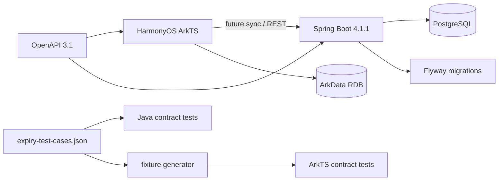

# M1 Architecture

## M1 boundaries

M1 intentionally does **not** include AI/OCR, reminder scheduling, Redis, auth, cloud sync, shopping, or family sharing. Their package boundaries are reserved by the V1 technical design but not implemented yet.
